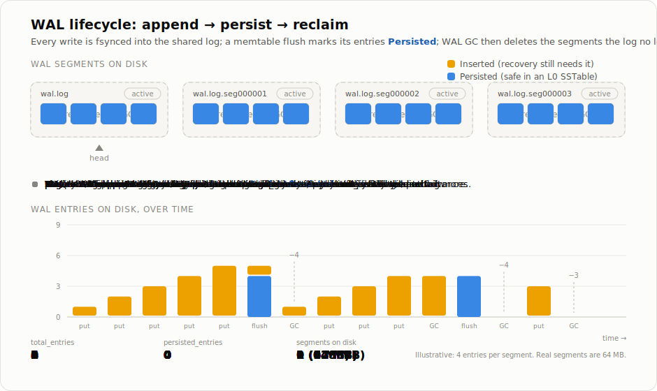

# MinnalDB

MinnalDB is an embedded, high-performance key-value store written in Rust. Its defining characteristic is that it stores keys and values *separately* — keys live in a small, cheaply-compacted LSM tree, while values live in an append-only log alongside it. This design, taken from the [WiscKey paper](https://www.usenix.org/conference/fast16/technical-sessions/presentation/lu), keeps write amplification low even for large values. The name *minnal* (மின்னல்) means "lightning" in Tamil.

> **Platform support:** Linux and macOS only. Windows is not supported — the WAL relies on Unix positional I/O (`pread`/`pwrite`) for safe concurrent access without a global file lock.

> **Just want to use it?** This document is the engine's internal design
> reference — it walks through the storage internals in depth. If you want to
> add `minnal_db` to your project and start writing code, go straight to the
> **[Embedded Quickstart](QUICKSTART.md)** instead; come back here when you
> want to know *why* it works the way it does.

## Table of Contents

- [Design Inspiration](#design-inspiration)
- [Architecture Overview](#architecture-overview)
- [Component Deep Dives](#component-deep-dives)
  - [LSM Tree](#lsm-tree)
  - [Value Log](#value-log)
  - [Write-Ahead Log (WAL)](#write-ahead-log-wal)
  - [Skip List](#skip-list)
  - [Sharding](#sharding)
  - [Namespaces](#namespaces)
  - [Background Workers](#background-workers)
- [Storage Layout](#storage-layout)
- [Read & Write Paths](#read--write-paths)
- [Compaction & Garbage Collection](#compaction--garbage-collection)
- [Crash Safety & Recovery](#crash-safety--recovery)
- [MinnalDB as an Embedded Store](#minnaldb-as-an-embedded-store)
- [Configuration](#configuration)
- [Performance](#performance)
- [Building & Benchmarks](#building--benchmarks)

---

## Design Inspiration

MinnalDB is built on the central idea from the **WiscKey** paper:

> **WiscKey: Separating Keys from Values in SSD-Conscious Storage**
> Lanyue Lu, Thanumalayan Sankaranarayana Pillai, Andrea C. Arpaci-Dusseau, Remzi H. Arpaci-Dusseau
> *USENIX FAST '16* — [usenix.org/conference/fast16/.../lu](https://www.usenix.org/conference/fast16/technical-sessions/presentation/lu)

A traditional LSM tree stores keys and values together inside its SSTables. The problem is compaction: every time the tree reorganizes itself, it rewrites the values too — even when only the key metadata needed to move. For large values on an SSD, this *write amplification* dominates the I/O cost and wears the drive down faster.

WiscKey's answer is to **keep only keys (and pointers to their values) in the LSM tree, and store the values themselves in a separate append-only log**. Now the LSM tree is small, so compacting it is cheap, and the bulky values are only ever rewritten during a dedicated garbage-collection pass rather than on every compaction.

MinnalDB takes this separation as its foundation and builds four things on top of it:

- **A sharded value log** — values are spread across a configurable number of buckets (`num_buckets`, fixed at creation) so I/O and garbage collection can run in parallel.
- **A sharded LSM** — each bucket has its own L1 SSTable, avoiding a single-file write bottleneck.
- **Multi-namespace isolation** — many independent keyspaces coexist in one database.
- **Epoch-tracked records** — every value carries a timestamp in its record header. TTL expiry is opt-in: it only kicks in for namespaces given a TTL, where a background worker uses these timestamps to expire stale records.

The rest of this document works from the top of the stack down to these components, then covers the paths data takes through them and how the whole thing survives a crash.

---

## Architecture Overview

The diagram below shows how a request flows through MinnalDB. At the top, callers use the public API; underneath, a single **Database Coordinator** routes each operation to the right place; and at the bottom sit the storage components that actually persist data.

```
┌──────────────────────────────────────────────────────────────────────┐
│                         Public API Layer                             │
│                                                                      │
│   Db / AsyncDb               Namespace / AsyncNamespace             │
│   (raw bytes)                (scoped to a single namespace)         │
│   put / get / delete         put_typed / get_typed (rkyv)           │
│   iter / range / scan_prefix                                        │
└──────────────────────────────┬───────────────────────────────────────┘
                               │
                ┌──────────────▼──────────────┐
                │       Database Coordinator   │
                │       (db/database.rs)        │
                │                              │
                │  • Namespace registry        │
                │  • Shared WAL                │
                │  • KVStore map (per NS)      │
                │  • Worker lifecycle          │
                └──────────────┬──────────────┘
                               │
         ┌─────────────────────┼────────────────────┐
         │                     │                    │
         ▼                     ▼                    ▼
┌────────────────┐   ┌──────────────────┐   ┌──────────────┐
│ KVStore (per   │   │ Write-Ahead Log  │   │  Namespace   │
│ namespace)     │   │ (shared, global) │   │  Registry    │
│                │   │                  │   │              │
│ • LSM tree     │   │ • Append-only    │   │ • Name → u32 │
│ • Value log    │   │ • Segmented      │   │ • Persistent │
│ • GC worker    │   │ • CRC-validated  │   │ • Monotonic  │
│ • TTL worker   │   │ • GC on persist  │   │   IDs        │
└───────┬────────┘   └──────────────────┘   └──────────────┘
        │
        ├─────────────────────────────────────────────┐
        │                                             │
        ▼                                             ▼
┌───────────────────────────────┐     ┌─────────────────────────────────┐
│         LSM Tree              │     │         Sharded Value Log        │
│                               │     │                                  │
│  ┌─────────────────────────┐  │     │  Bucket 0   Bucket 1  ... B15   │
│  │ MemTable (SkipList)     │  │     │  ┌───────┐  ┌───────┐   ┌────┐ │
│  │ • Max 100k entries      │  │     │  │ 64 MB │  │ 64 MB │   │... │ │
│  │ • Arena-allocated       │  │     │  │ pages │  │ pages │   │    │ │
│  │ • SIMD key comparison   │  │     │  └───────┘  └───────┘   └────┘ │
│  └────────────┬────────────┘  │     │  Append-only, page-structured   │
│               │ flush         │     │  Per-bucket GC journal           │
│  ┌────────────▼────────────┐  │     │  Record: len+version+flags+      │
│  │ L0 Files (per bucket)   │  │     │         epoch+value+CRC32        │
│  │ Staged before L1 merge  │  │     └─────────────────────────────────┘
│  └────────────┬────────────┘  │
│               │ compact       │
│  ┌────────────▼────────────┐  │
│  │ L1 SSTables (16 files)  │  │
│  └─────────────────────────┘  │
└───────────────────────────────┘
        │                     │
        ▼                     ▼
┌───────────────┐   ┌──────────────────────────────────────┐
│  LSM Worker   │   │       Background Workers             │
│  • Compaction │   │  GCWorker   WalGcWorker  TTLWorker   │
│  • L0→L1 merge│   │  (global)   (global)    (global)     │
└───────────────┘   └──────────────────────────────────────┘
```

A few things are worth pulling out of the diagram, because they shape everything that follows:

- **Each namespace owns a private `KVStore`** — its own LSM tree and value log. Namespaces never share key data.
- **The WAL is the one global, shared component.** Every write from every namespace lands in the same log first, which is what makes crash recovery a single, ordered replay.
- **A write fans out into two stores.** The LSM tree records the *key* and a pointer; the value log holds the *value*. A read reverses this: find the pointer in the LSM, then follow it into the value log.
- **Background workers do the slow work off the critical path** — compaction, garbage collection, WAL cleanup, and TTL expiry all run on their own schedules so foreground reads and writes stay fast.

> **A note on bucket count.** Throughout this document we use **16 buckets** as a concrete example, because that is the default. The count is actually set by `num_buckets`, fixed once at database creation, and everything that is "16-wide" here — the value-log shards, the L1 SSTables, the GC journals, and bucket routing — scales to whatever you configure.

---

## Component Deep Dives

With the overall shape in mind, this section examines each component in turn: the two storage structures that a write fans out into (the LSM tree and the value log), the WAL that protects them, the skip list that backs the in-memory tier, and finally the cross-cutting concerns of sharding, namespaces, and background work.

### LSM Tree

The LSM (Log-Structured Merge) tree is MinnalDB's index over keys. Following WiscKey, it stores **only keys and value-log pointers — never the values themselves**. Because the entries are tiny, the tree stays small and is cheap to compact.

Data moves through three levels, from fast-and-volatile to slow-and-durable — the in-memory **MemTable**, the **L0 files** it flushes into, and the single sorted **L1 SSTable** those compact down to:


A write first lands in the in-memory **MemTable** (a skip list). At 95% capacity it is sealed read-only, a fresh MemTable takes over writes, and the sealed one is flushed to disk as an **L0 file** for the relevant bucket. L0 files accumulate and *overlap* — the same key can appear in several of them — so a background worker periodically merge-sorts a bucket's L0 files together with its L1 file into a single, sorted **L1 SSTable**. That merge is where the tree shrinks: duplicate versions of a key collapse to the newest one, and a tombstone drops the key entirely, so L1 holds fewer entries than the inputs it was built from.

Because the same key can exist in several tiers at once, a read must decide which copy is current. It does that by **write sequence, not by layer order**:

1. **Fast path.** Look up the key in the active MemTable (an `O(log n)` skip-list lookup). Each tree tracks the highest sequence held anywhere below that MemTable, so if the hit's sequence beats it, no lower tier can hold anything newer and the read returns straight away. Ordinary writes always carry the newest sequence, so this is the common case.
2. **Full resolution.** Otherwise, gather the key's entry from *every* layer — the active MemTable, each sealed read-only MemTable, the bucket's L0 files, and its L1 SSTable — and keep the one with the **highest sequence**. A tombstone winning means "not found".
3. Follow the winning pointer into the value log to fetch the actual bytes.

Step 2 exists because layer order is not a safe proxy for recency. Value-log GC relocates a value and re-points its key while *preserving that key's original sequence*, so an older version can end up in a newer layer, sitting above a newer tombstone — and a read that stopped at the first hit would resurrect the deleted key. Resolving by sequence everywhere (reads, the GC liveness scan, and the L0→L1 merge alike) is what rules that out, at a cost of roughly 5–10% on reads.

Two details make this efficient. First, each LSM entry stores its key alongside a compact **`u128` pointer** that packs the value's location — `bucket (32-bit) | page_offset (64-bit) | segment_id (32-bit)` — and is extracted in `O(1)` from the skip-list node. Second, keys are **routed to buckets by a Murmur3 hash**, so any given lookup only ever touches one bucket's L1 file — a single 1/16th-sized slice of the data rather than the whole tree.

### Value Log

If the LSM tree holds the keys, the value log holds the bytes. It is the heart of the WiscKey design: **values never enter the LSM at all**, so compaction never has to move them. Each shard bucket gets its own append-only file, divided into fixed-size 64 MB pages.

#### A page and its slot table

A page has a 32-byte header (`magic="VPG1"`, `version`, `free_offset`, `table_offset`, `next_segment_id`, `page_size`), and then grows from **both ends**: value records append forward from the header, while an 8-byte **slot entry** per record — `(segment_id, record_offset)` — is written backward from the page's end. When the two regions meet, the page is closed and a new one opens at the file's tail.


The slot table is the load-bearing indirection. A key's pointer is **`(page_offset, segment_id)`** — never a raw byte offset — so a read is "look up the slot, follow it to the record", and GC is free to move a record's bytes within a page as long as the slot agrees. The LSM packs the whole address into one `u128`: `bucket (32b) | page_offset (64b) | segment_id (32b)`. Each record carries a 36-byte header (`total_len`, `version`, `flags`, `epoch_ms`, `value_len`, CRC32 of the value, and the write `seq`) followed by the value bytes.

#### Writes, deletes, and garbage

Writes only ever append, which turns all value writes into sequential I/O — exactly what SSDs and NVMe drives are fastest at. Records are never modified in place; instead, two **flags** mark records that are no longer current:

- `0x01` **Tombstone** — a logical delete. The bytes stay until garbage collection reclaims the space.
- `0x02` **Updated** — superseded by a newer write, and therefore treated as garbage.

So an update appends a *new* record and flags the old one; a delete flags the record and writes an LSM tombstone. Neither reclaims a byte — that is GC's job, and it only runs once a bucket's waste ratio crosses the threshold (30% by default):


GC is a **copying** collector, and its ordering is what makes it crash-safe. It takes the bucket write lock (the same one `put`/`delete` hold, so its scan and re-point are atomic against them), rewrites the survivors of the dirty pages into a new file — pages *below* the waste threshold are copied byte-for-byte, so their pointers stay valid and need no LSM update — and then fsyncs a **GC journal** (`key → new pointer`) plus a **commit marker** *before* swapping the file in. If a crash lands after the swap, startup replays the journal; if the journal is unreadable, it reverts to the preserved old file. The re-point itself is a compare-and-set: a key is only moved if it still maps to the exact pointer GC copied, and it is re-inserted under its **existing sequence**, so a relocation can neither resurrect a deleted key nor change a key's version.

Every record also carries an **`epoch_ms` timestamp** (its creation time in Unix milliseconds). This is what makes TTL cheap: the TTL worker can find and tombstone expired records straight from the value log, without ever scanning the LSM tree.

#### Reading while GC moves the bytes

A read happens in two steps: first ask the LSM where the value is, then go read it there. GC is what makes that risky — between those two steps it can rewrite the file and move the value somewhere else. A reader that is unlucky enough to land in that window is holding a pointer into a file that no longer exists, or worse, into a slot that now belongs to a *different* record. Reads never take the bucket lock (that would put them behind GC), so instead they **detect** the race and retry:


**Check 1 — did GC touch this bucket while I was reading?** Every bucket has a counter that GC bumps when it starts a swap and again when it finishes, so an **odd** value means "a swap is happening right now" and an **even** value means "the file and the pointers agree". A reader reads the counter before it starts and again after it finishes. If it was odd, or if it changed in between, GC ran underneath the read — the result is thrown away and the read starts over.

**Check 2 — is this still the record I asked for?** The counter catches a swap in progress, but not a read that arrives *after* one finished and follows a pointer GC has since reused for someone else's value. So every value record also stores the **sequence number** of the write that created it, and the LSM stores the same number next to the pointer. If the record's sequence isn't the one the LSM expected, this slot was recycled and the bytes belong to another key — throw it away and retry.

Both checks are cheap, and together they mean a stale read is always *caught*, never served. A reader that keeps losing the race isn't stuck retrying forever, either: after a few attempts, `get` falls back to reading while holding the bucket write lock, which locks GC out of that bucket and guarantees the read completes.

The three read paths run exactly these checks; they differ only in how much work they batch behind them:

- **`get`** — the walk-through above: one key, one pointer, one record.
- **Scans** — the LSM pass, the file handles, and the value reads all happen *inside* one before/after counter check covering every bucket, so the whole page is either consistent or retried as a unit. (Resolving a pointer outside that window is precisely the bug the window exists to prevent.) A key that resolved but came back empty is re-read afterwards through single-key `get`.
- **`get_multiple`** — resolves every key in one LSM pass, groups the pointers by bucket, and reads each bucket in parallel with batched `pread`s (roughly `2 + N` syscalls per page rather than four per key), checking each record's sequence just as `get` does.

### Write-Ahead Log (WAL)

The WAL is the safety net beneath every write. It is a single, global, append-only log shared by all namespaces, and its job is to make a write durable *before* it is acknowledged — bridging the gap between "the caller was told it succeeded" and "it has been flushed from the in-memory MemTable into a stable SSTable."

**Durability model (deliberate — do not "optimise" with group commit).** Every `put`/`delete` `fsync`s the WAL *before returning*, so each acknowledged write is durable against power loss the moment the call returns. The engine intentionally does **not** group-commit independent writes — that is, it never defers or batches their WAL `fsync`. Doing so would let a write be acknowledged before it reached stable storage, so a power loss in that window would silently lose a write the caller believed had succeeded. (Separately, `records_per_sync` tunes only the *value-log* `fsync` cadence, which is safe to batch precisely because the WAL already holds a durable copy that recovery can replay.)

Each WAL entry is length-prefixed, checksummed, and stored in a compact binary format:

```
[size: 4B] [rkyv-serialized WalEntry] [CRC32: 4B]

WalEntry {
  status:       Inserted | Persisted
  operation:    Upsert | Delete
  namespace_id: u32
  sequence:     u64   — global monotonic counter
  op_name:      String — caller-supplied label, used in fail-log output
  key:          Vec<u8>
  value:        Option<Vec<u8>>   — None for Delete
}
```

Every write is a **single-op transaction**: one `put` or `delete` is one WAL append, and a single append is inherently atomic, so every un-persisted entry is replayed on recovery. There is no multi-op batch/transaction type — secondary structures (field index, vector index) are derived and reconstructable, so higher layers order independent single-op writes and reconcile on recovery rather than committing them atomically.

The **`sequence` number** is what keeps recovery correct. It is allocated under the WAL append lock, so it always matches the order entries were written to disk. On recovery, MinnalDB sorts every eligible entry by sequence and replays them in that one global order — so the last write to any key wins after a crash just as it did before.

Physically, the WAL is split into **64 MB segment files** (`wal.log` is segment 0, `wal.log.seg000001` is segment 1, and so on). Once every entry in a segment is marked `Persisted` — meaning the data is safely in an L0 or L1 SSTable on disk — the WAL garbage collector deletes the whole segment, decrements the global `total_entries`/`persisted_entries` counters, and advances the WAL head pointer past any consecutively deleted segments so a later startup scan never tries to open a file that is gone.

#### How WAL storage evolves over time

The log grows with every write and shrinks in whole-segment steps, so its on-disk size is a sawtooth rather than a monotonic climb. The animation below follows entries through all three stages — appended (`Inserted`), covered by a memtable flush (`Persisted`), and reclaimed:



Three rules set the shape of that curve:

- **Only flushes shrink the log.** An entry stays `Inserted` — and its segment stays on disk — until *its* memtable is flushed to an L0 SSTable. Until then the WAL is the only durable copy of that write, so nothing about it can be reclaimed.
- **Reclamation is per segment, never per entry.** A segment is deleted only when *every* entry in it is `Persisted`, which is why the size drops in 64 MB steps: one straggler entry pins the whole file. GC also skips the **active segment** — the tail the log is currently appending to is never reclaimed, even if all of its entries are persisted.
- **The head only moves forward over contiguous deletions.** After deleting segments, GC advances `head` past the consecutively deleted ones, so recovery's `scan_entries(head, tail)` always starts at a file that still exists.

The steady-state footprint therefore isn't "everything ever written" but roughly *the entries not yet flushed to L0, plus the active segment*. A large memtable (or a stalled flush) widens the sawtooth by holding more segments un-persisted; a database that stops writing settles at a single active segment once the last flush lands, with all earlier segments reclaimed.

### Skip List

The MemTable — the in-memory tier of every LSM tree — is a custom **arena-allocated skip list** tuned for CPU cache efficiency. Rather than allocating each node on the heap (which scatters related data across memory), it packs everything into three flat, contiguous buffers:

```
nodes[]   — Node structs (height, key_offset, key_len, value, tombstone, seq)
keys[]    — Raw key bytes, packed contiguously (nodes index by offset+len)
links[]   — Forward pointer arrays (u32 node indices, packed per-node)
```

Keeping nodes, keys, and forward links in separate flat arrays means that walking the list touches cache-local memory, which makes traversal markedly faster than a pointer-chasing node graph. A node is referred to by its **`u32` index into `nodes[]`**, not by a pointer.

Here is the whole structure under the four operations that touch it:


Each operation earns its keep differently:

- **Create.** A new node's height is decided by a coin flip (geometric, `p = 0.5`, capped at 32 levels), then it is linked in at every level it reaches. Tall nodes are the express lanes — level 0 is the complete sorted list, and each level above it is a shortcut over the level below.
- **Read.** Start at the head's top level and hop right while the next key is still smaller than the target; when the next hop would overshoot, drop a level and continue. That is the `O(log n)` search, and every hop is an array index rather than a pointer dereference.
- **Update.** If the key is already present, its value and sequence are overwritten **in place** — no new node, no relinking. A write whose sequence is *older* than the node's is **dropped** (highest-sequence-wins), which is what makes the winner of two racing same-key writes identical to the one WAL recovery would replay.
- **Delete.** The node is **not** unlinked; it is flagged as a **tombstone** and stays in the list. That is deliberate: a search must be able to report "deleted" as distinct from "absent", because a delete recorded here has to shadow any older copy of the key still sitting in an L0 file or the L1 SSTable.

The structure's other properties:

- Up to **32 levels**, with probabilistic height assignment.
- Up to **100,000 entries** by default (configurable), flushing at **95% capacity**.
- **Tombstones are counted separately** from live entries, and capacity is measured against live entries only.
- Key ordering uses **SIMD-accelerated byte comparison** on x86_64 (a plain scalar comparison on Apple Silicon — see [SIMD coverage by architecture](#simd-coverage-by-architecture)). Bucket assignment uses a separate, also SIMD-accelerated hash of the key prefix.
- A monotonic **`u32` sequence counter** records insertion order within the table.

### Sharding

Sharding is what lets MinnalDB do its slow work in parallel. Every storage component is split across **16 buckets** (set at creation and fixed thereafter), which means:

- Garbage collection runs across 16 independent value-log files at once.
- Compaction runs across 16 independent L1 SSTables at once.
- Writes contend on a **per-bucket lock** rather than one global value-log lock.

A key is assigned to a bucket by hashing its first eight bytes:

```
bucket = Murmur3(key[0..8]) % num_buckets
```

Using a fixed-length prefix has a useful consequence: **keys that share an 8-byte prefix always land in the same bucket**, so a prefix scan only needs to touch a predictable subset of buckets rather than fanning out across all of them.

The location a bucket assignment ultimately produces is encoded in the `u128` value pointer stored in the LSM:

```
bits 96–127  bucket_id       (u32)
bits 32–95   page_offset     (u64, byte offset within value-log file)
bits 0–31    segment_id      (u32, record index within page)
```

### Namespaces

A namespace is a fully isolated keyspace inside a single database instance — the mechanism for keeping, say, documents and their vector embeddings in separate logical stores without opening separate databases.

**Each namespace is self-contained.** It has its own LSM tree (skip list, L0 files, L1 SSTables), its own sharded value log (`num_buckets` shards), and its own on-disk directory at `<db_path>/ns_<name>/`. Keys in one namespace are invisible to another. (Maintenance — GC, LSM compaction, and TTL expiry — is run by single global workers that fan out over the namespaces, not one worker per namespace; see [Background Workers](#background-workers).)

**Two things are shared across all namespaces:** the single global WAL (each entry tagged with its `namespace_id`), and the namespace registry — a persistent file that maps names to numeric IDs. The registry makes two guarantees worth relying on: the default namespace is always ID `0`, and IDs are assigned monotonically and **never reused**, even after a namespace is deleted. The registry also stores each TTL-enabled namespace's TTL configuration (`ttl` + `max_deletes_per_run`), so TTL expiry is restored automatically on restart rather than having to be re-declared.

**Dropping a namespace** (`remove_namespace`) reclaims its storage and is carefully ordered so that it is crash-safe:

1. The registry deletion is persisted **first**. From this moment the namespace is logically gone, and all of its files *and* WAL entries are unreferenced.
2. Its `KVStore` is flushed, shut down, and dropped, releasing every open file handle.
3. Its WAL entries are marked persisted, so WAL GC can reclaim those segments.
4. Its on-disk data directory and index files are deleted.

The reason this order matters is recovery. The cleanup touches only the namespace's own files — **never the shared WAL or its metadata** — so recovery for surviving namespaces is unaffected. And because the registry deletion is made durable *before* any file is removed, a crash partway through cleanup simply leaves some unreferenced files behind (a harmless disk leak): on the next startup, recovery **skips any WAL entry whose namespace is absent from the registry**, so a dropped namespace can never be resurrected. The never-reused-ID guarantee is what makes this unambiguous — a leftover WAL entry pointing at a missing namespace can only mean that namespace was deleted, never that its ID was handed to something else.

**The WAL leak self-heals — it never becomes permanent.** Step 3 (marking the namespace's WAL entries persisted) is only the *clean-shutdown* fast path; a crash before it runs leaves those entries un-persisted in the shared log. That is not a standing leak. Because un-persisted entries make `persisted_entries < total_entries`, the next startup always runs WAL recovery, and recovery's cleanup pass marks **every** scanned entry persisted — orphans from the dropped namespace included, with no per-namespace filter — and advances the persisted watermark to the WAL tail. So the orphan segments become fully persisted and WAL GC reclaims them on its next cycle. The dropped namespace's entries are pinned only across the single crash/restart boundary that immediately reclaims them, never indefinitely.

### Background Workers

Everything expensive happens off the foreground path, on `tokio` tasks that run on their own intervals and shut down gracefully when the database closes:

| Worker | Scope | Trigger | Action |
|---|---|---|---|
| `GCWorker` | Global (fans out per namespace) | Interval; per-namespace waste ratio > threshold | Compact each namespace's value log |
| `LsmWorker` | Global (fans out per namespace) | Interval OR memtable seal | Flush L0, compact L0→L1 across namespaces |
| `WalGcWorker` | Global | Interval | Remove fully-persisted WAL segments |
| `TtlWorker` | Global (fans out per namespace) | Interval (default 1h) | Tombstone expired records in each TTL-enabled namespace |

**On "Scope":** every worker is a **single** background task — one interval, one handle on `Database`. `GCWorker`, `LsmWorker`, and `TtlWorker` are global tasks that loop over the relevant namespaces on each tick (each namespace has its own value log / LSM tree, so the per-store *work* is still isolated). `TtlWorker` reads the per-namespace TTL configuration (`ttl` / `max_deletes_per_run`) from the persistent namespace registry and expires only the namespaces that have it — so a database with many TTL stores still runs just one timer task, not one per store, and the configuration is restored on restart.

These workers don't poll blindly; they are driven by an **observer pattern** that fires on LSM events. When a memtable is sealed, `LsmFlushObserver` wakes the LSM worker. When that sealed table is flushed to L0, `WalPersistObserver` marks the corresponding WAL entries `Persisted`. An `LsmFlushObserverHub` coordinates the two so that the WAL is always updated before the LSM worker finishes — which is what lets WAL GC safely reclaim a segment the instant its data is durable in an SSTable.

---

## Storage Layout

Putting the pieces together, here is how a database lays itself out on disk. The top level holds the shared structures (registry, WAL, fail logs); each namespace then gets its own subtree containing the value log and LSM data described above.

```
<db_path>/
├── namespace_registry          # Persistent namespace name→ID map (rkyv)
│
├── wal_metadata                # WAL head/tail/stats (CRC32-protected)
├── wal.log                     # WAL segment 0 (64 MB)
├── wal.log.seg000001           # WAL segment 1
├── wal.log.seg000002           # WAL segment 2 (deleted segments are removed)
├── ...
│
├── fail_logs/                  # Recovery fail-log files (one per recovery run)
│   └── fail_log_<timestamp>.json
│
├── ns_default/                 # Default namespace (always present)
│   ├── value_logs/
│   │   ├── value_log_0.log     # Value log bucket 0 (64 MB pages)
│   │   ├── value_log_0.metadata
│   │   ├── ...                 # Buckets 0–15
│   │   └── gc_journal_0.bin    # GC crash-recovery journal for bucket 0
│   ├── lsm_data/
│   │   ├── level0/
│   │   │   ├── level0_0/       # L0 files for bucket 0
│   │   │   └── ...
│   │   └── level1/
│   │       ├── level1_0.dat    # Stable L1 SSTable for bucket 0
│   │       └── ...
│   └── lsm_manifest
│
└── ns_<name>/                  # Additional named namespaces (e.g. ns_orders)
    ├── value_logs/
    ├── lsm_data/
    └── lsm_manifest
```

---

## Read & Write Paths

Having seen the components individually, it helps to trace a single operation end to end. The two paths are mirror images: a write fans *out* into the WAL, the value log, and the LSM; a read works *in* from the LSM index to the value bytes.

### Write Path

A write is durable the moment the WAL `fsync` returns — everything after that updates in-memory or amortised state.

```
put(key, value)
        │
        ├──► WAL.append(Upsert, Inserted)   ← fsynced on every single-op write,
        │                                      so the write is crash-durable
        │                                      before put() returns
        │
        ├──► ValueLog.append(value)          ← sharded by Murmur3(key)
        │         └─ returns u128 pointer
        │
        └──► LSM.insert(key, pointer)        ← in skip list (memory only)

        ...every records_per_sync writes...
        └──► fsync(value_log)                ← value-log durability cadence only
```

> **On `fsync` cadence.** Each `put`/`delete` `fsync`s the WAL *individually* — that is what makes the operation durable on return — so `records_per_sync` governs only how often the **value log** is `fsync`ed, never the WAL.

### Read Path

A read resolves the key's current version by **highest write sequence**, then follows that pointer into the value log:

```
get(key)
        │
        ├──► SkipList.get(key)  → hit whose seq beats every lower tier?
        │                            └─► yes: nothing below can be newer, return it  (fast path)
        │
        │    otherwise gather candidates from every layer and keep the highest seq:
        ├──► active MemTable            → (pointer | tombstone, seq)
        ├──► read-only MemTables         → (pointer | tombstone, seq)
        ├──► L0 files for bucket         → (pointer | tombstone, seq)
        ├──► L1 SSTable for bucket       → (pointer | tombstone, seq)
        │                                            │
        │                          winner = max by seq
        │                                            │
        │                    tombstone ──► None      │ pointer
        │                                            ▼
        │                                 ValueLog.read(bucket, offset)
        │                                     └─► value bytes
        │
        └──► no candidate → return None
```

Layer order is deliberately *not* the tie-breaker: value-log GC re-points a relocated key under its original sequence, so a newer layer can legitimately hold an older version. See [LSM Tree](#lsm-tree) for why first-hit-wins would resurrect deleted keys.

---

## Compaction & Garbage Collection

Three independent reclamation processes keep the on-disk footprint in check, each operating on a different structure: LSM compaction merges accumulated L0 files, value-log GC reclaims dead value bytes, and WAL GC drops segments whose data is safely persisted.

### LSM Compaction (L0 → L1)

LSM compaction runs when a memtable fills (95% capacity) or on the compaction worker's interval (default 60s). It folds the loose L0 files for a bucket into that bucket's single sorted L1 SSTable:

1. The active MemTable is sealed, becoming a read-only table.
2. A background worker flushes that sealed table to per-bucket L0 files.
3. All of a bucket's L0 files are merge-sorted into a new L1 SSTable.
4. The old L0 files are removed only once every in-flight read has finished with them, so a concurrent read is never pulled out from under.

The [LSM tier animation](#lsm-tree) walks through a full cycle of this — flush, accumulate, merge — including how duplicate keys and tombstones make L1 smaller than the files it was built from.

### Value Log GC

Value-log GC runs when a bucket's waste ratio (garbage bytes ÷ total bytes) exceeds 30% (configurable). The tricky part is doing this safely while writes and deletes are landing in the same bucket, so the whole compaction holds the **per-bucket write lock** that `put` and `delete` also take — making the scan and the subsequent LSM update atomic with respect to concurrent mutations.

1. Acquire the bucket lock and scan the LSM for that bucket's live keys, remembering each key's current pointer.
2. Compute per-page waste and select the pages that exceed the threshold.
3. Copy the live records into fresh, compacted pages.
4. Write a **GC journal** for crash recovery (see below).
5. Atomically swap the old file for the compacted one with `rename()`, bumping the bucket's **swap generation**.
6. Re-point each relocated key in the LSM as a **compare-and-set**: a key is only updated if it still maps to the exact pointer that was copied. A key deleted or overwritten since the scan is left alone, so GC never resurrects a deletion or reverts a newer write.
7. Delete the GC journal. (If a crash interrupts the swap, the journal replay on startup applies the same "skip keys that are now deleted" rule.)

Readers stay correct throughout *without* taking the bucket lock. A reader samples the bucket's swap generation before and after it reads the pointer and value, and only trusts the result if the generation is unchanged; otherwise it retries and, if needed, falls back to a lock-held read. This guarantees a reader can never pair a stale pointer with a freshly-swapped file. The [Value Log](#value-log) section animates both sides of this — the swap protocol and what each read path does while it runs.

### WAL GC

WAL GC runs every 60s. Its job is simply to drop segments whose every entry is already safely in an SSTable:

1. For each segment other than the current write segment, compare its `total_entries` against its `persisted_entries`.
2. If every entry is `Persisted`, delete the segment file and subtract its counts from the global totals.
3. Advance the WAL `head` past all consecutively deleted segments, so the next startup scan begins at a live file.

An entry becomes `Persisted` the moment its key is flushed from the MemTable to an on-disk L0 file — that is, once a durable copy exists in the LSM and the WAL no longer needs to protect it. See [How WAL storage evolves over time](#how-wal-storage-evolves-over-time) for the resulting sawtooth in on-disk size.

---

## Crash Safety & Recovery

The components above were each designed with one shared goal: surviving a crash without losing acknowledged data or leaving storage in an inconsistent state. The table below maps the failure scenarios to the mechanism that covers each one.

| Scenario | Protection |
|---|---|
| Process crash after `put()` | WAL is fsynced on every append; recovery replays the WAL on startup |
| Crash after `put()` returns, before in-memory apply | The op is durable in the WAL and replayed on next startup |
| Crash mid-GC (value-log file swap incomplete) | GC journal is written before the swap; replayed at startup to fix LSM pointers |
| Corrupt metadata file | CRC32 mismatch is detected; the file is recovered or the error reported |
| Crash between L0 flush and WAL mark-Persisted | WAL entries remain `Inserted` and are replayed on next open |
| Recovery apply failure (transient error) | Each entry is retried once; persistent failures are written to a timestamped fail-log |

**Startup recovery** runs these steps in order, reconstructing in-memory state from what's on disk and then replaying anything the WAL still holds:

1. Load the namespace registry.
2. Load WAL metadata and scan all WAL segments.
3. Load the LSM manifest and reopen the L0/L1 SSTables.
4. Load value-log metadata and reopen the shard files.
5. Scan for GC journals and replay any incomplete value-log file swaps.
6. Replay the WAL entries that aren't yet `Persisted`:
   - Sort all eligible entries by sequence number and apply them in that one global order — so writes to the same key resolve to whichever was written last — retrying each once on failure.
   - Any entry that fails both attempts is written to `fail_logs/<timestamp>.json` and marked `Persisted`, so WAL GC can still make progress.
7. Spawn the background workers (GC, LSM compaction, WAL GC, TTL).

**The fail log** is the operator's escape hatch. When recovery cannot apply an entry even after a retry, it writes a human-readable JSON file to `<db_path>/fail_logs/` (configurable via `[recovery] fail_log_dir`). The file records each failed op with its `name`, `operation`, `namespace_id`, key/value (rendered as nested JSON when the payload is JSON, hex otherwise), and the `error` — so the affected records can be replayed, deleted, or ignored deliberately rather than silently lost.

---

## MinnalDB as an Embedded Store

MinnalDB is the **base storage layer** of the minnal stack and is designed to be embedded directly inside any Rust process — no server, no separate daemon. You depend on the `minnal_db` crate, call `Db::open` (or `AsyncDb::open`) on a directory path, and get a durable, namespaced key-value store with all background workers (compaction, value-log GC, WAL GC, TTL) running inside your process.

`minnal_db` is a **single crate**; the document and semantic-search layers are
folded in as cargo features (`doc-store`, `semantic-search`) that you opt into.
The base (`kv-store`, default) is the KV engine plus **built-in field indexing** —
secondary (field-level) indexing is a capability of the engine itself, not
something layered on by the document store.

Crucially, MinnalDB stores **opaque value bytes** — it never assumes a format. The field index is driven by an *extractor closure* you supply (`&[u8] -> Option<IndexValue>`), so you decide how to pull an indexed field out of your own value encoding (JSON, Protocol Buffers, a fixed binary layout, …). Deriving those extractors from a JSON schema is precisely what the `doc-store` feature adds on top; the indexing machinery itself is engine-level.

> **Want the API?** The feature matrix, the key-value API (sync and async), TTL
> namespaces, field indexing with predicate queries, and the document-store and
> semantic-search handles are all covered — with runnable examples — in the
> **[Embedded Quickstart](QUICKSTART.md)**. **Platform:** Linux and macOS only
> (`pread`/`pwrite`).

---

## Configuration

MinnalDB is configured through a TOML file or a `DbConfig` built in code.

[`config/sample.toml`](../config/sample.toml) is the annotated reference: it lists every tunable parameter with its default and a short explanation, and is the recommended starting point rather than writing a config from scratch.

The knobs that most affect engine behaviour:

| Key | Effect |
|---|---|
| `sharding.num_buckets` | Value-log / L1 shard count. **Fixed at creation** — it cannot change once data exists. |
| `memtable.max_capacity` | SkipList entry limit before a flush is triggered. |
| `lsm.compaction_threshold_percent` | How full the memtable gets before it is sealed and flushed. |
| `sync.records_per_sync` | Value-log `fsync` cadence. The WAL is `fsync`ed on **every** write regardless. |
| `thresholds.value_log_waste_threshold` | Waste ratio at which value-log GC compacts a bucket. |
| `recovery.fail_log_dir` | Where recovery fail-log JSON files are written (defaults to `<db_path>/fail_logs`). |

---

## Performance

### Where the speed comes from

Each design choice in MinnalDB pays off as a specific performance property:

| Choice | Impact |
|---|---|
| Key/value separation (WiscKey) | Low write amplification — LSM compaction never rewrites values |
| Arena skip list | Reduced GC pressure and high cache locality for key lookups |
| 16-bucket sharding | 16× parallel GC and compaction; 16× write parallelism |
| Append-only value log | Sequential write I/O; ideal for SSDs and NVMe |
| SIMD key comparison | Faster skip-list traversal on x86_64. See [SIMD coverage by architecture](#simd-coverage-by-architecture) below for the Apple Silicon story. |
| Zero-copy serialization | No deserialization overhead on typed reads |
| Epoch-based memory reclamation | Lock-free L0 cleanup without stopping readers |

### SIMD coverage by architecture

minnal targets both x86_64 and Apple Silicon (aarch64/ARM64). Not every hot path has a hand-written vector version for both — this table is the accurate picture of what's accelerated where:

| Subsystem | x86_64 | Apple Silicon | Notes |
|---|---|---|---|
| Field-index bitmap operations (AND/OR/NOT, popcount, merge) | AVX-512 → AVX2 → scalar | NEON | Detected automatically at build/run time; both paths are unit-tested against a scalar reference |
| Vector search distance math | AVX-512 / AVX2 | NEON / SVE | Provided by the `simsimd` library |
| Skip-list key comparison | AVX-512 / AVX2 | Plain scalar loop | No NEON version yet — correct, just not vectorised on Apple Silicon |
| Bucket-assignment hashing | AVX | Portable scalar path | From the `mm3h` hashing library |

In short: on Apple Silicon, field-index queries and vector search get their full SIMD speed-up; ordinary key comparisons and hashing currently run the portable fallback. All fallback paths are correctness-equivalent — this is a speed difference, not a behavioural one.

### Expected throughput

These are single-threaded ballpark figures with a configurable sync cadence; treat them as orders of magnitude rather than guarantees.

| Operation | Approximate throughput |
|---|---|
| `put` (small values, deferred value-log sync) | 100k–500k ops/s |
| `get` (cache-warm) | 500k–1M ops/s |
| `get` (cold, hits L1 SSTable) | 100k–300k ops/s |
| Range / prefix scan | Bounded by result-set size |
| Value-log GC throughput | 100–500 MB/s |

Actual numbers depend heavily on value size, the `records_per_sync` setting, and the underlying storage hardware.

---

## Building & Benchmarks

```bash
# Build
cargo build --release

# Run tests
cargo test

# Run benchmarks (individual)
cargo bench --bench bench_write
cargo bench --bench bench_read
cargo bench --bench bench_scan
cargo bench --bench bench_mixed
cargo bench --bench bench_typed
cargo bench --bench bench_wal

# All benchmarks
cargo bench
```

Benchmark reports are written to `target/criterion/`. The helpers in `benches/common.rs` disable background workers and use `target/bench_tmp/` (rather than `/tmp/`) to avoid skew from RAM-backed filesystems.

---

## License

See [LICENSE](LICENSE).
