# minnal_db — Benchmark Report

This is a full benchmark run of the `minnal_db` engine: the key-value store, the
field-index predicate evaluator, and the semantic-search distance math. It was
measured at one point in time on a single machine, so treat the absolute numbers
as specific to the hardware below. The durable signal is in the *relative*
comparisons — how cost changes with value size, key count, a read versus a
write, the raw API versus the typed one, or data in memory versus data on disk.
Those ratios hold up across machines even when the raw microsecond figures
don't.

The [README's Performance section](README.md#performance) explains the design
choices behind these numbers and lists the ballpark figures this report is
checked against; the final section here closes the loop on that comparison.

---

## Environment

| | |
|---|---|
| OS | Ubuntu 26.04 LTS, kernel 7.0.0-28-generic, x86_64 |
| CPU | AMD Ryzen 9 9950X3D — 16 cores / 32 threads, boost to 5.76 GHz, AVX-512 |
| RAM | 96 GB |
| Disk | NVMe SSD (`nvme0n1`, non-rotational, 1.8 TB) — `target/` and all benchmark temp dirs live here |
| rustc / cargo | 1.96.0 |
| gnuplot | 6.0 (Criterion's plotting backend; also used to render the charts in this report) |
| Repo | branch `main` @ commit `1a302ac` |
| Date | 2026-07-18 |

---

## How this was run

Everything here comes from `cargo bench --all-features`, run from the repo root.
That builds and runs all nine benchmark suites; the `--all-features` flag only
matters for the semantic-search suite, which needs the vector code compiled in.
Criterion writes full interactive per-benchmark plots (violin plots, PDFs,
regression lines) under `target/criterion/*/report/index.html` — this document
is a curated summary of them, not a replacement.

One narrow case couldn't complete on this machine. A single WAL benchmark — the
one measuring *unsynced* appends — runs each operation so fast that Criterion's
measurement window churns through hundreds of thousands of setup/teardown
cycles, each opening a fresh temporary file, and exhausted the machine's
open-file limit before the sample finished. That looks like an interaction
between the benchmark harness and the OS rather than a real leak in the engine
(every other suite with the same setup pattern ran cleanly), so that one case is
left out here rather than reported with degraded methodology.

Everything else ran with Criterion's defaults — 100 samples per case, a 3-second
warm-up, a 10-second measurement window, 95% confidence intervals. The one
exception is the mixed read/write suite, which re-seeds thousands of durable keys
before every measured batch; at 100 samples that took 20-45 minutes per case, so
it was cut to 20 samples, trading some confidence-interval width for a run that
finishes in minutes.

### A word on memory versus disk

minnal_db keeps recently-written data in an in-memory table (very fast to read)
and moves older data down onto an on-disk SSTable (slower, but that on-disk tier
is where most of the data lives most of the time). A benchmark that only ever
reads freshly-written, still-in-memory keys paints too rosy a picture of a real
running database, where the working set has aged onto disk.

So every read benchmark here measures **both** tiers side by side: one case with
the data resident in memory, and one where the same data has been flushed and
compacted onto disk and the store reopened, so the read genuinely goes through
the on-disk lookup path — its key-range check, bloom filter, and bounded index
scan. Write benchmarks aren't split this way, because a write always lands in the
in-memory table regardless of what's already on disk, so the tier distinction
doesn't apply to write cost. The lookup benchmark goes one step further and adds
a *mixed* case, described in its own section, where a single read-only workload
reads across both tiers at once.

There's deliberately no third tier for "flushed to disk but not yet compacted."
That intermediate state exists internally, but there's no way through the public
API to hold the database in it long enough to measure — the only operation that
produces it immediately compacts it away in the same call. So it isn't measured
as its own tier.

---

## Writes

Every write is a fully durable transaction — the change is synced to disk before
the call returns, with no batching and no way to relax that per call. That
durability has a fixed cost, and it shows. Writing a 128-byte value takes about
2.3 ms; writing a 64-kilobyte value — 512 times more data — takes about the
same, roughly 2.3 ms. Latency is essentially flat across that entire value-size
range, because the disk sync itself, not the amount of data, is what a write
pays for. Payload size only starts to move the needle once the synced write is
large enough to matter on its own.

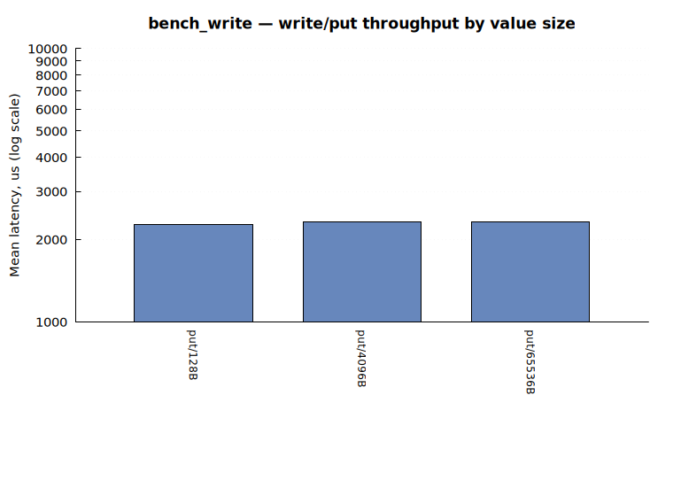

## Reads

Reading a key that's still in memory is fast and stays fast regardless of value
size — under a microsecond for small and medium values. Pushing the same read
onto disk adds a roughly constant penalty: a small-value lookup goes from about
0.4 µs in memory to about 3.2 µs on disk, and that gap of roughly 2.8 µs holds
steady across small and medium values. It's a fixed per-lookup disk cost — the
bloom-filter check, the index probe, and one read from the value log — that
value size barely affects until the payload gets big enough that reading the
bytes themselves starts to count (a 64-kilobyte value takes about 3.7 µs in
memory and 6.4 µs on disk, where the extra bytes finally show up).

The miss path — looking up a key that was never written — is a special case
worth calling out. It's around 0.2 µs whether the data is in memory or on disk,
and, surprisingly, marginally *cheaper* on disk than in memory. Both are really
just measuring the bloom filter proving a key absent, so the two tiers land
within noise of each other rather than showing any real difference.

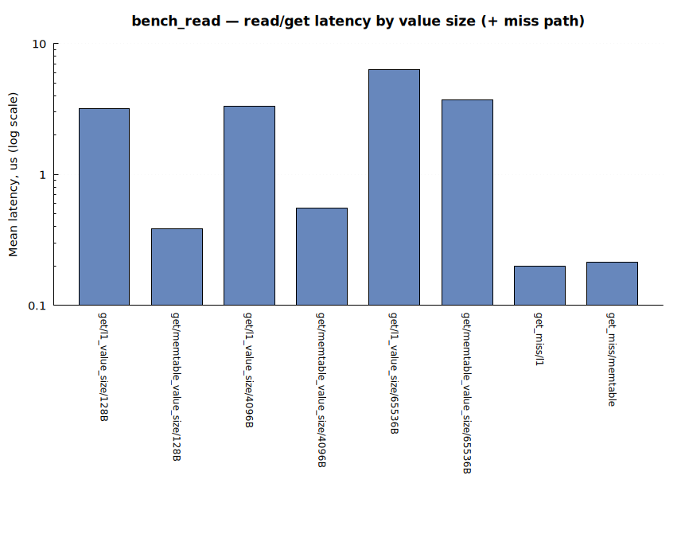

*Bar labels: `memtable` = still in the in-memory table, `l1` = flushed and
compacted onto disk.*

## Point lookups as the key count grows

This is a closer look at the same on-disk lookup path, sweeping the number of
keys in the store from a thousand up to a hundred thousand, and adding a mixed
case the plain read benchmark doesn't cover. In the mixed case a single
read-only workload alternates on every call between a key resident in memory and
one resident on disk, so its cost is the blended price of a 50/50 tier mix —
a closer approximation of a real steady-state database than either pure extreme.

The headline is that an on-disk hit barely gets slower as the store grows: it
rises only about 7% (roughly 3.1 to 3.3 µs) across a hundredfold increase in key
count. That near-flat curve is the intended behaviour, not a fluke — the on-disk
lookup fast-rejects using the key range, then a bloom filter, then a bounded
index search that caps any residual scanning to a fixed number of entries no
matter how large the file gets. In-memory reads stay faster throughout (about
0.4 to 0.6 µs), though that gap narrows as the store grows, since the on-disk
side stays flat while the in-memory skip-list search cost creeps up mildly with
key count.

Two findings here are counterintuitive.

The first is about misses. On disk, minnal_db keeps a quick filter that can
usually say "definitely not here" without looking any further — so an on-disk
miss stays flat and cheap (about 0.2 µs) no matter how many keys are in the
store. In memory there's no such shortcut: to be sure a key is missing, the
engine still has to search through the in-memory data the same way it would to
find a real key. So an in-memory miss costs about the same as an in-memory hit,
and grows the same way as the store grows (about 0.34 to 0.54 µs) — the two
tiers end up flipped for misses compared to hits.

The second is about the mixed workload: reading it costs about 11-12% more
than simply averaging the memory and disk numbers would predict. The likely
reason is that memory and disk lookups go through two quite different code
paths internally, and jumping back and forth between them on every single call
adds a small overhead of its own, on top of whatever each lookup costs by
itself. A workload that read a whole batch of in-memory keys and then a whole
batch of on-disk keys — rather than alternating one by one — probably
wouldn't pay this extra cost.

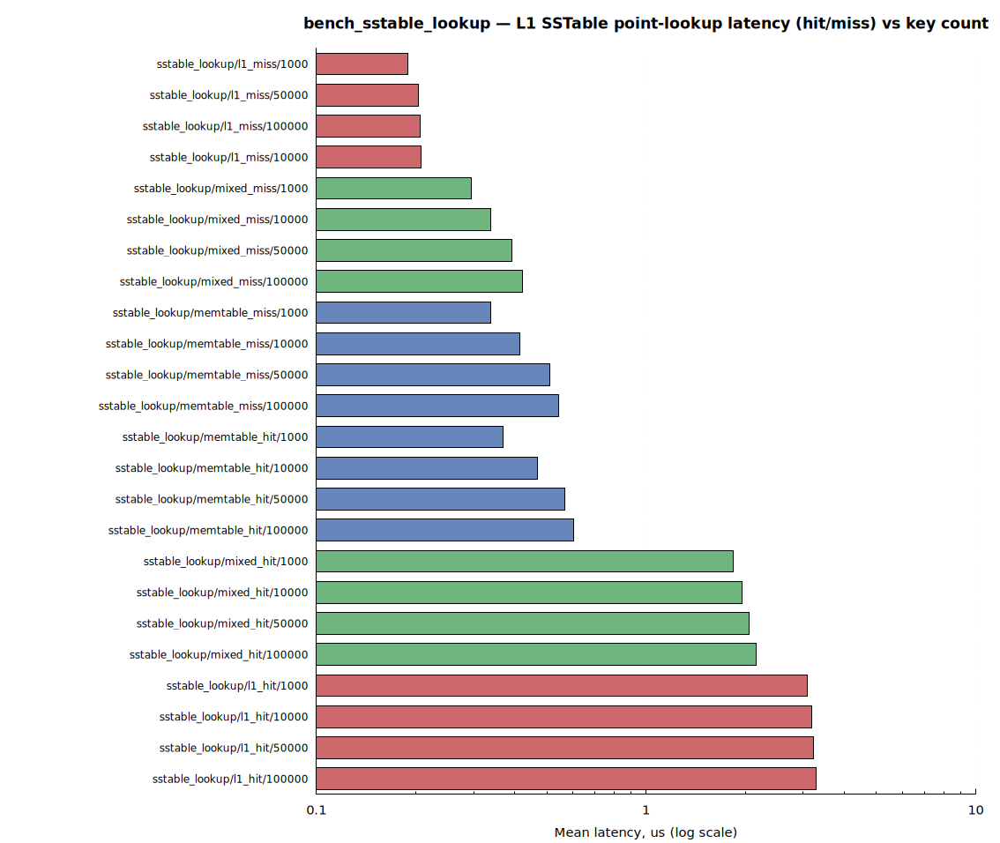

*Bar labels: `memtable` = in memory, `l1` = on disk, `mixed` = the blended
workload described above; `hit` = the key exists, `miss` = it doesn't; the
trailing number is how many keys are in the store for that case.*

## Scans

This suite covers the four ways to read many keys at once — prefix scan, range
scan, cursor pagination, and a full async iteration — each measured against data
in memory and on disk.

Prefix and range scans give the cleanest comparison: on disk they cost a
consistent **~2x** their in-memory equivalent across every result-set size, and
that ratio holds steady rather than widening as the result grows. So the on-disk
penalty here is a roughly constant per-scan overhead, not a per-element one.
Full iteration shows the mildest tier gap of the four — about 2x for small
values, shrinking toward 1.25x for larger ones — because iteration resolves
every value, so value-log I/O already dominates its cost before the tier
distinction even enters, and the larger the values, the more that dominates.

Cursor pagination has the surprise. At its smallest page size it runs *faster*
on disk than in memory (about 94 µs versus 145 µs), the reverse of everything
else here. By the largest page size the expected order returns and disk is
slower again. The most likely explanation is that at very small pages the
pagination bookkeeping itself dominates the cost regardless of which tier the
data sits in, so the usual tier gap simply doesn't get a chance to show.

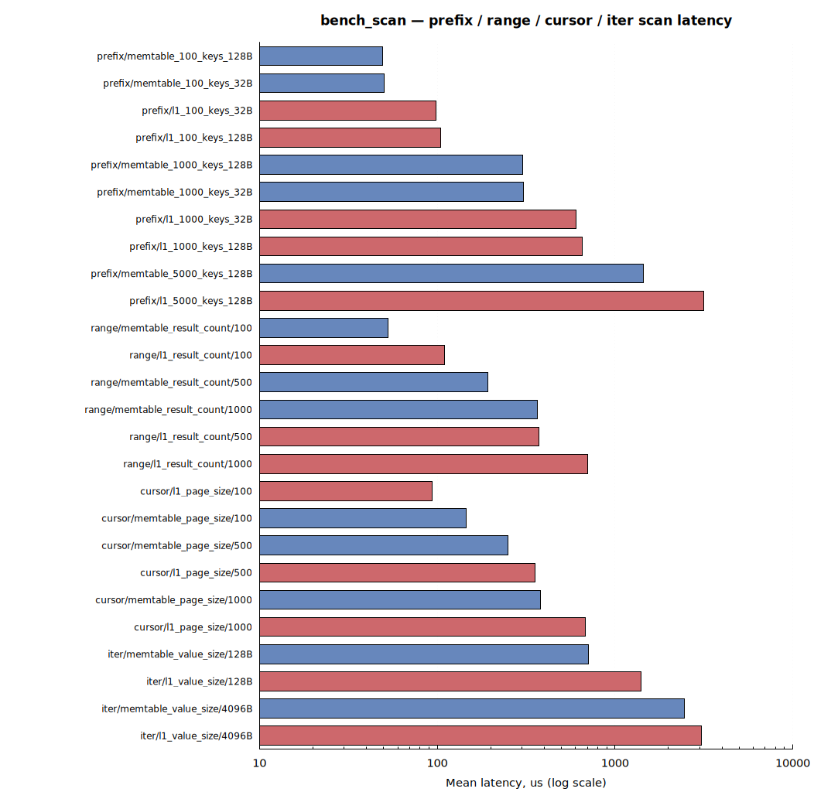

*Bar labels: `prefix`/`range`/`cursor`/`iter` are the four scan types above;
`memtable`/`l1` = in memory vs. on disk. The trailing number means whatever
that scan type varies — matching keys for `prefix`, results returned for
`range`, page size for `cursor`, value size for `iter`.*

## Mixed read/write workload

These cases run blended workloads — 80% reads with 20% writes, and an even
50/50 split — with the read set living in memory or on disk, reporting the
average cost per operation. (This is the suite run at the reduced sample size, so
its confidence intervals are wider than the rest.)

All four cases land within about 1% of each other. Neither the tier nor the
read/write ratio makes a visible difference, and the reason is the same in both
cases: a write costs about 2.3 ms (the disk sync) while a read costs a few
microseconds on either tier, so the writes utterly dominate the average. Even at
50% writes, the write half alone accounts for roughly 99.9% of the per-operation
time. The read tier and the read/write ratio would only start to matter to this
average at write fractions far lower than anything swept here.

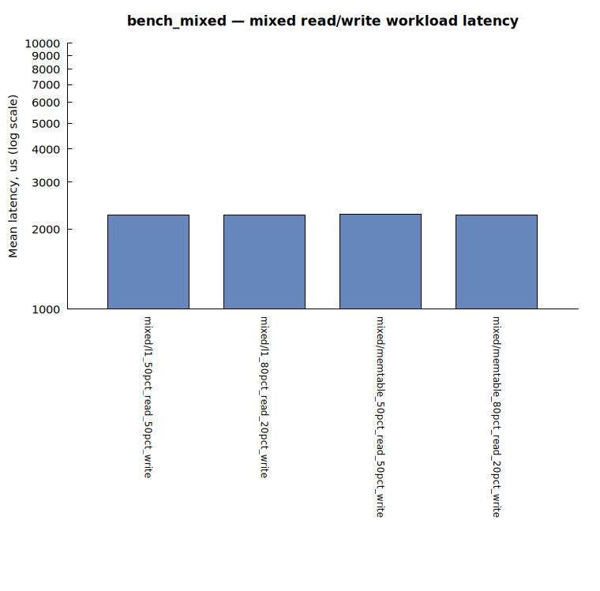

*Bar labels: `memtable`/`l1` = whether the pre-seeded read set lives in
memory or on disk; the percentages are the read/write split.*

## Write-ahead log

This suite breaks the write path apart: the durable WAL append on its own, the
serialization round-trip, the recovery scan, the full write throughput, and the
cost of tagging an entry with its namespace. The three pieces sit in three very
different cost bands, so they're shown as three separate charts below rather
than one crowded chart spanning six orders of magnitude.

The clearest result is how little of the write cost is anything *but* the disk
sync. The full write path (WAL plus value log plus in-memory index, about 2.3
ms) is statistically indistinguishable from the durable WAL append measured
alone, and tagging an entry with a namespace ID costs nothing measurable — the
difference between namespaces is within noise. In other words, the disk sync
*is* the write path's cost: the per-write sync is a deliberate durability
choice, and this confirms it in measurement, not just in design intent.

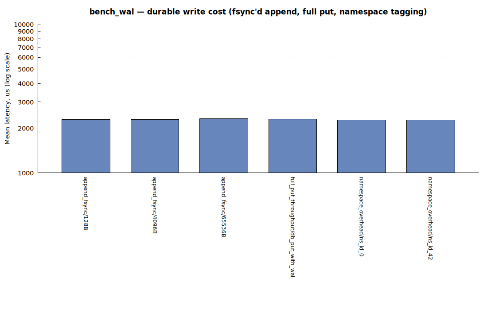

*Bar labels: `append_fsync` = a raw, durable WAL append in isolation;
`full_put_throughput` = the entire write path (WAL + value log + in-memory
index) end to end; `namespace_overhead` = the same raw append tagged with a
namespace id (`ns_id_0` is the default namespace, `ns_id_42` an arbitrary
non-default one, to check tagging isn't adding cost).*

Serializing and deserializing a WAL entry, by contrast, is three to four
orders of magnitude cheaper than the sync itself — tens of nanoseconds up to
about a microsecond, against roughly 2.3 ms — so it's nowhere near the
critical path.

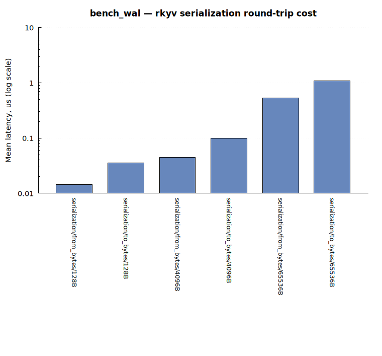

*Bar labels: `to_bytes` = serializing a WAL entry, `from_bytes` =
deserializing one back.*

The recovery scan, which reads entries back the way a restart would, runs at a
few million entries per second for small values.

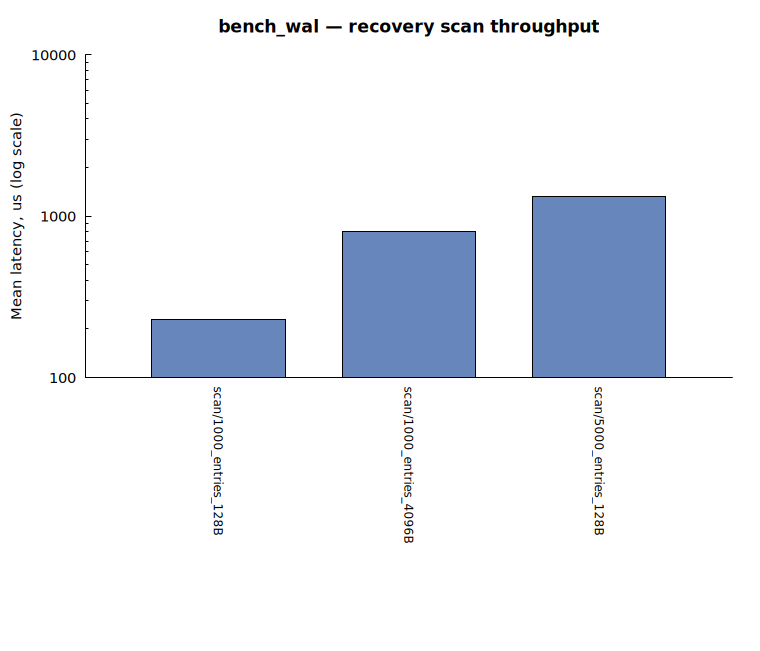

## Typed API

minnal_db offers a typed convenience layer that serializes and deserializes your
own types with zero-copy on top of the raw-bytes API. The question this suite
answers is what that convenience costs, and the answer is essentially nothing on
top of what the underlying operation already costs.

Typed writes and deletes land within noise of raw writes — the disk sync swamps
everything else regardless of which API you call. On the read side, a typed
read shows the same roughly 2.8 µs memory-to-disk step that a raw read does, so
the zero-copy deserialization adds no tier penalty of its own. The typed
iteration, range, and prefix scans all sit in the same consistent ~1.8-2.1x
on-disk-versus-memory band as their raw counterparts, inheriting their tier
sensitivity directly from the underlying scan rather than from anything specific
to the typed layer.

The keys-only operation is the one that behaves differently. Fetching just the
keys shows *no* memory-versus-disk gap at small key counts — the two tiers are
statistically indistinguishable — and only opens up a gap (about 1.6x) at larger
counts. That fits: fetching keys never touches the value log, so at small counts
the tier difference is too small to clear the noise floor, and only becomes
visible once there are enough keys for it to accumulate.

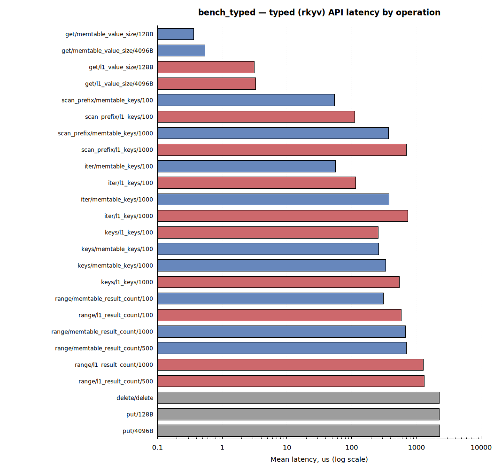

*Bar labels: `get`/`put`/`delete`/`iter`/`keys`/`range`/`scan_prefix` are the
typed operations, mirroring the raw-bytes API's method names; `memtable`/`l1`
= in memory vs. on disk.*

## Field-index predicates

These benchmarks evaluate field-index queries — the bitmap-backed predicate
engine — over a hundred thousand rows across three indexed fields.

Equality lookups are cheap: a string-equality predicate runs at about 11 µs, and
combining two equality predicates with AND or OR costs about 32 µs. A *range*
predicate over an integer field is a different story entirely — around 1.1 ms,
roughly 100x more expensive than equality and the single costliest operation in
the suite by a wide margin. Parsing overhead, by contrast, is negligible:
evaluating a query from its string form and evaluating an already-parsed query
take the same time, so the query parser is not where the cost lives.

One result runs against intuition: selectivity doesn't track cost. Sweeping a
compound query so that it matches progressively *fewer* rows makes it *slower*,
not faster — the most selective case in the sweep is the slowest one. Narrowing
the result set here does not mean less work.

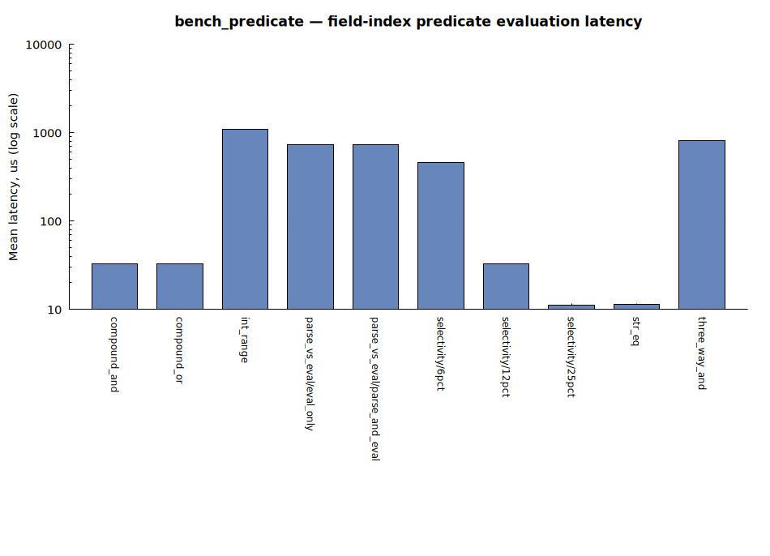

*Bar labels: `str_eq` = a string-equality predicate, `int_range` = an
integer-range predicate, `compound_and`/`compound_or` = two predicates
combined with AND/OR, `three_way_and` = three predicates combined,
`parse_vs_eval` = isolating query-string parsing cost (`parse_and_eval`)
from evaluating an already-parsed query (`eval_only`), `selectivity/AND/Npct`
= an AND query matching about N% of rows.*

## Semantic search

These benchmarks measure the vector-search pipeline used for semantic queries,
run against the real cluster centroids bundled with the project (256 clusters)
and synthetic 768-dimension embeddings, so no external embedding service needs
to be running.

Scoring a batch of candidate documents against a query is fast and cheap — a
couple of microseconds for a hundred candidates up to about 16 µs for a
thousand, scaling linearly, and roughly the same whether it's the coarse first
pass or the more precise second pass. The extra precision of the second pass
costs nothing extra at this scale. Picking out which few clusters are worth
searching, the equivalent of choosing the right shelf before scanning it, takes
under 10 µs and barely changes whether 8 or 128 clusters are requested.

A full end-to-end search's cost tracks how long the *query* is, not how many
clusters get probed (that's held fixed). A query ten times longer costs only
about 2.2x as much — sub-linear — because the final re-ranking step only ever
looks at a capped number of candidates no matter how many fed into it. Growing
the *document* side instead, by giving each document more searchable chunks,
doesn't get that cap: cost there scales roughly in step with the extra chunks
(eight times the chunks per document costs about 5.4x as much), because the first
pass scans all of them rather than capping.

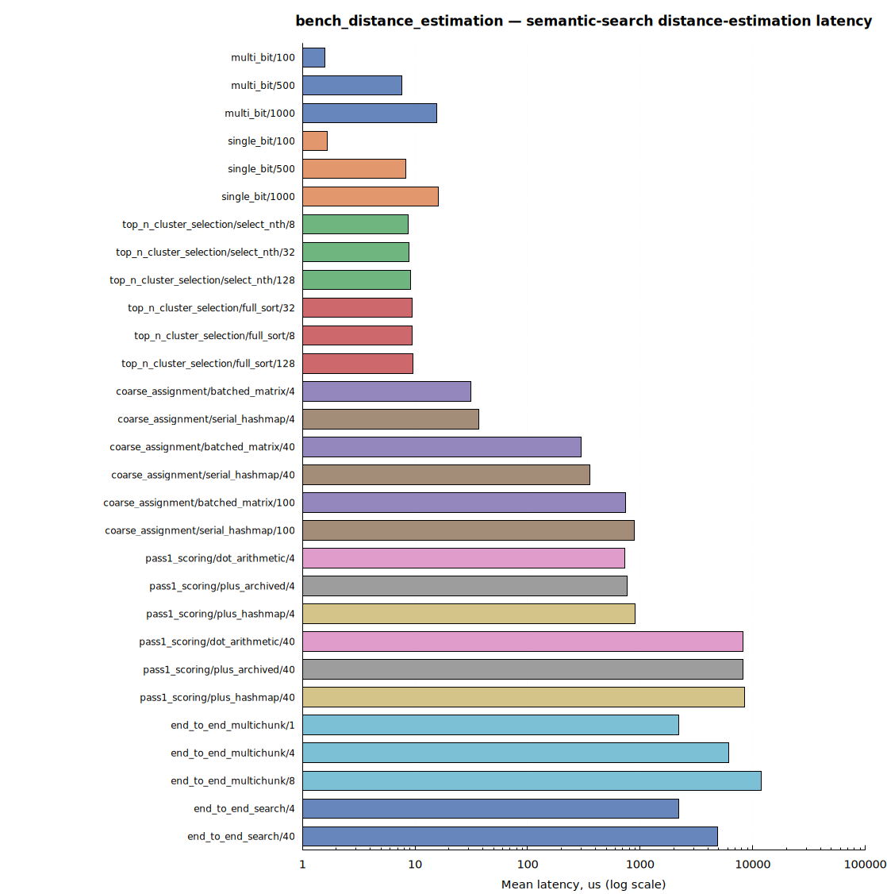

*A guide to the bars. `single_bit` and `multi_bit` are the coarse first pass
and the more precise second pass. Under `top_n_cluster_selection`, `select_nth`
is the current cluster-picking algorithm and `full_sort` is the older
sort-everything baseline it is measured against. `coarse_assignment` contrasts
two ways of assigning a multi-chunk query to its nearest clusters: `serial_hashmap`
walks the query's chunks one at a time, looking each one up individually in a
scattered `HashMap` of clusters, while `batched_matrix` — the current approach —
scores all of a query's chunks at once against a single contiguous matrix of
cluster centroids. That contiguity is what produces the speedup, through better
cache locality and more vectorizable math. `pass1_scoring` peels the first pass
apart into cumulative layers, starting from the bare distance math
(`dot_arithmetic`), then adding the cost of reading the on-disk format
(`plus_archived`), and finally the real scoring data structure (`plus_hashmap`),
which is the closest of the three to what production actually pays. Finally,
`end_to_end_search` and `end_to_end_multichunk` are complete searches that vary
the query length and the per-document chunk count respectively.*

---

## How this compares to the README's published figures

The README publishes single-threaded ballpark throughput figures, and the
measurements here corroborate them:

| Operation | README ballpark | Measured here |
|---|---|---|
| Write (small values, single writer) | ~400–500 ops/s | ~440 ops/s — in range |
| Read (warm, from memory) | 500k–1M ops/s | ~2.6M ops/s — above range |
| Read (cold, from disk) | 100k–300k ops/s | ~313k ops/s — just above range |
| Range / prefix scan | bounded by result size | consistent — see the Scans section |

Write throughput lands squarely in the published range. The WAL is synced on
every write by design — only the value log's sync cadence is tunable — so about
440 writes per second is the expected, sync-bound ceiling for a single writer at
roughly 2.3 ms per sync on this drive, not a number a configuration change could
raise.

The cold-read figure is corroborated twice over. Two different benchmarks — one
in the reads section, one in the point-lookup section — both measure a
small-value lookup forced onto disk, using different setups, and arrive within 3%
of each other (about 313k and 324k ops/s). Read throughput comfortably meets or
beats the README's ballpark on both tiers.

Sharding gives concurrent writers real headroom beyond that single-writer
figure: writes fan out across the buckets (16 by default), so at about 440
writes per second per writer, sixteen writers spread one-per-bucket would land
somewhere around 7k writes per second. That aggregate concurrent number isn't
measured here — this whole report covers single-threaded latency only — and
would be worth a dedicated concurrent-writer benchmark if it's needed.
