# minnal_db — Benchmark Report

This is a full benchmark run of the `minnal_db` engine: the key-value store, the
field-index predicate evaluator, and the semantic-search distance math. It was
measured at one point in time on a single machine, so treat the absolute numbers
as specific to the hardware below. The durable signal is in the *relative*
comparisons — how cost changes with value size, key count, a read versus a
write, the raw API versus the typed one, or data in memory versus data on disk.
Those ratios hold up across machines even when the raw microsecond figures
don't.

The [README's Performance section](README.md#performance) explains the design
choices behind these numbers and lists the ballpark figures this report is
checked against; the final section here closes the loop on that comparison.

---

## Environment

| | |
|---|---|
| OS | Ubuntu 26.04 LTS, kernel 7.0.0-34-generic, x86_64 — bare metal (no virtualisation layer between the benchmarks and the disk) |
| CPU | AMD Ryzen 9 9950X3D — 16 cores / 32 threads, boost to 5.76 GHz, AVX-512 |
| RAM | 96 GB |
| Disk | NVMe SSD (`nvme0n1`, non-rotational, 1.8 TB) — `target/` and all benchmark temp dirs live here |
| rustc / cargo | 1.96.0 |
| gnuplot | 6.0 patchlevel 2 (used to render the charts in this report) |
| Repo | commit `e5d15c9` (branch `fix/search-concurrency`); the semantic-search suite re-run at `2559786` |
| Date | 2026-09-26 |

---

## How this was run

Everything here comes from `cargo bench -p minnal_db --all-features`, run from
the repo root. That builds and runs all eleven benchmark suites; the
`--all-features` flag only matters for the semantic-search suite, which needs
the vector code compiled in. Criterion writes full interactive per-benchmark
plots (violin plots, PDFs, regression lines) under
`target/criterion/*/report/index.html` — this document is a curated summary of
them, not a replacement. Every figure quoted here is Criterion's **mean point
estimate**.

The whole report is reproducible in one step:

```sh
minnal_db/docs/benchmarks/tools/run_report.sh
```

which runs every suite, extracts Criterion's means, and re-renders the charts
here. It archives any previous `target/criterion` rather than deleting it, so
Criterion never reports a cross-machine "regression" against a baseline measured
somewhere else.

**Reading the charts.** Four conventions, so a chart can be read on its own
rather than decoded against the table:

- **Bars ascend by measured value**, never by benchmark name, so the shape of a
  chart is the finding.
- **A group spanning more than about two orders of magnitude is split across
  several charts**, one per magnitude band, because a log axis wide enough to
  hold nanoseconds and milliseconds draws every bar in the upper band at the
  same height. Within a band the axis is linear, which is what makes a
  few-percent spread visible at all.
- **Where the finding is a comparison, the compared category stays contiguous** —
  the tier blocks in the lookup and scan charts, for instance. Pure value order
  would drop an `l1` bar between two `memtable` ones and break the side-by-side
  read. The exceptions are deliberate and called out in the caption: cursor
  pagination and first-versus-second-pass scoring are both charted in plain value
  order, because there the interleaving *is* the result.
- **Where the finding is that several numbers are the same**, the axis starts at
  zero. A truncated axis would turn sub-1% noise into a staircase that reads as
  a trend. The exception is the durable-CRUD chart, which is deliberately zoomed
  to a 2.26-2.34 ms window so the ordering is legible; its spread is noise, as
  that section explains.
- **Labels sit horizontally under their bars wherever they fit**, with each part
  of the name on its own line, so they are read at a glance rather than sideways
  a character at a time. Only a chart whose bars are too narrow for that falls
  back to rotated labels.

Everything ran with Criterion's defaults — 100 samples per case, a 3-second
warm-up, a 10-second measurement window, 95% confidence intervals. The one
exception is the mixed read/write suite, which re-seeds thousands of durable keys
before every measured batch; at 100 samples that took 20-45 minutes per case, so
it was cut to 20 samples, trading some confidence-interval width for a run that
finishes in minutes.

**How much a repeat run moves.** Criterion's confidence intervals describe
spread *within* a measurement, which is not the same as reproducibility. Across
runs on this hardware: fsync-bound writes are the steadiest thing here (±1.5%),
CPU-bound work — the semantic-search stages, predicate evaluation, bitmap
paging — holds to ±5%, and the sub-microsecond cases (memtable hits, miss paths)
swing 20-40% if the machine is doing anything else at the time. Read the small
numbers as orders of magnitude unless the host is idle.

Those bounds are optimistic across runs. Between the previous run (2026-08-22,
kernel 7.0.0-30) and this one (kernel 7.0.0-34), the only engine changes were
the semantic-search hot-path commits, which touched the L1 scan path and search
itself. Yet rows whose code did not change moved further than the bounds above:
point reads 5-8% faster and predicate evaluation up to 7% faster. The clearest
case is the multi-bit second-pass estimator, which measured 20% faster than
August in the full run and then back at August's value (+30%) when its suite was
re-run three hours later, with identical code on the same kernel. So it is not
the kernel update; some CPU-bound microbenchmarks here simply move 20-30% from
run to run. Treat a cross-run difference under ~10% as the environment unless
the code changed, and confirm anything larger with an A/B on one boot.

### A word on memory versus disk

minnal_db keeps recently-written data in an in-memory table (very fast to read)
and moves older data down onto an on-disk SSTable (slower, but that on-disk tier
is where most of the data lives most of the time). A benchmark that only ever
reads freshly-written, still-in-memory keys paints too rosy a picture of a real
running database, where the working set has aged onto disk.

So every read benchmark here measures **both** tiers side by side: one case with
the data resident in memory, and one where the same data has been flushed and
compacted onto disk and the store reopened, so the read genuinely goes through
the on-disk lookup path — its key-range check, bloom filter, and bounded index
scan. Write benchmarks aren't split this way, because a write always lands in the
in-memory table regardless of what's already on disk, so the tier distinction
doesn't apply to write cost. The lookup benchmark goes one step further and adds
a *mixed* case, described in its own section, where a single read-only workload
reads across both tiers at once.

There's deliberately no third tier for "flushed to disk but not yet compacted."
That intermediate state exists internally, but there's no way through the public
API to hold the database in it long enough to measure — the only operation that
produces it immediately compacts it away in the same call. So it isn't measured
as its own tier.

---

## Writes

Every write is a fully durable transaction — the change is synced to disk before
the call returns, with no batching and no way to relax that per call. That
durability has a fixed cost, and it shows. Writing a 128-byte value takes
2.272 ms; writing a 64-kilobyte value — 512 times more data — takes 2.336 ms, a
2.8% difference. Latency is essentially flat across that entire value-size range,
because the disk sync itself, not the amount of data, is what a write pays for.
Payload size only starts to move the needle once the synced write is large
enough to matter on its own.


## `merge` against the rest of CRUD

`merge` is the atomic read-modify-write: it reads a key, runs the caller's
closure over the old value and an operand, and writes the result back, with a
per-key lock held across all three so nothing can land in between. The obvious
question is what that costs against a plain `put` — and the honest answer is
that on this hardware the write benchmarks cannot see it, because a merge and a
put both pay exactly one WAL fsync and everything else is rounding error.

| Operation | Mean | Against `put/2KiB` |
|---|---:|---:|
| `crud/put/2KiB` | 2.329 ms | — |
| `crud/delete/2KiB` | 2.311 ms | −0.78% |
| `crud/get_then_put_sorted_set/2KiB` | 2.284 ms | −1.94% |
| `crud/merge_sorted_set/2KiB` | 2.283 ms | −2.00% |
| `crud/put/8B` | 2.265 ms | −2.74% |
| `crud/merge_counter/8B` | 2.264 ms | −2.80% |
| `crud/get/2KiB` | 435 ns | — |

All six write rows sit inside a 2.9% band, and every one of them is the same
number: the drive's fsync latency.

Read the sign of that table before anything else. **Every merge row measures
*faster* than the plain `put` it is supposed to cost more than** — and a merge
is a `put` with a read and a closure in front of it, so it cannot actually be
cheaper. The ordering is impossible, which is exactly what makes it useful: it
tells you the spread in this table is measurement noise, not work, and puts a
floor of roughly 2-3% on anything these write rows could resolve. Whatever
`merge` adds is somewhere below that floor.

So the way to size it is not to difference two millisecond figures. It is to
measure the parts that aren't the fsync, which the suite does separately and
which reproduce to within a couple of percent:

| Component | Mean |
|---|---:|
| the read a merge does that a put doesn't (`crud/get/2KiB`) | 435 ns |
| the per-key stripe: hash + uncontended lock (`stripe/*`) | 51 ns |
| the caller's own closure — counter (`closure/counter`) | 9.7 ns |
| the caller's own closure — 2 KiB sorted set (`closure/sorted_set`) | 170 ns |

Summed, a merge does **0.50–0.66 µs** of work a blind `put` does not, or
**0.03%** of the 2.27 ms the fsync costs — about a hundredth of the noise floor
the table above establishes, which is why no write row can see it. Two
consequences worth stating plainly:

- **Atomicity is free here.** `get_then_put_sorted_set` is the same work with no
  guarantee — the hand-rolled version a caller writes without `merge` — and the
  two land 0.06% apart, indistinguishable. The striped lock costs 51 ns; nothing
  in the durable write path notices.
- **The closure is the only part you control.** At 170 ns for a 2 KiB sorted-set
  splice it is still four orders of magnitude under the fsync, so a merge stays
  fsync-bound until the closure does something genuinely expensive.

This impossible-ordering check is the one `bench_merge.rs`'s header comment
tells you to apply before trusting any write row here, and it is worth
internalising because the *shape* of the violation moves between runs — an 8 B
put measuring slower than a 2 KiB one, a merge measuring faster than a put.
Any of them means the same thing: read the decomposition, not the difference
between two write rows.

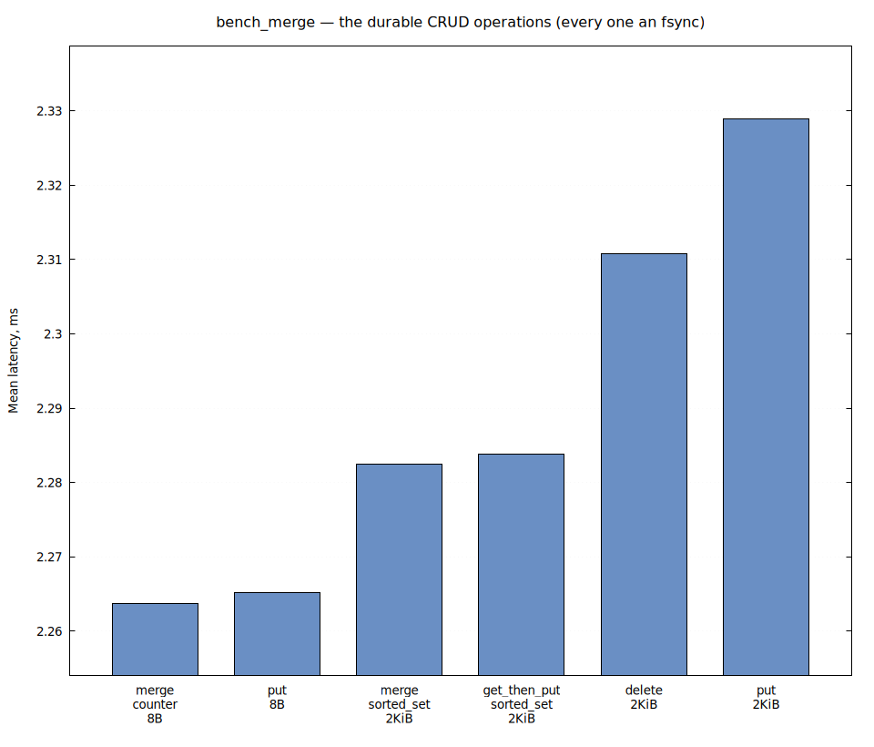

*The six durable operations on a linear axis, which is the only way a 2.9%
spread is visible. Note `put_2KiB` sitting at the top and both merges below it —
the impossible ordering described above.*

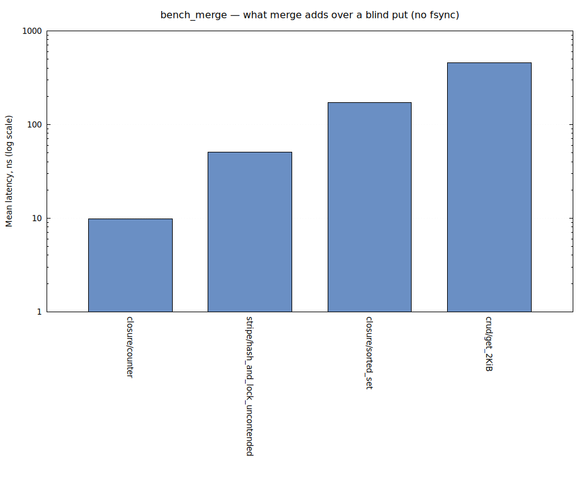

*The same section's decomposition, on its own axis because it is three orders of
magnitude below the writes: `crud/get_2KiB` is the read a merge does and a put
does not, `closure/*` are the two merge closures run with no database
underneath, and `stripe/*` reproduces the per-key lock's hash-and-acquire
against the same primitives the engine uses (`KeyLocks` is crate-private, so the
bench cannot call it directly).*

## Reads

Reading a key that's still in memory is fast and stays fast regardless of value
size — under a microsecond for small and medium values. Pushing the same read
onto disk adds a roughly constant penalty: a small-value lookup goes from
0.37 µs in memory to 3.22 µs on disk, and that gap of roughly 2.85 µs holds
steady across small and medium values (4 KiB: 0.54 µs against 3.37 µs, a 2.83 µs
step). It's a fixed per-lookup disk cost — the bloom-filter check, the index
probe, and one read from the value log — that value size barely affects until
the payload gets big enough that reading the bytes themselves starts to count (a
64-kilobyte value takes 3.67 µs in memory and 6.41 µs on disk, where the extra
bytes finally show up).

The miss path — looking up a key that was never written — is a special case
worth calling out. It costs 0.27 µs on disk and 0.33 µs in memory: both
sub-microsecond, and, surprisingly, *cheaper* on disk than in memory. The
on-disk side is really just measuring the bloom filter proving a key absent,
which is a cheaper thing to do than the in-memory skip-list search that has to
walk to the insertion point to be sure. The same inversion shows up, more
clearly, in the point-lookup sweep below.

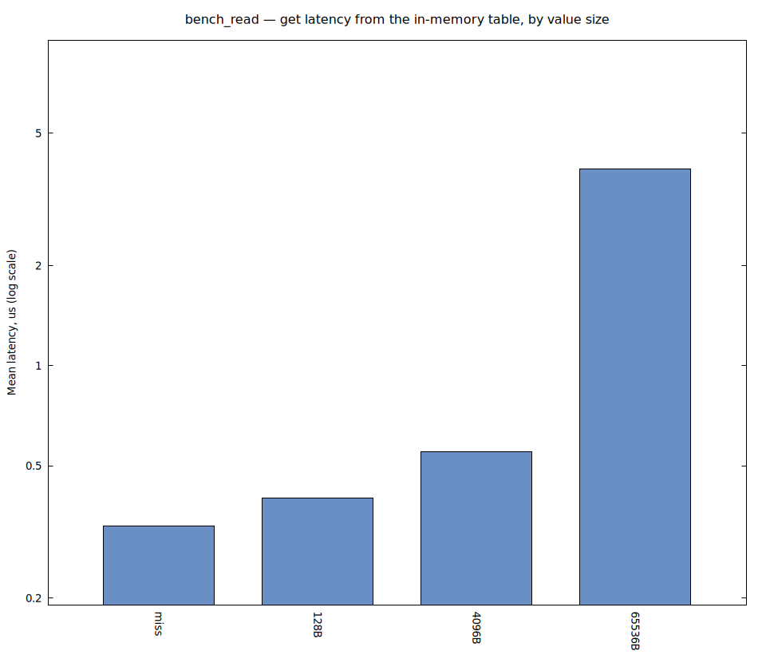

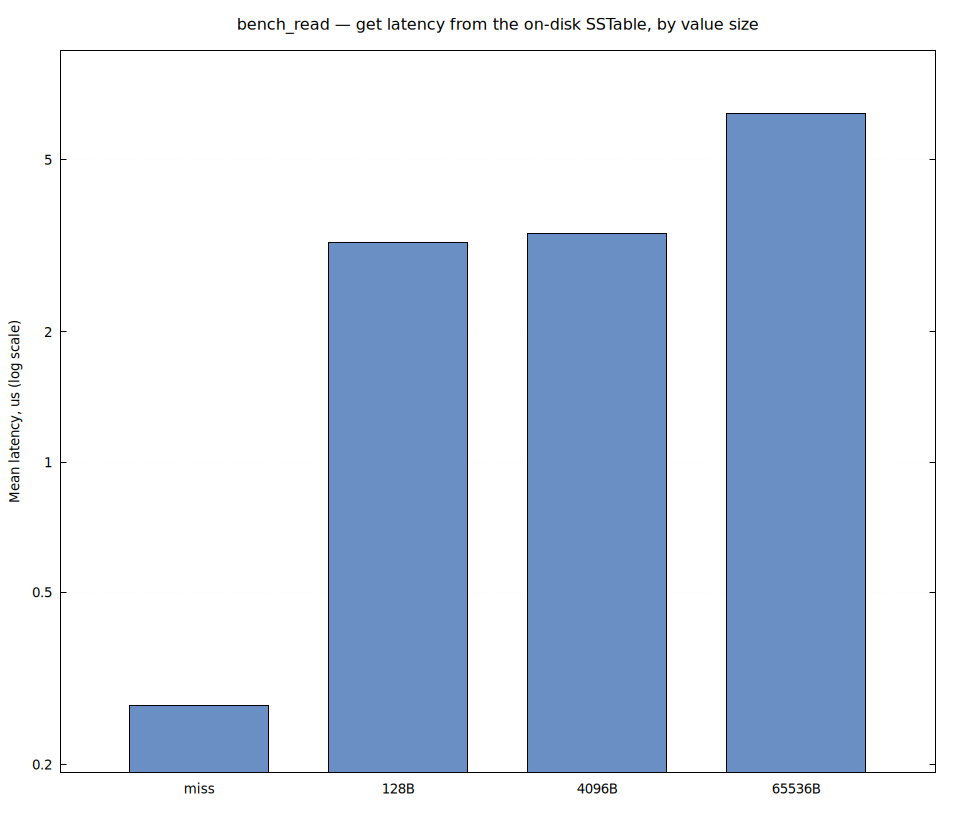

*One chart per tier, drawn on a shared axis so bar heights are directly
comparable between them — the whole l1 chart sits about 2.8 µs above its
memtable twin, which is the fixed disk cost. Within each tier the 64 KiB bar is
the value log making itself felt: values live in the value log whichever tier
holds the key, so a large value pays for the bytes in both. `miss` is a lookup
for a key that was never written, and it is the one bar that is cheaper on disk
than in memory.*

## Point lookups as the key count grows

This is a closer look at the same on-disk lookup path, sweeping the number of
keys in the store from a thousand up to a hundred thousand, and adding a mixed
case the plain read benchmark doesn't cover. In the mixed case a single
read-only workload alternates on every call between a key resident in memory and
one resident on disk, so its cost is the blended price of a 50/50 tier mix —
a closer approximation of a real steady-state database than either pure extreme.

The headline is that an on-disk hit barely gets slower as the store grows: it
rises only 6.1% (3.17 to 3.36 µs) across a hundredfold increase in key
count. That near-flat curve is the intended behaviour, not a fluke — the on-disk
lookup fast-rejects using the key range, then a bloom filter, then a bounded
index search that caps any residual scanning to a fixed number of entries no
matter how large the file gets. In-memory reads stay faster throughout (0.35 to
0.59 µs), though that gap narrows as the store grows, since the on-disk side
stays flat while the in-memory skip-list search cost creeps up mildly with key
count — a 71% rise over the same hundredfold sweep, against the on-disk 6.1%.

Two findings here are counterintuitive.

The first is about misses. On disk, minnal_db keeps a quick filter that can
usually say "definitely not here" without looking any further — so an on-disk
miss stays flat and cheap (0.19 to 0.21 µs, with no trend) no matter how many keys are in the
store. In memory there's no such shortcut: to be sure a key is missing, the
engine still has to search through the in-memory data the same way it would to
find a real key. So an in-memory miss costs about the same as an in-memory hit
(slightly more, in fact, since a hit can stop early), and grows the same way as
the store grows (0.48 to 0.67 µs) — the two tiers end up flipped for misses
compared to hits, by roughly 3x at the largest key count.

The second is about the mixed workload: reading it costs 6-12% more
than simply averaging the memory and disk numbers would predict, and the
overhead widens with key count. The likely
reason is that memory and disk lookups go through two quite different code
paths internally, and jumping back and forth between them on every single call
adds a small overhead of its own, on top of whatever each lookup costs by
itself. A workload that read a whole batch of in-memory keys and then a whole
batch of on-disk keys — rather than alternating one by one — probably
wouldn't pay this extra cost.

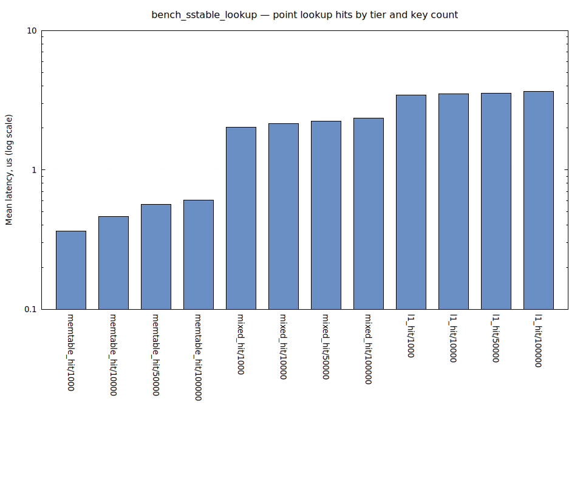

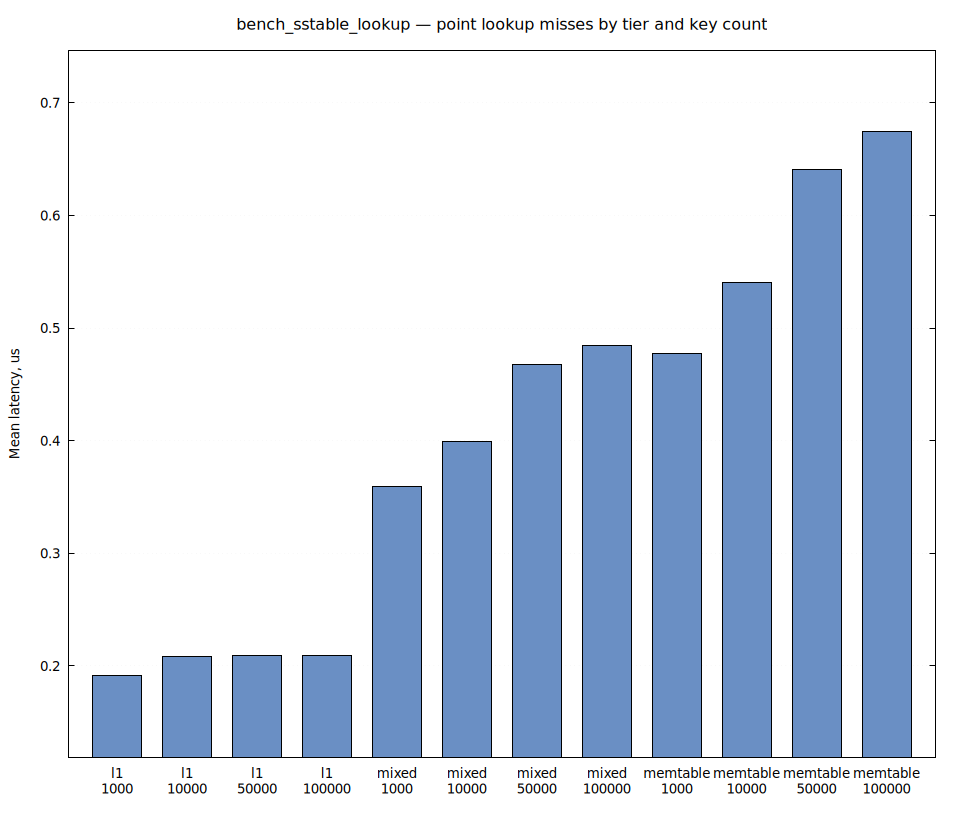

*Hits and misses are charted separately because they invert: sorted ascending,
the hit chart runs `memtable` → `mixed` → `l1` and the miss chart runs the other
way round. `memtable` = in memory, `l1` = on disk, `mixed` = the blended workload
described above; the trailing number is how many keys are in the store.*

## Scans

This suite covers the four ways to read many keys at once — prefix scan, range
scan, cursor pagination, and a full async iteration — each measured against data
in memory and on disk.

Prefix and range scans give the cleanest comparison: on disk they now cost
**1.2x–1.6x** their in-memory equivalent, and the ratio *shrinks* as the result
grows (prefix: 1.51x at 100 keys down to 1.21x at 5,000; range: 1.57x at 100
down to 1.31x at 1,000). The previous run put this at a flat ~2x. The change is
the buffered L1 range reader added for semantic search (`e414cdb`): an on-disk
scan used to read each ~60-byte entry with two `pread` calls, and now reads
consecutive entries out of one buffer, so what is left of the on-disk penalty
is per-scan setup that a large result amortises. On-disk scans got 26–47%
faster between the two runs; in-memory ones moved within 8%. Full iteration
shows the mildest tier gap of the four — 1.41x for 128-byte values, shrinking to
1.09x at 4 KiB — because iteration resolves every value, so value-log I/O
already dominates its cost before the tier distinction even enters, and the
larger the values, the more that dominates.

Cursor pagination has the surprise. At its smallest page size it runs *faster*
on disk than in memory (75 µs versus 144 µs), the reverse of everything else
here. At 500 the two tiers are level (267 µs versus 256 µs), and by the largest
page size the expected order returns (507 µs versus 389 µs). The most likely
explanation is that at very small pages the pagination bookkeeping itself
dominates the cost regardless of which tier the data sits in, so the usual tier
gap simply doesn't get a chance to show.

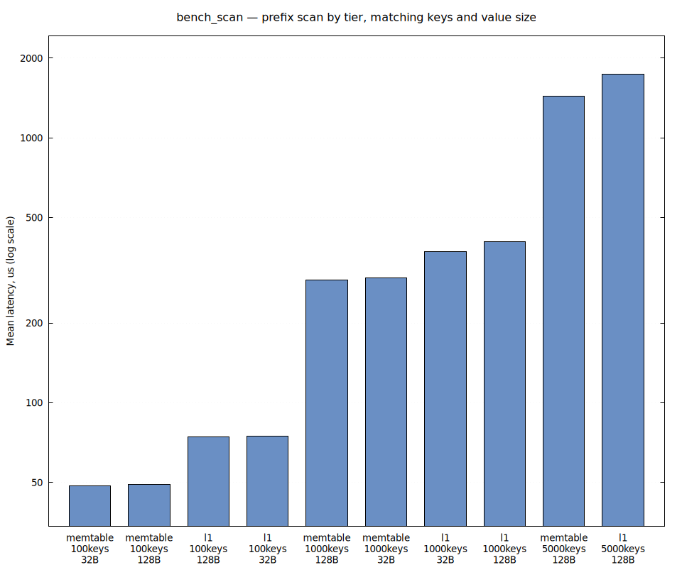

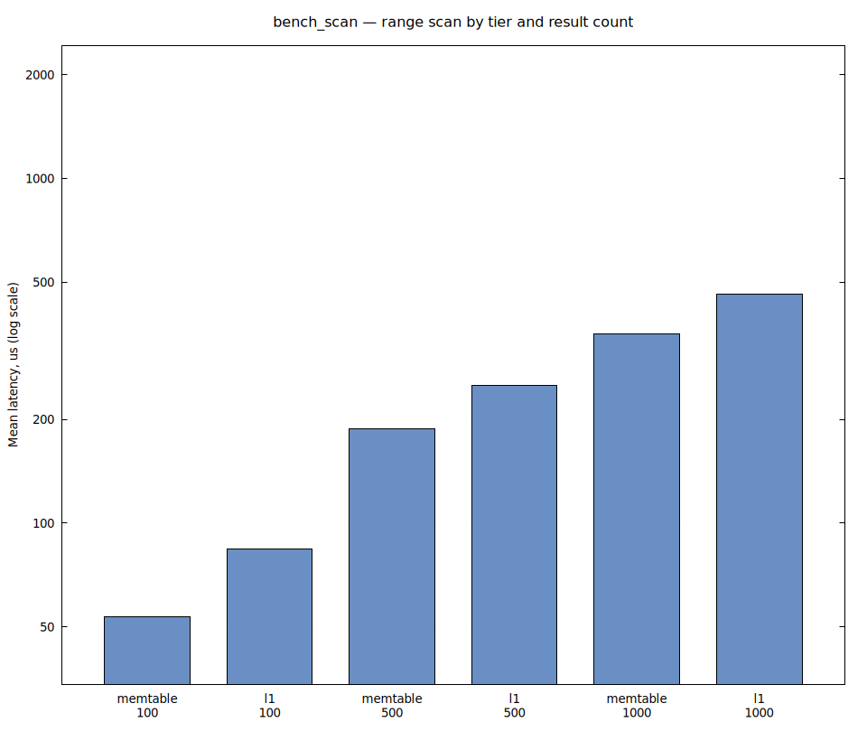

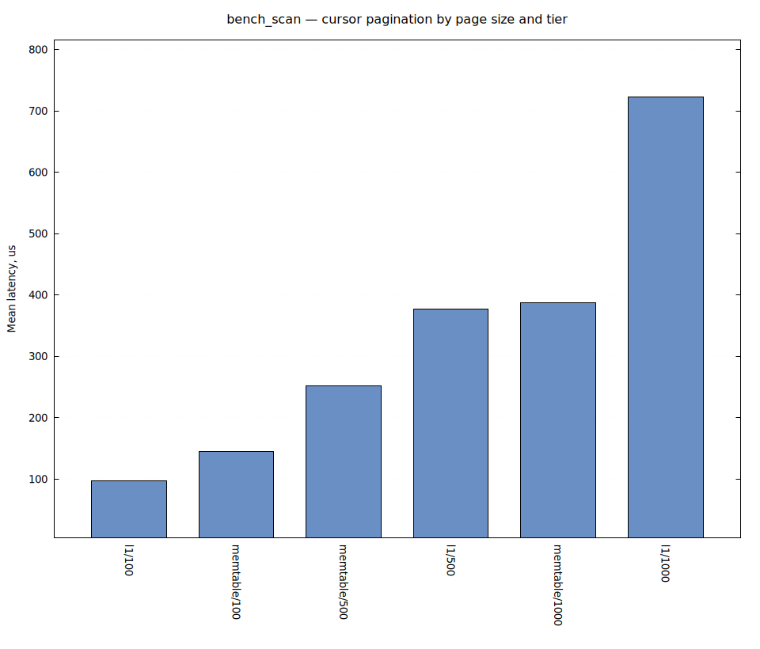

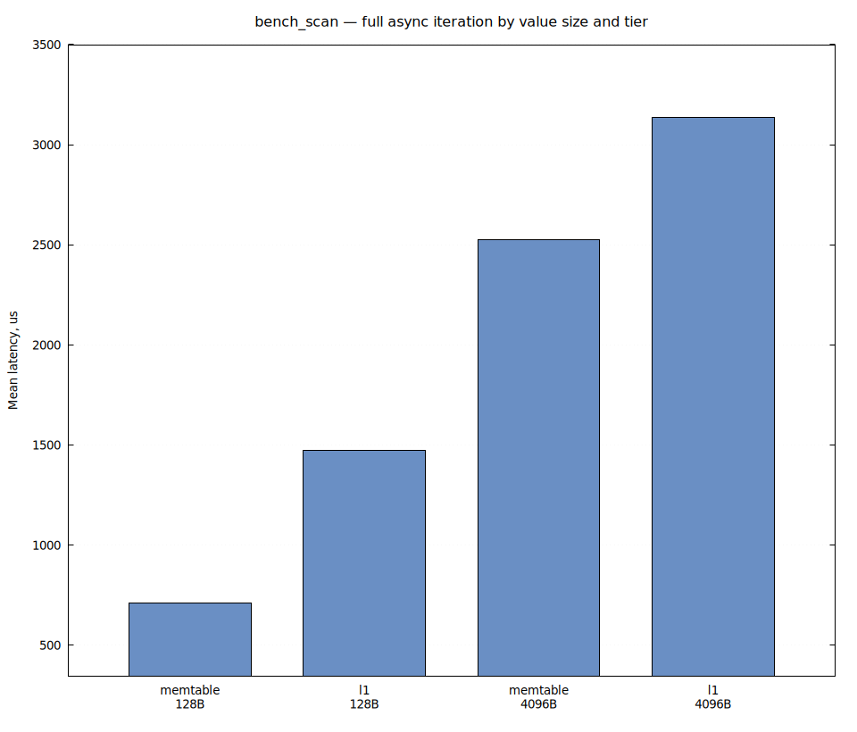

*One chart per scan type, and the prefix and range charts share an axis so the
two can be compared with each other. Sorted by value, each `memtable`/`l1` pair
at a given size lands on adjacent bars, so the 1.2x–1.6x ratio is the step
between neighbours. The cursor chart is a deliberate exception: sorted by value, `l1/100`
lands first and `memtable/100` second, which is the small-page inversion stated
above, and tier blocks would have put those two bars at opposite ends. The
trailing number is whatever that scan type varies — matching keys for `prefix`,
results returned for `range`, page size for `cursor`, value size for `iter`.*

## Mixed read/write workload

These cases run blended workloads — 80% reads with 20% writes, and an even
50/50 split — with the read set living in memory or on disk, reporting the
average cost per operation. (This is the suite run at the reduced sample size, so
its confidence intervals are wider than the rest.)

All four cases land within 2.4% of each other (2.257–2.310 ms per operation).
Neither the tier nor the read/write ratio makes a visible difference, and the
reason is the same in both cases: a write costs about 2.27 ms (the disk sync)
while a read costs a few
microseconds on either tier, so the writes utterly dominate the average. Even at
50% writes, the write half alone accounts for roughly 99.9% of the per-operation
time. The read tier and the read/write ratio would only start to matter to this
average at write fractions far lower than anything swept here.

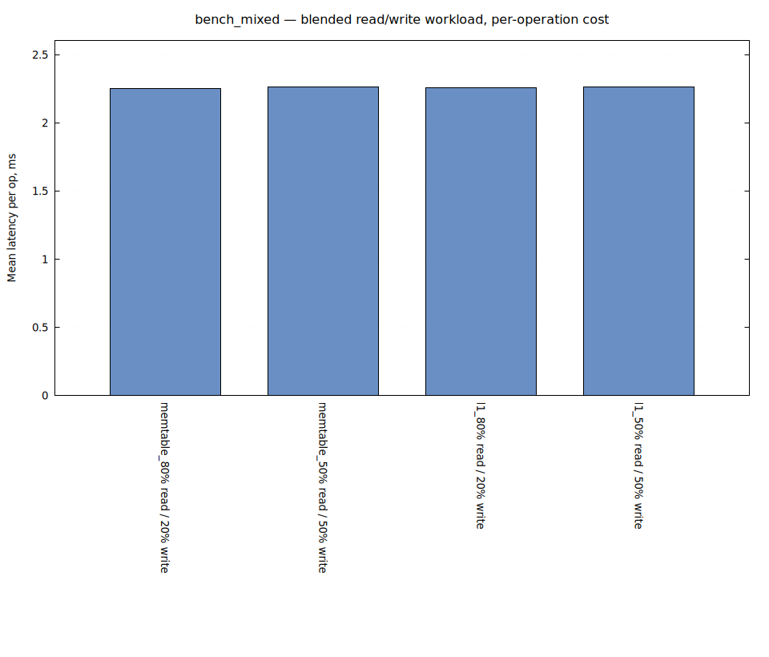

*Bar labels: `memtable`/`l1` = whether the pre-seeded read set lives in
memory or on disk; the percentages are the read/write split.*

## Write-ahead log

This suite breaks the write path apart: the durable WAL append on its own, the
serialization round-trip, the recovery scan, the full write throughput, and the
cost of tagging an entry with its namespace. The three pieces sit in three very
different cost bands, so they're shown as three separate charts below rather
than one crowded chart spanning six orders of magnitude.

The clearest result is how little of the write cost is anything *but* the disk
sync — and the cleanest way to see it is to turn the sync off. A durable append
costs 2.328 ms; the same append unsynced costs **1.55 µs**. The fsync is
**1,497x** the cost of everything else the WAL append does.

Everything else in this group is consistent with that. The full write path (WAL
plus value log plus in-memory index) measures 2.277 ms against the isolated
durable append's 2.328 ms — that is, the whole write came out 2.2% *cheaper*
than one of its own components, which is impossible and therefore informative:
the value log and memtable insert are below what these rows can resolve.
Namespace tagging agrees: 2.288 ms for the default namespace against 2.287 ms
for an arbitrary non-default one, indistinguishable (the previous run had them
31 µs apart the other way, which is the same noise). In other words, the disk sync *is* the
write path's cost: the per-write sync is a deliberate durability choice, and
this confirms it in measurement, not just in design intent.

Unsynced appends also show what payload size costs once the fsync is out of the
way, which is the one place in this report where it is visible rather than
swamped: 1.55 µs at 128 bytes, 2.48 µs at 4 KiB, 10.26 µs at 64 KiB. That is the
real shape of the write path underneath its durability guarantee.

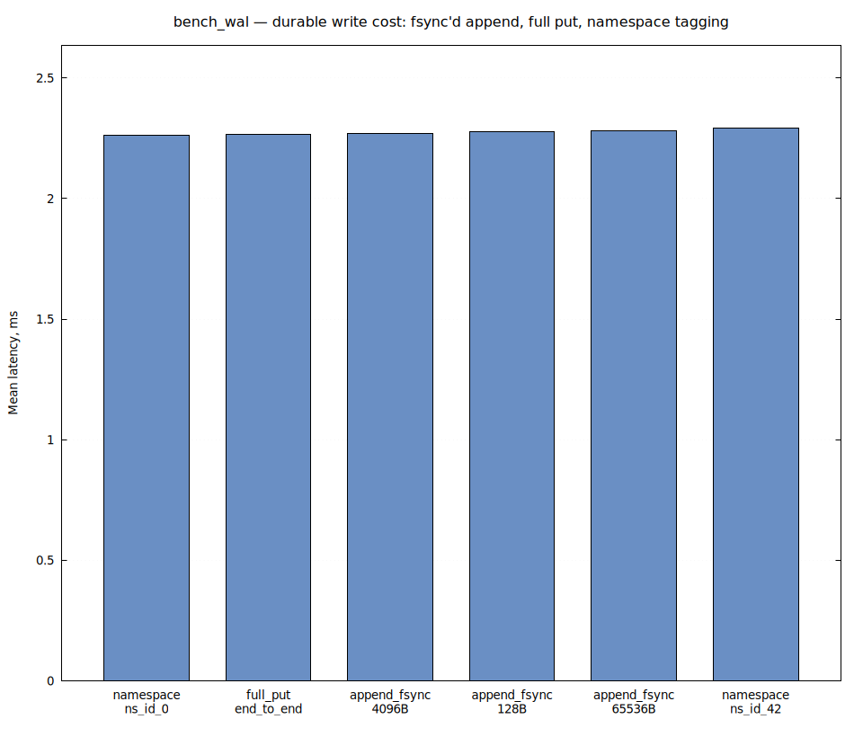

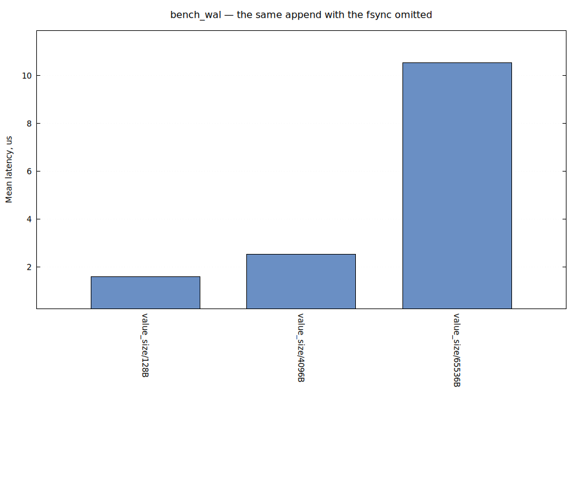

*Two charts rather than one, because at 1,497x apart the unsynced bars are
invisible next to the durable ones — the contrast is the ratio in the text, and
each chart's own axis is what makes its internal spread readable. The second
chart is also the only place in this report where payload size drives the shape.
Bar labels: `append_fsync` = a raw, durable WAL append in isolation;
`append_no_fsync` = the same append with the sync omitted, which is what the
rest of the write path costs; `full_put_throughput` = the entire write path
(WAL + value log + in-memory index) end to end; `namespace_overhead` = the same
raw append tagged with a namespace id (`ns_id_0` is the default namespace, `ns_id_42` an arbitrary
non-default one, to check tagging isn't adding cost).*

Serializing and deserializing a WAL entry, by contrast, is three to five
orders of magnitude cheaper than the sync itself — serializing runs 43 ns for a
128-byte entry up to 0.97 µs at 64 KiB, deserializing 14 ns to 537 ns, against
2.33 ms — so it's nowhere near the critical path.

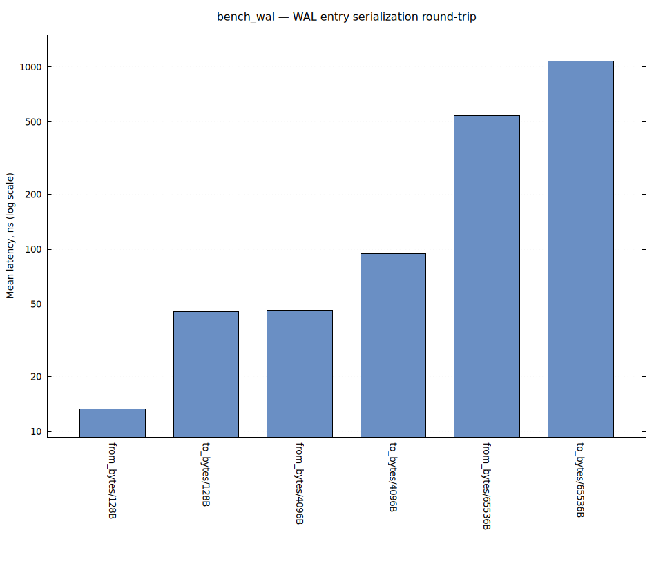

*Bar labels: `to_bytes` = serializing a WAL entry, `from_bytes` =
deserializing one back.*

The recovery scan, which reads entries back the way a restart would, runs at
about 3.8 million entries per second for small values — 259 µs for 1,000
128-byte entries, 1.31 ms for 5,000 of them, so the rate holds as the scan grows
— and 2.7 million/s at 4 KiB.

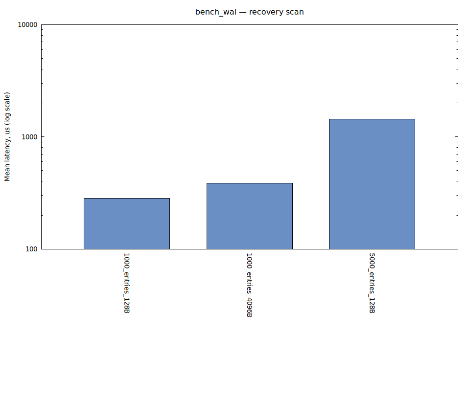

## Typed API

minnal_db offers a typed convenience layer that serializes and deserializes your
own types with zero-copy on top of the raw-bytes API. The question this suite
answers is what that convenience costs, and the answer is essentially nothing on
top of what the underlying operation already costs.

Typed writes and deletes land within noise of raw writes (2.281 ms and 2.263 ms
against the raw 2.272 ms) — the disk sync swamps everything else regardless of
which API you call. On the read side, a typed read shows a 2.76 µs
memory-to-disk step against the raw path's 2.85 µs, so the zero-copy
deserialization adds no tier penalty of its own. The typed iteration, range, and
prefix scans sit in the same 1.2x–1.7x on-disk-versus-memory band as their raw
counterparts, shrinking the same way as results grow (typed iteration: 1.66x at
100 keys, 1.38x at 1,000), so they inherit their tier sensitivity directly from
the underlying scan rather than from anything specific to the typed layer.

The keys-only operation is the one that behaves differently. Fetching just the
keys shows *no* memory-versus-disk gap at small key counts — at 100 keys the
on-disk case is marginally *faster* (261 µs against 263 µs in memory, i.e. the
two are indistinguishable) — and only opens up a gap (1.68x) at 1,000. That fits: fetching keys
never touches the value log, so at small counts the tier difference is too small
to clear the noise floor, and only becomes visible once there are enough keys
for it to accumulate.

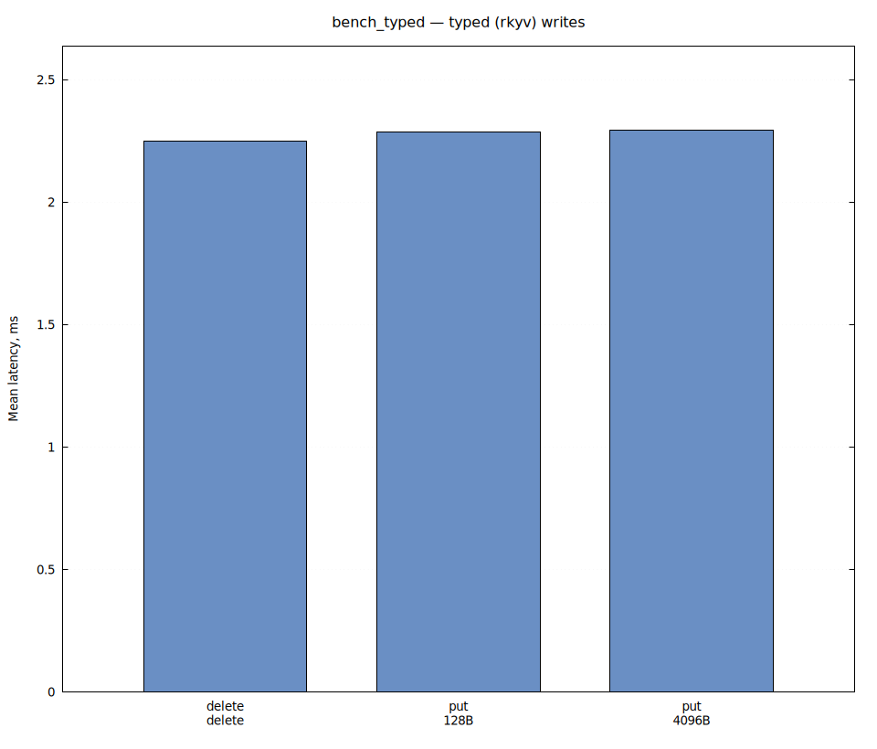

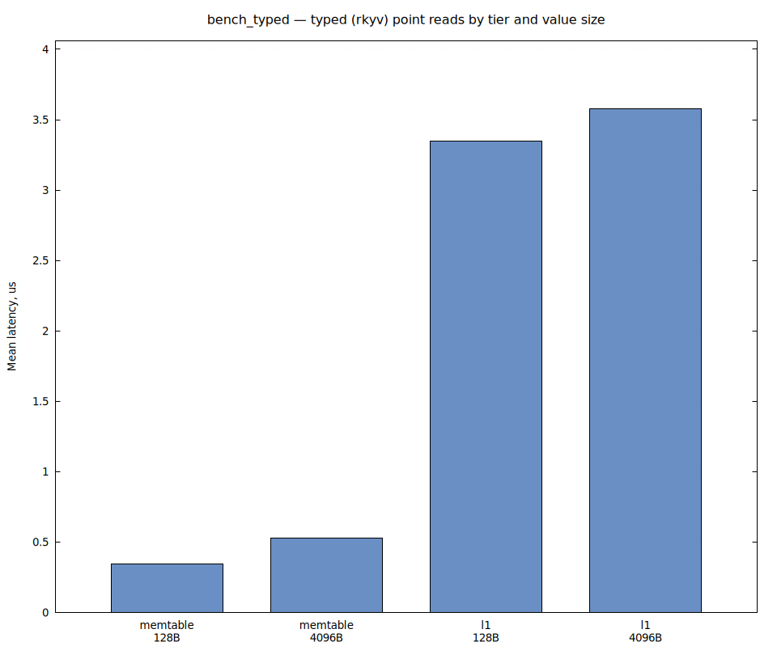

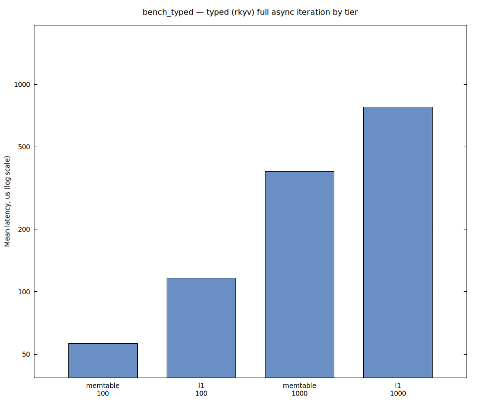

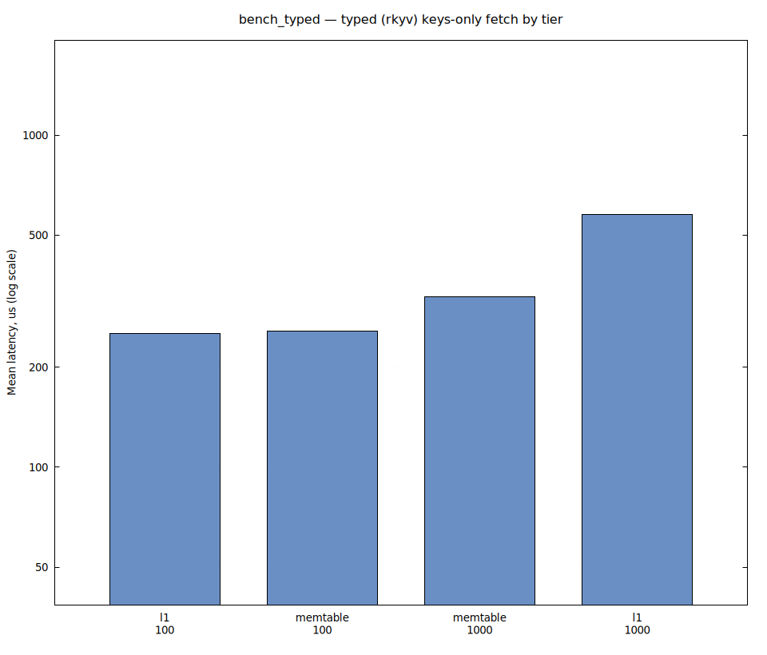

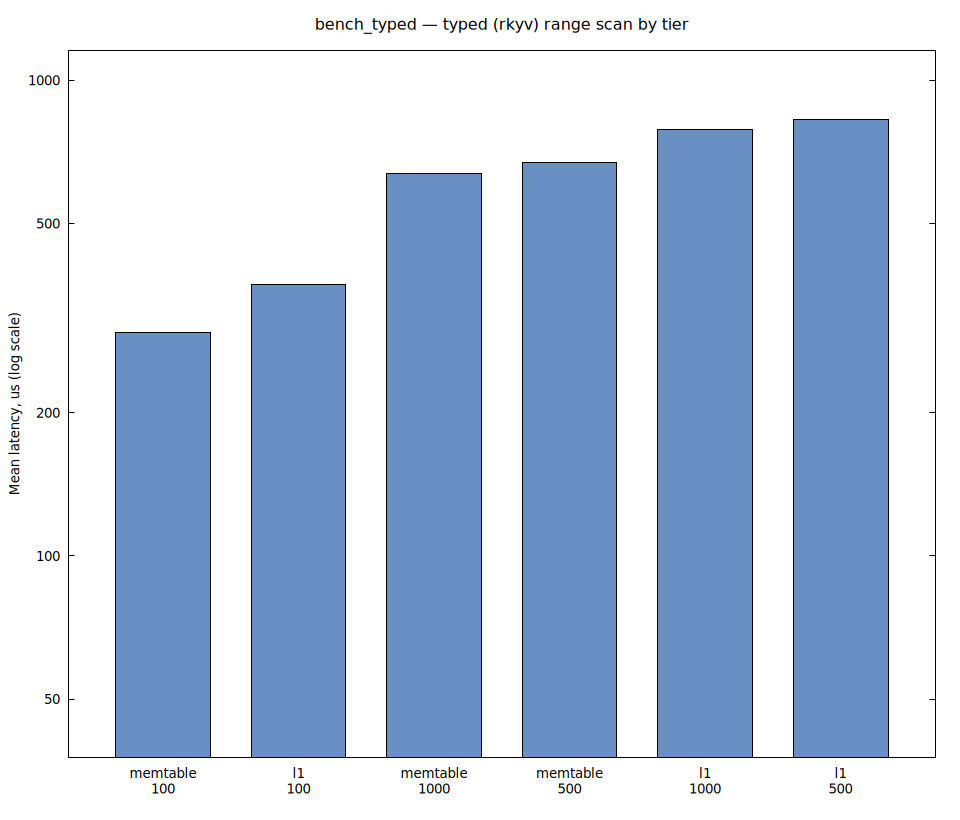

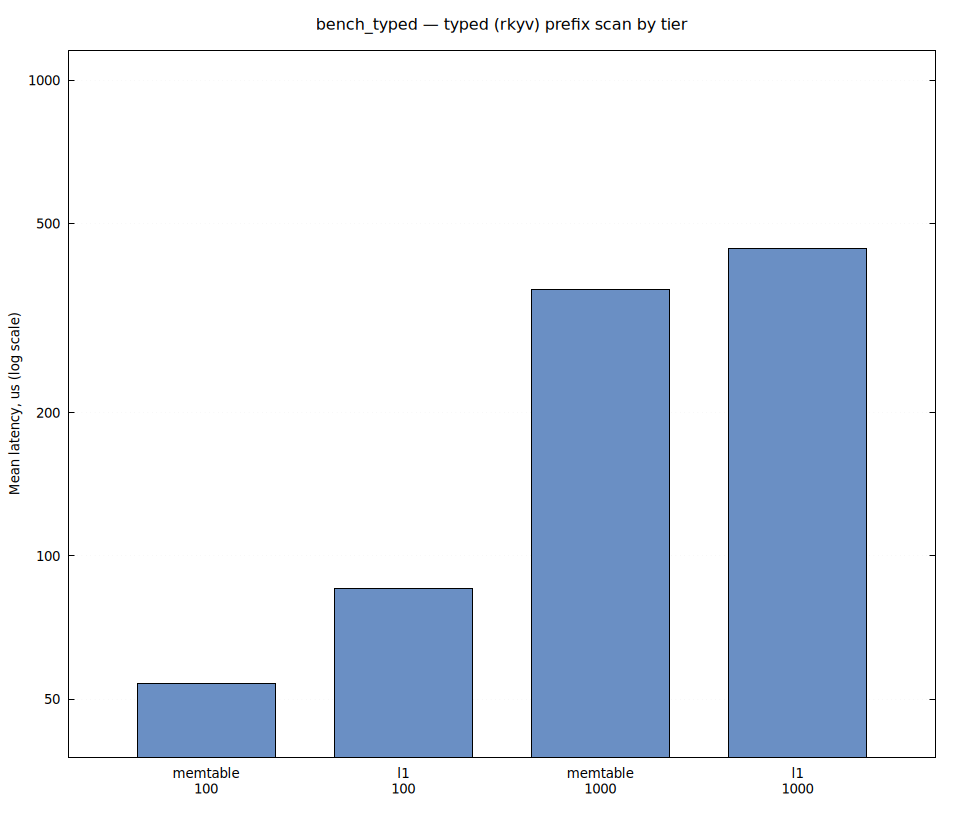

*The writes are fsync-bound milliseconds and the point reads are microseconds,
so they get their own charts; the four multi-key operations then get one chart
each, all four drawn on a single shared axis so they remain comparable with one
another. One operation per chart is what makes the tier ratio legible: sorted by
value, each `memtable`/`l1` pair falls on adjacent bars, so the tier step is the
gap between neighbours rather than something to hunt for across eighteen bars.

The keys-only chart is the one to look at twice — it is the only one where the
on-disk bar comes *first* (`l1/100` at 261 µs against `memtable/100` at 263 µs),
which is the no-tier-gap-at-small-counts result described above, and by 1,000
keys the usual order has returned. Bar labels:
`get`/`put`/`delete`/`iter`/`keys`/`range`/`scan_prefix` are the typed
operations, mirroring the raw-bytes API's method names; `memtable`/`l1` = in
memory vs. on disk, and the trailing number is the key or result count.*

## Field-index predicates

These benchmarks evaluate field-index queries — the bitmap-backed predicate
engine — over a hundred thousand rows across three indexed fields.

Equality lookups are cheap: a string-equality predicate runs at 11.4 µs, and
combining two equality predicates with AND or OR costs 33.1 µs. A *range*
predicate over an integer field is a different story entirely — 1.10 ms,
97x more expensive than equality and the single costliest operation in the suite
by a wide margin. Parsing overhead, by contrast, is negligible: evaluating a
query from its string form (730 µs) and evaluating an already-parsed one
(728 µs) differ by 0.3%, so the query parser is not where the cost lives.

One result runs against intuition: selectivity doesn't track cost. Sweeping a
compound query so that it matches progressively *fewer* rows makes it *slower*,
not faster — 11.3 µs at 25% of rows, 32.7 µs at 12%, and 465 µs at 6%. The most
selective case in the sweep is the slowest one by 41x. Narrowing the result set
here does not mean less work.

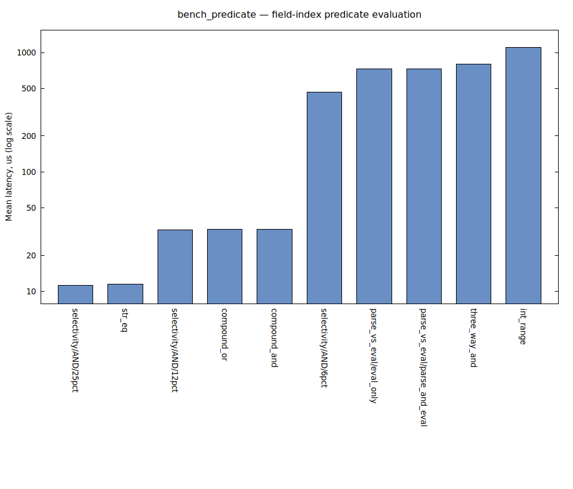

*Bar labels: `str_eq` = a string-equality predicate, `int_range` = an
integer-range predicate, `compound_and`/`compound_or` = two predicates
combined with AND/OR, `three_way_and` = three predicates combined,
`parse_vs_eval` = isolating query-string parsing cost (`parse_and_eval`)
from evaluating an already-parsed query (`eval_only`), `selectivity/AND/Npct`
= an AND query matching about N% of rows.*

## Paging through query results

A field-index query produces a bitmap of matching rows, and a paginated query
has to window it — return rows *n* through *n+limit*. This suite compares the
obvious way to do that (`iter().skip(n)`, walking the bitmap from the start) with
the one the engine uses (`iter_page(n)`, which skips whole bitmap containers
using their cached cardinality). It runs over 200,000 matching rows at a
50-row page, which is what a REST client paging through results actually does.

Fetching a single page is where the difference is starkest, and it grows with
how deep into the result set the page sits:

| Page offset | `iter().skip(n)` | `iter_page(n)` | Speedup |
|---|---:|---:|---:|
| 0 | 78.4 µs | 0.45 µs | 174x |
| 1,000 | 77.2 µs | 0.81 µs | 96x |
| 50,000 | 79.4 µs | 17.6 µs | 4.5x |
| 199,000 | 243.3 µs | 0.35 µs | 693x |

The 50,000 row is the weak case and the interesting one: that offset lands in
the *middle* of a container, so the walk within that one container still has to
happen — a cost bounded by the container's cardinality (at most 65,536), but not
eliminated. Offsets that land on a container boundary skip straight through, so
paging deep into the set (199,000) is actually *cheaper* than paging near the
front, because there is less of a partial container left to walk.

Walking every page of the result set end to end — the realistic client
behaviour — is **5.3x** faster overall (2.47 ms against 467 µs). That is the
quadratic-versus-linear difference: the old path re-walks the bitmap from the
start on every page, so its cost grows with the square of the number of pages,
while container-skipping stays linear.

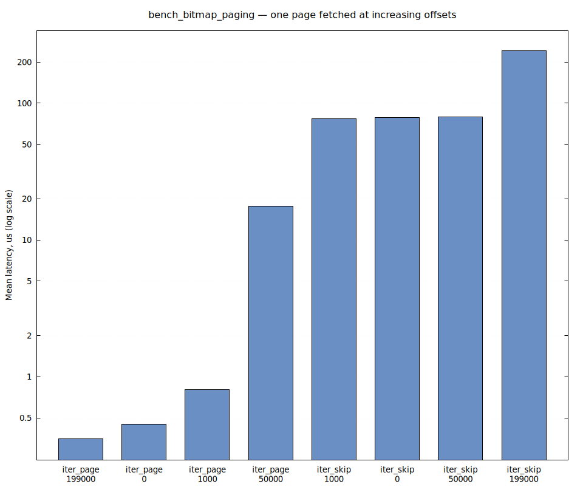

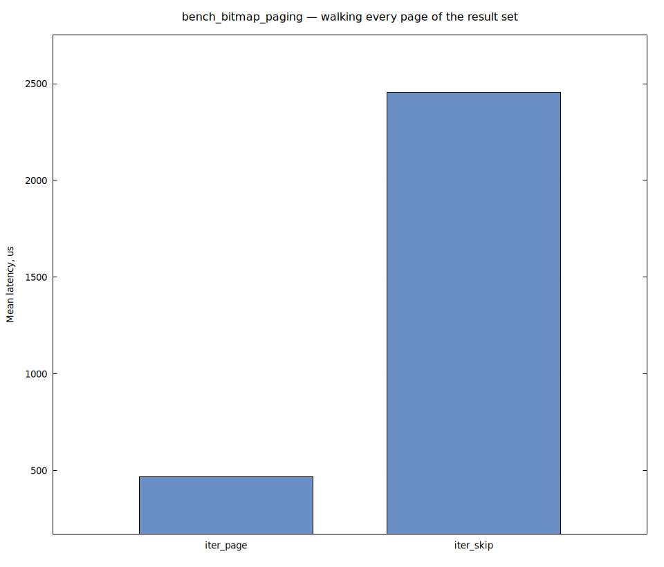

*The single-page chart keeps a log axis — it spans 693x, which is the finding —
while the full-walk chart is linear so the 5.3x is read directly off the axis.
`iter_skip` is the old path, `iter_page` the current one; the trailing number on
the first chart is the page offset.*

## Semantic search

These benchmarks measure the vector-search pipeline used for semantic queries,
run against the real cluster centroids bundled with the project (256 clusters)
and synthetic 768-dimension embeddings, so no external embedding service needs
to be running.

Scoring a batch of candidate documents against a query is fast and cheap —
1.7 µs for a hundred candidates up to 17.0 µs for a thousand, scaling linearly,
and roughly the same whether it's the coarse first pass (17.0 µs) or the more
precise second pass (15.7 µs). The extra precision of the second pass
costs nothing extra at this scale. Picking out which few clusters are worth
searching, the equivalent of choosing the right shelf before scanning it, takes
under 10 µs and barely changes whether 8 clusters are requested (8.8 µs) or 128
(9.3 µs).

A full end-to-end search got **29–44% faster** since the previous run, from the
semantic-search hot-path work (`e414cdb`, `d14d73e`, `2559786`): scoring
parallel over entries rather than clusters, per-document grouping by sort
instead of a hash map, buffered on-disk range reads, an O(n) first-pass cut, and
each query vector's sum computed once rather than once per probed cluster. A
4-vector query over 5,000 documents went from 2.25 ms to 1.56 ms, a 40-vector
one from 4.92 ms to 3.21 ms, and 8 chunks per document from 11.9 ms to 6.6 ms.
Ten times the query now costs 2.07x as much (2.19x before), and because the
first pass scans every probed chunk, eight times the chunks per document costs
4.22x (5.36x before).

For one intermediate commit the 40-vector case was the exception. The hot-path
rewrite moved Pass-1 estimator construction, one per probed cluster × query
vector, out of the old parallel per-cluster fold into a single-threaded
pre-pass, and each construction recomputed the query's 768-element sum, which
depends only on the query. At 40 vectors that was 2.9 ms of a 6.0 ms search
(+23% against the previous run). Computing the sum once per query vector
(`2559786`) cut the stage to 0.3 ms with bit-identical scores. Production embeds
one query vector, so it was never exposed; the concurrency fix (`6d38cc1`)
costs 2–5% on the single-threaded 1-chunk and 4-vector cases, which that change
recovered.
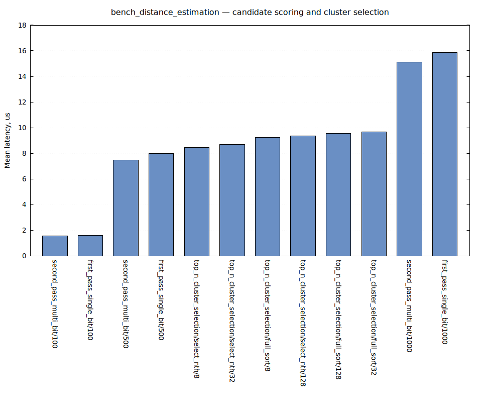

*`first_pass` is the coarse pass and `second_pass` the more precise one. Sorted
by value they interleave pairwise at every candidate count, and that
interleaving is the finding: the extra precision costs nothing at this scale.*

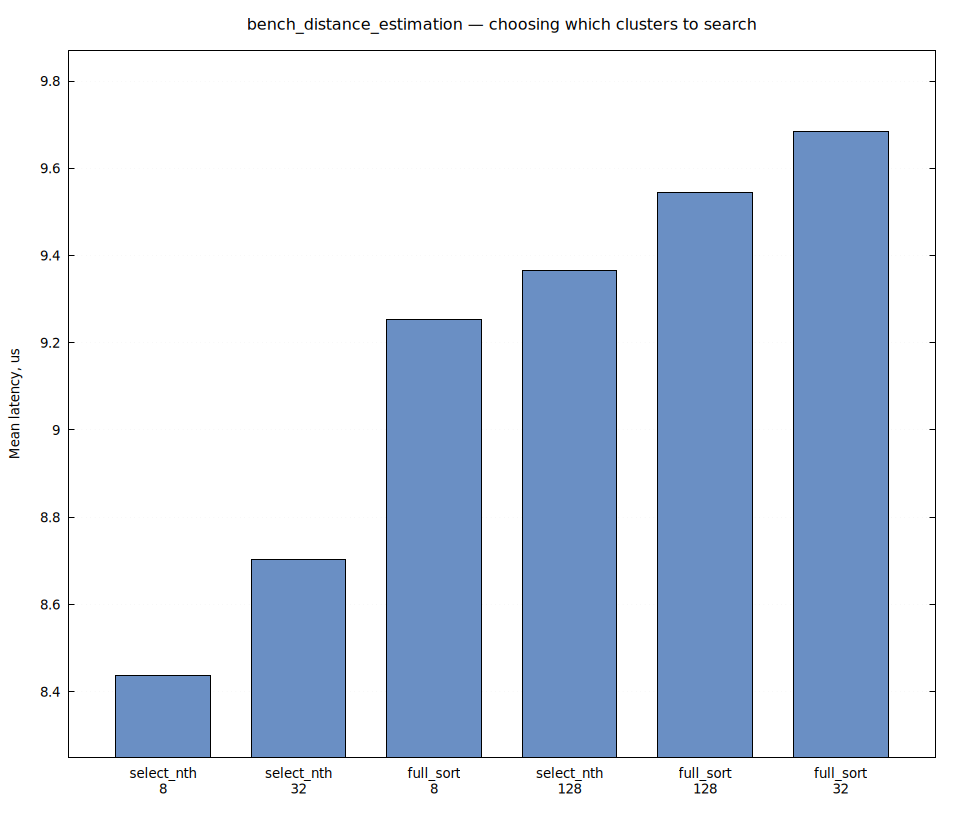

*`select_nth` is the current cluster-picking algorithm, `full_sort` the older
sort-everything baseline it is measured against; the trailing number is how many
clusters were requested. `select_nth` occupies the three cheapest bars and
`full_sort` the three dearest, and `full_sort` is flat because it sorts all 256
clusters whatever you ask for.*

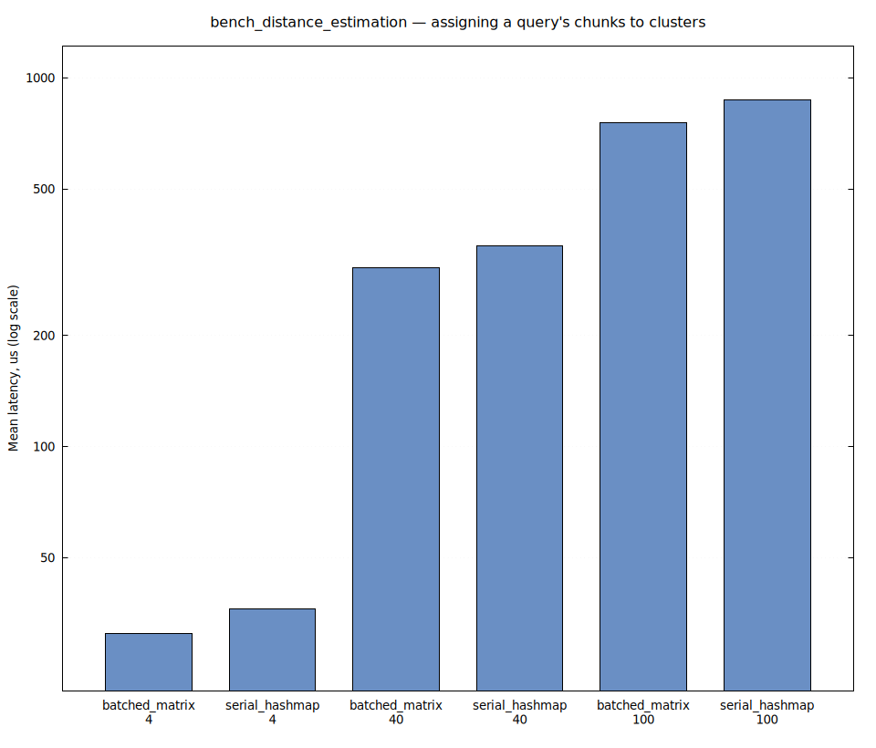

*Two ways of assigning a multi-chunk query to its nearest clusters, paired at
each query size. `serial_hashmap` walks the query's chunks one at a time,
looking each one up individually in a scattered `HashMap` of clusters;
`batched_matrix` — the current approach — scores all of a query's chunks at once
against a single contiguous matrix of cluster centroids. That contiguity is what
produces the speedup, through better cache locality and more vectorizable math,
and the chart shows it as the gap within each adjacent pair.*

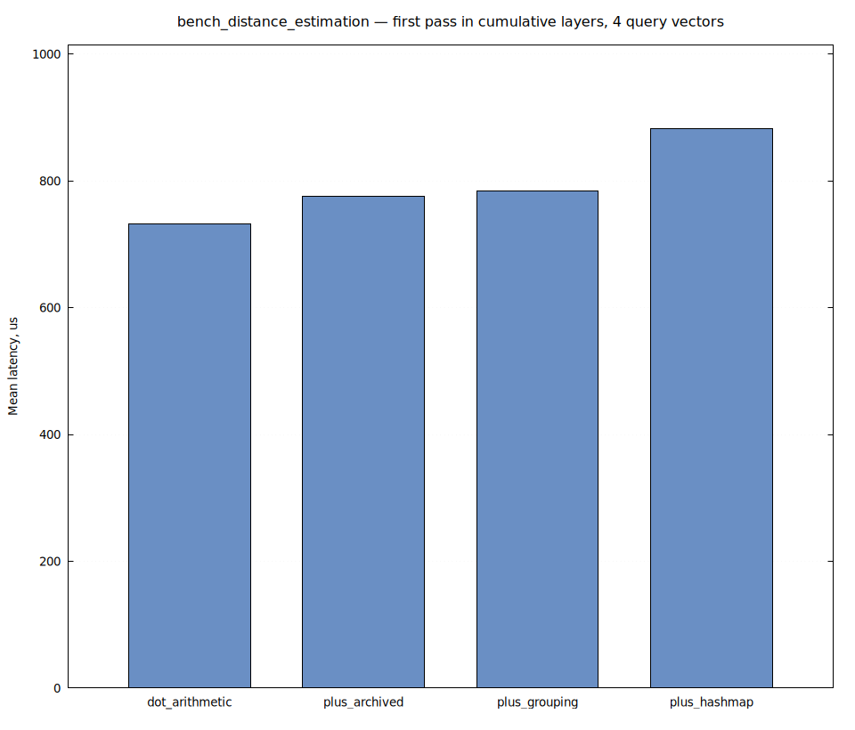

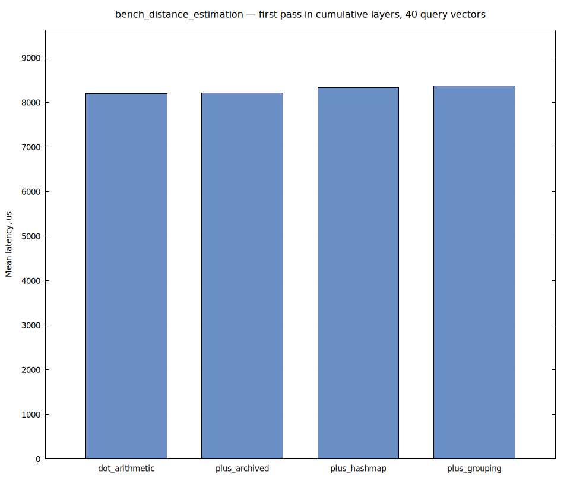

*One chart per query size, each on a linear axis from zero, because on the
single log axis the previous run used the layer steps were invisible. The first
pass in cumulative layers, single-threaded, starting from the bare distance math
(`dot_arithmetic`), then adding the cost of reading the on-disk format
(`plus_archived`), then production's per-document grouping (`plus_grouping`: one
row per entry, sorted by document id and folded). The fourth bar,
`plus_hashmap`, is the hash-map fold that grouping replaced, kept for
comparison. Grouping adds 22 µs over reading the archive at 4 query vectors and
57 µs at 40, where the map added 109 µs and 172 µs. At 40 vectors every layer is
within 2%, the size of run-to-run noise, so read that chart for the ordering
only.*

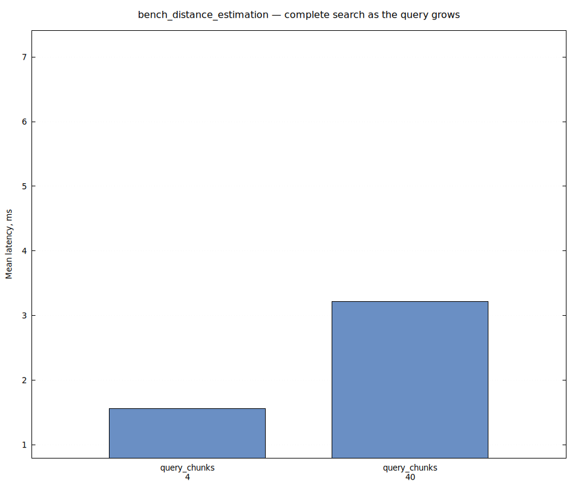

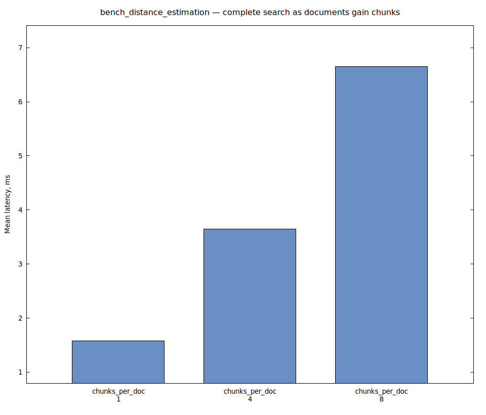

*The two end-to-end sweeps, on a shared millisecond axis so they can be read
against each other: the query-length sweep is sub-linear (ten times the query
for 2.07x the cost) while the chunk sweep is not (eight times the chunks for
4.22x), because Pass 2 re-ranks a capped candidate set but Pass 1 scans every
probed chunk.*

---

## How this compares to the README's published figures

The README publishes single-threaded ballpark throughput figures, and the
measurements here corroborate them:

| Operation | README ballpark | Measured here |
|---|---|---|
| Write (small values, single writer) | ~400–500 ops/s | 440 ops/s — in range |
| `merge` (small values, single writer) | ~400–500 ops/s | 442 ops/s — in range |
| Read (warm, from memory) | 1M–2.5M ops/s | 2.69M ops/s — above range |
| Read (cold, from disk) | 100k–300k ops/s | 311k ops/s — just above range |
| Range / prefix scan | bounded by result size | consistent — see the Scans section |

Write throughput lands squarely in the published range. The WAL is synced on
every write by design — only the value log's sync cadence is tunable — so 440
writes per second is the expected, sync-bound ceiling for a single writer at
2.27 ms per sync on this drive, not a number a configuration change could raise.
The unsynced WAL benchmark puts a number on what that guarantee costs: without
the sync the same append runs 1,497x faster. `merge` inherits exactly that
ceiling, which is the point of its own section above.

The cold-read figure is corroborated twice over. Two different benchmarks — one
in the reads section, one in the point-lookup section — both measure a
small-value lookup forced onto disk, using different setups, and arrive within
1.6% of each other (311k and 316k ops/s). Read throughput now sits slightly
above the top of the README's ballpark on both tiers; see *How much a repeat run
moves* for why a 5-8% cross-run shift in reads is not, by itself, a code
change.

Sharding gives concurrent writers real headroom beyond that single-writer
figure: writes fan out across the buckets (16 by default), so at 440 writes per
second per writer, sixteen writers spread one-per-bucket would land somewhere
around 7k writes per second. That aggregate concurrent number isn't measured
here — this whole report covers single-threaded latency only — and would be
worth a dedicated concurrent-writer benchmark if it's needed.
