# minnal_db benchmarks

How fast the `minnal_db` engine is at the things an application does with it:
writing, reading, scanning, querying a field index, and running a semantic
search. Every number is a single-threaded latency measured on one machine
(below), so read the absolute values as specific to that machine. The
comparisons — memory against disk, small values against large ones — carry over
to other hardware much better than the raw microseconds do.

## Summary

| What | Typical cost | Section |
|---|---|---|
| A durable write (`put`, `delete`, `merge`) | 2.3 ms, whatever the value size up to 64 KiB | [Writes](#writes) |
| Reading one key from memory | 0.3–0.6 µs | [Reads](#reads) |
| Reading one key from disk | 3.2–3.4 µs, barely growing with store size | [Reads](#reads) |
| Scanning 1,000 keys with their values | 0.3–0.5 ms | [Scans](#scans) |
| A field-index equality query over 100,000 rows | 11–33 µs | [Field-index queries](#field-index-queries) |
| A field-index range query over 100,000 rows | 0.5–1.1 ms | [Field-index queries](#field-index-queries) |
| A semantic search over 5,000 documents | 1.3–3.7 ms, excluding the embedding call | [Semantic search](#semantic-search) |

The one number that shapes everything else: **a write costs 2.3 ms because it
waits for the disk to confirm the data is safe** (an fsync). The WAL append
itself, without the fsync, takes 0.4 µs. That is a deliberate choice — a write that
returns has survived a power cut — and it caps the database at about 440 writes
per second on this drive. Adding writer threads does not raise that ceiling,
because writes fsync one at a time.

## Terms used here

- **In memory / on disk.** New writes land in an in-memory table (the
  *memtable*). As it fills, it is flushed to sorted files on disk
  (*SSTables*; the benchmarks call the on-disk level *L1*). A long-running
  database holds most of its keys on disk, so every read benchmark measures
  both.
- **Value log.** Values are stored separately from keys, in an append-only
  value log. The key structures hold a pointer into it. Reading a value is one
  extra disk read whichever tier holds its key.
- **WAL (write-ahead log).** Every write is first appended to the WAL and
  fsynced. After a crash, the WAL is replayed to restore anything not yet
  flushed.
- **fsync.** The system call that waits until the drive has made data durable.
  It is the dominant cost of every write.
- **Miss.** A lookup for a key that does not exist.

## Setup

| | |
|---|---|
| Machine | AMD Ryzen 9 9950X3D (16 cores), 96 GB RAM, NVMe SSD, bare metal |
| OS | Ubuntu 26.04, Linux 7.0.0-34 |
| Rust | 1.96.0 |
| Code | commit `3bd0710`; the WAL suite with `benches/bench_wal.rs` as committed alongside this report |
| Date | 2026-10-01 |

To reproduce everything, including the charts:

```sh
minnal_db/docs/benchmarks/tools/run_report.sh    # about 100 minutes; run on an idle machine
```

It runs `cargo bench -p minnal_db --all-features`, takes Criterion's mean for
every case, and redraws the charts in this report from
`docs/benchmarks/tools/charts.json`. Criterion's own detailed reports land in
`target/criterion/*/report/index.html`. Every figure here is Criterion's mean,
with its default settings (100 samples, 95% confidence intervals). The mixed
read/write suite uses 20 samples, because it re-creates thousands of durable
keys before each sample.

**How far to trust a number.** Repeat runs on this machine agree to about ±1.5%
for writes, and ±5% for CPU-bound work such as queries and search scoring. Some
CPU-bound cases have moved 20–30% between runs of identical code, and
sub-microsecond cases swing 20–40% if anything else is running. Treat a
difference under 10% between two runs as noise unless the code changed.

---

## Writes

Every write is durable when it returns: the WAL is fsynced before the call
comes back. There is no batching, and no way to turn the sync off per call. So
a write's cost is the drive's fsync time, and value size hardly matters:

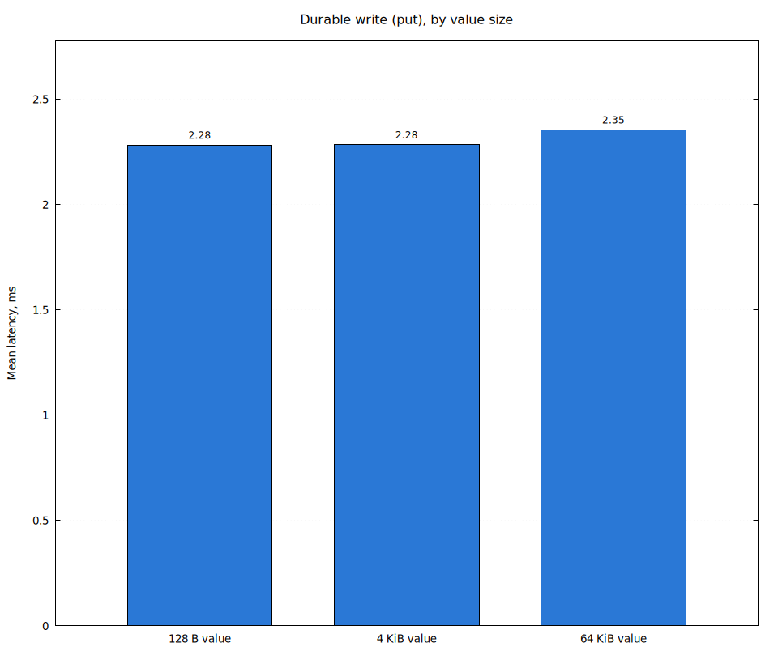

A 64 KiB value is 512 times the data of a 128-byte one and costs 3.2% more
(2.359 ms against 2.286 ms).

The chart below shows what the fsync costs on its own. It times a single WAL
append with and without the sync. Synced, an append takes 2.3 ms. Without the
sync it takes 0.39 µs — the fsync is about 6,000 times everything else the
append does. Only in the unsynced case does value size show up at all: 0.39 µs
at 128 bytes, 1.0 µs at 4 KiB, 7.8 µs at 64 KiB. Both cases append to a WAL
file that already exists, as production does; creating the file is not timed.

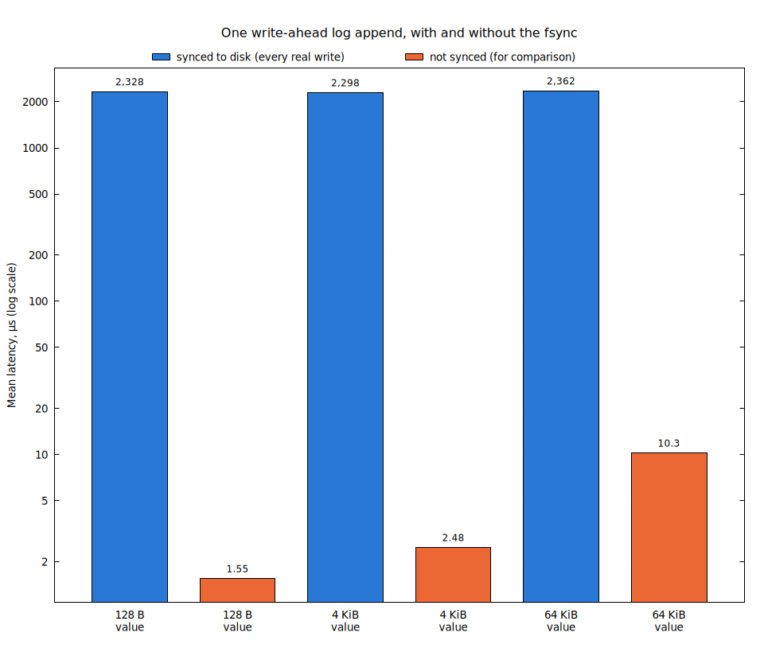

*Log scale: the synced bars are 300 to 6,000 times taller than the unsynced
ones. Production writes always sync; the unsynced case exists only to measure
the rest of the path.*

Other write-path measurements:

- **The full `put`** (WAL, value log and memtable together) measures 2.292 ms.
  That is within noise of the WAL append alone, so the value-log write and
  memtable insert are too small to see next to the fsync.
- **Namespaces cost nothing.** Writing to the default namespace and to a named
  one measure 2.27 and 2.30 ms, within noise.
- **Mixed read/write workloads cost the same as pure writes.** With 80% or 50%
  reads, from memory or from disk, every case lands between 2.25 and 2.30 ms per
  operation. A read costs a few microseconds against a write's 2.3 ms, so the
  writes set the average.
- **Encoding a WAL entry** takes 42 ns (128 B) to 1.1 µs (64 KiB), and decoding
  it 14 ns to 0.54 µs.
- **Replaying the WAL after a crash** reads about 3.9 million small entries per
  second (1,000 entries of 128 bytes in 0.26 ms), and 2.7 million per second at
  4 KiB.

### What `merge` costs over `put`

`merge` is the atomic read-modify-write: it reads a key, runs your closure on the
old value, and writes the result, while holding a per-key lock so no other write
to that key can land in between. Compared with a plain `put`, it does three
extra things: a read, the lock, and your closure. Those extras are timed
separately, because next to a 2.3 ms fsync they are too small to show up in the
write latency:

| Extra work `merge` does | Mean |
|---|---:|
| Reading the current value (a 2 KiB `get` from memory) | 433 ns |
| Taking the per-key lock (hash plus uncontended lock) | 48 ns |
| The closure: increment a counter | 9.9 ns |
| The closure: insert into a 2 KiB sorted set | 175 ns |

That adds up to 0.5–0.7 µs, about 0.03% of the fsync. The full operations,
measured directly, cannot tell merge and put apart:

| Operation | Mean |
|---|---:|
| `put`, 2 KiB | 2.323 ms |
| `delete`, 2 KiB | 2.294 ms |
| `get` then `put` by hand, 2 KiB sorted set (no atomicity) | 2.286 ms |
| `merge`, 2 KiB sorted set | 2.307 ms |
| `put`, 8 B | 2.308 ms |
| `merge`, 8 B counter | 2.278 ms |

In this table `merge` measures slightly *faster* than `put`, which cannot be
real: a merge is a put plus extra work. That tells you the 2% spread between
these rows is noise, and it is why the extra work is timed separately above.
The practical conclusion: the atomicity of `merge` is free. It stays as cheap as
a `put` unless your closure does something expensive.

## Reads

Reading a key from memory takes well under a microsecond. Reading the same key
from disk adds about 2.9 µs: the check against the file's bloom filter, a
search of its index, and the read from the value log. That step is constant for
small and medium values. At 64 KiB the value itself becomes big enough to add
time on both tiers.

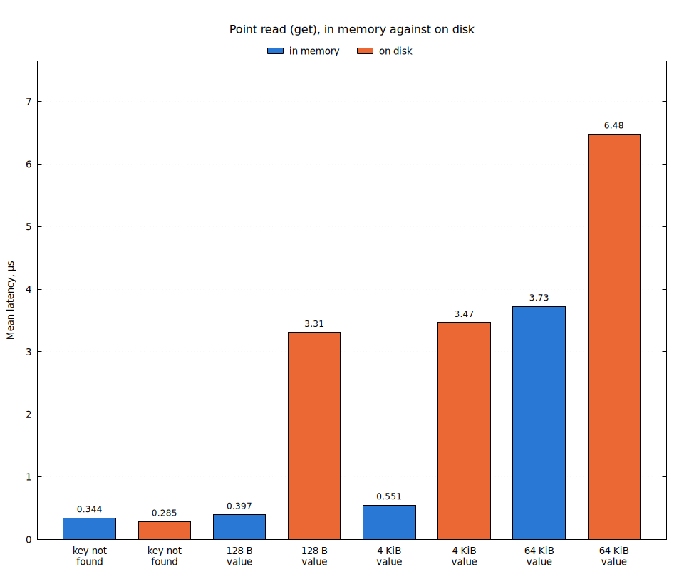

*Each pair is one kind of read, in memory (blue) then on disk (orange). The
first pair is a lookup for a key that doesn't exist; there, disk is faster than
memory — see below.*

### As the store grows

This benchmark repeats the lookup with 1,000 to 100,000 keys in the store (16-byte values), and adds
a third case that alternates on every call between a key in memory and a key on
disk.

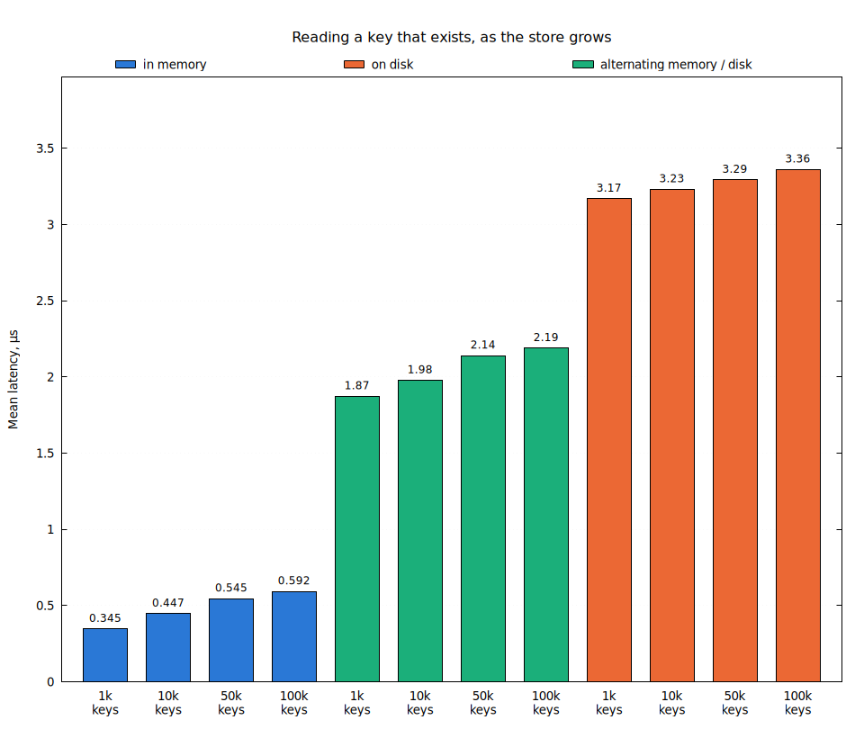

A read from disk barely slows as the store grows: 3.17 µs at 1,000 keys and
3.36 µs at 100,000, 6% more for 100 times the keys. The on-disk lookup
first rules files out by key range and bloom filter, then searches only a small
bounded section of the file, so its work does not grow with file size. A read
from memory rises 70% over the same range (0.35 to 0.59 µs), because the
in-memory table is a skip list whose search deepens as it grows. Memory is
still 6–9 times faster.

The alternating workload costs 6–12% more than the average of the two tiers
would predict, and the gap widens with store size. We have not measured why.
The two tiers use different code paths, and switching between them on every call
may cost cache locality.

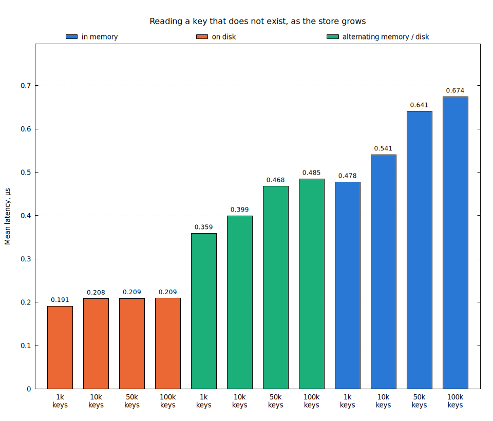

For a missing key the order flips: **disk is 2.5 to 3.2 times faster than
memory**. On disk, a bloom filter usually proves a key is absent without reading
anything else, so a miss stays at about 0.2 µs at any store size. The in-memory
table has no such filter. To prove a key is absent it walks the skip list just as
far as it would to find one. So an in-memory miss costs about what an in-memory
hit does, and grows the same way (0.48 to 0.69 µs).

## Scans

Four ways to read many keys at once, each measured in memory and on disk. On
disk, a scan costs 1.1 to 1.7 times the in-memory scan. The ratio shrinks as
the result grows, because most of the on-disk extra is a fixed setup cost per
scan.

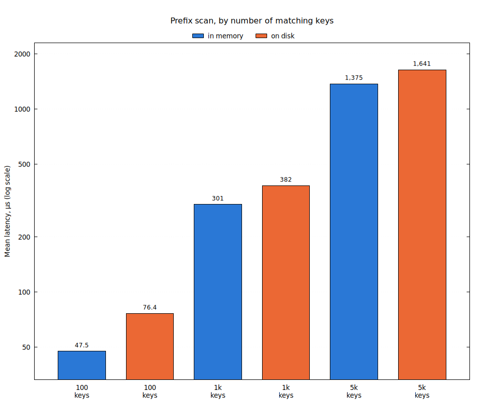

*Prefix scan: all keys starting with a given prefix, returned with their
values. On disk costs 1.61x memory at 100 keys and 1.19x at 5,000. Keys are 128
bytes here; 32-byte keys measure within 5% of these.*

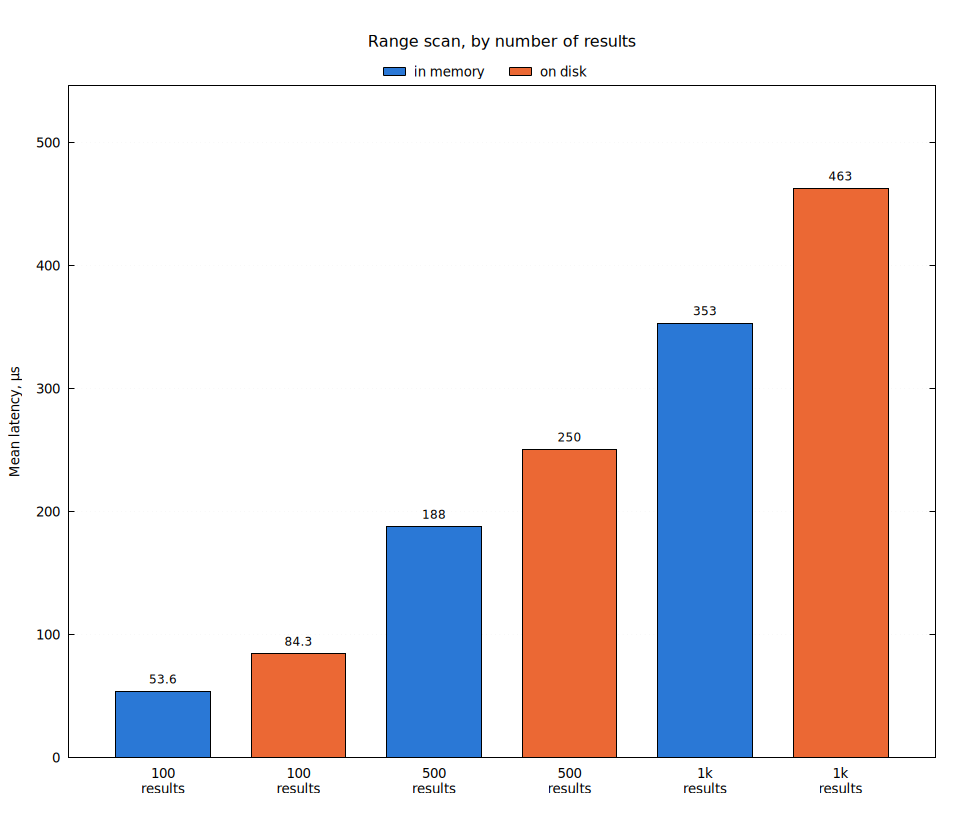

*Range scan: all keys between a start and end key, from a store of 2,000. On
disk costs 1.66x memory at 100 results and 1.35x at 1,000.*

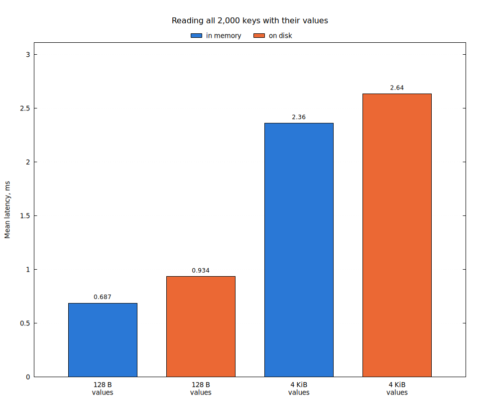

*Reading all 2,000 keys with their values. On disk costs 1.36x memory with
128-byte values and 1.12x with 4 KiB values. The larger the values, the more of
the time goes into reading them from the value log. That cost is the same on
both tiers.*

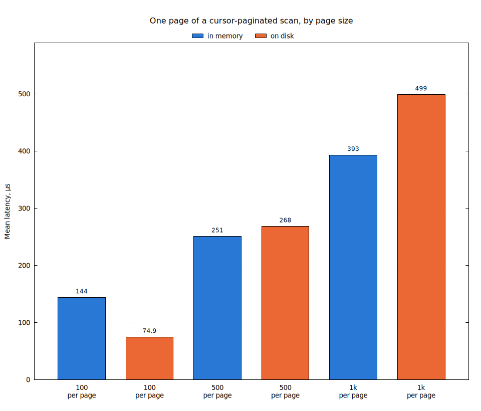

*Cursor pagination: the first page of a paginated scan over 1,000 keys with
256-byte values. This is how the REST API's list endpoints read.*

Cursor pagination is the one scan where the tiers swap. At 100 keys per page,
disk (72 µs) is almost twice as fast as memory (143 µs). At 500 per page they are close (267 µs on disk, 242 µs in memory), and at
1,000 (the whole store) disk is slower, as expected. We have not established why
small pages favour disk.

A related cost is visible in the memory numbers. A 100-key page costs 37% of
reading all 1,000 keys. Each page currently collects the keys from the cursor to
the end of the range before it keeps the first `limit` of them. It loads values
only for the page, but it still walks every key after the cursor. Bounding that
walk is a known follow-up.

## Typed API

The typed API (`put_typed`, `get_typed`, and so on) serialises your own Rust
types with `rkyv`, on top of the byte-oriented API. For single-key operations
it adds nothing measurable:

| Operation | Raw bytes | Typed |
|---|---:|---:|
| `put`, 128 B | 2.286 ms | 2.272 ms |
| `put`, 4 KiB | 2.317 ms | 2.283 ms |
| `get` from memory, 128 B | 0.37 µs | 0.32 µs |
| `get` from disk, 128 B | 3.25 µs | 3.10 µs |
| `get` from disk, 4 KiB | 3.42 µs | 3.39 µs |

The typed rows come out slightly faster than the raw ones. That is within the
noise, not a real speed-up.

Scans cost more typed, because every returned pair is deserialised:

| Scan | Raw bytes | Typed | Extra |
|---|---:|---:|---:|
| range, 100 results, in memory | 52 µs | 56 µs | +7% |
| range, 1,000 results, in memory | 338 µs | 364 µs | +8% |
| range, 100 results, on disk | 86 µs | 86 µs | 0% |
| range, 1,000 results, on disk | 457 µs | 458 µs | 0% |
| prefix, 100 keys, in memory | 47 µs | 55 µs | +15% |
| prefix, 1,000 keys, in memory | 301 µs | 369 µs | +23% |
| prefix, 100 keys, on disk | 76 µs | 85 µs | +11% |
| prefix, 1,000 keys, on disk | 382 µs | 440 µs | +15% |

One typed operation is slow for a structural reason. `keys_typed`, which lists
keys without values, takes about 250 µs even for 100 keys, in memory or on disk.
That is about four and a half times as long as reading the same 100 keys *with*
their values (56 µs). Key listing goes through the same full-store merge that value-log
garbage collection uses. Reading with values uses the faster range scan. Until
that changes, a range or prefix scan is the cheaper way to list keys.

## Field-index queries

A field index maps each value of a field to a compressed bitmap of the rows
holding it. A query combines those bitmaps. This benchmark queries 100,000 rows
with three indexed fields:

| Field | Type | Values |
|---|---|---|
| `status` | string | four values, each on 25% of rows |
| `active` | boolean | true on 50% of rows |
| `age` | integer | 18 to 80, spread evenly (63 distinct values) |

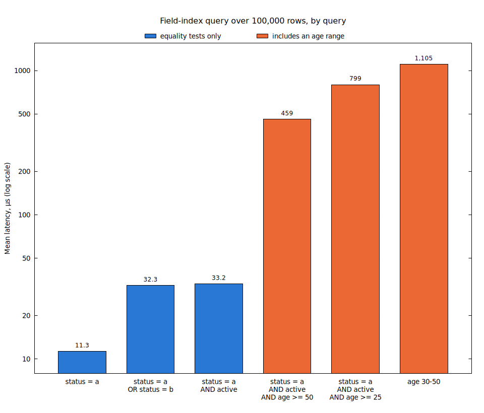

*`status = a` is `status = 'active'`, and `active` is `active = true`.*

The cost depends on **how many bitmaps the query has to load**, not on how many
rows it matches:

- **An equality test loads one bitmap.** `status = 'active'` takes 11 µs.
  Combining two equality tests with AND or OR takes 32–33 µs.
- **A range loads one bitmap per distinct value in the range.** `age >= 50` covers
  31 ages, so it merges 31 bitmaps. `age >= 30 AND age <= 50` is evaluated as
  two ranges, one over 51 values and one over 33, and then intersected. At
  1.1 ms it is the most expensive query here, about 100 times an equality test.

So adding a range to a query makes it slower even when it narrows the result:
`status = 'active' AND active = true` matches 12% of rows in 32 µs, and adding
`AND age >= 50` halves that to 6% but takes 459 µs. For a field queried by
range, fewer distinct values (bucketing ages into decades, say) make the query
cheaper.

Parsing the query text is negligible. A three-condition query takes 730 µs
parsed from text and 725 µs pre-parsed.

## Paging through query results

A query result is a bitmap of matching rows. Returning a page means skipping
the rows before it. Bitmaps store rows in containers of up to 65,536, each of
which records how many rows it holds. The engine uses those counts to skip whole
containers without opening them. The simple alternative, stepping through the
rows one by one, decodes every container it passes into a list, so it pays for
a full 65,536-row container even on the first page. One page of 50 rows, from a
result of 200,000:

| Page starts at row | Stepping through rows | Skipping containers (used) |
|---|---:|---:|
| 0 | 77 µs | 0.45 µs |
| 1,000 | 78 µs | 0.82 µs |
| 50,000 | 80 µs | 17.5 µs |
| 199,000 | 242 µs | 0.35 µs |

Container skipping still steps through the rows *inside* the container where the
page starts. Row 50,000 is 50,000 rows into its container, which is why that page
costs more than the others.

Paging through a whole 20,000-row result, 200 rows at a time (100 pages), takes
0.47 ms with container skipping and 2.46 ms by stepping through rows, which
starts again from the first row on every page.

## Semantic search

A semantic search runs in two passes. Pass 1 picks the clusters nearest to the
query and scores every document chunk stored in them with compact 1-bit
vectors. Pass 2 re-scores the best candidates with more precise vectors. (See
[Semantic-Search-Architecture.md](src/semantic_search/report/Semantic-Search-Architecture.md).)
This benchmark runs the full search over an in-memory store of 5,000
documents. It uses the project's bundled 256 cluster centroids, synthetic
768-dimension vectors, the default settings (64 clusters probed), and a query
shaped like production's: one vector for the whole query.

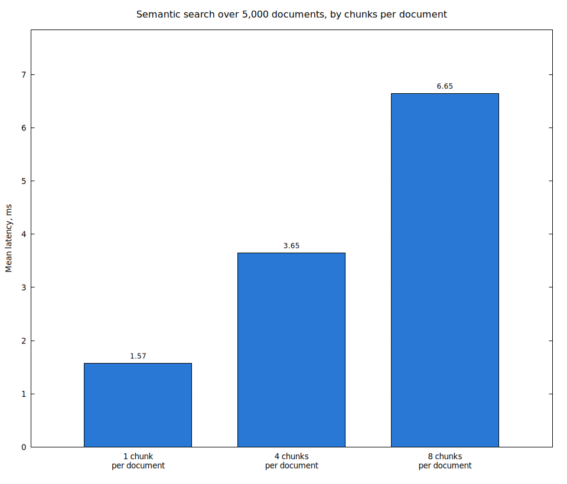

A document is split into overlapping chunks, and Pass 1 scores every chunk in
the clusters it probes. So search time grows with chunks per document: 1.3 ms
with one chunk, 2.1 ms with four, 3.7 ms with eight. Pass 2 re-scores a fixed
number of candidates, so its cost does not grow.

How these numbers relate to a real query:

- **The embedding call is not included.** A real query first sends its text to
  the embedding service, and that round trip usually takes longer than
  everything measured here. Repeated queries are served from a cache.
- **Multi-vector queries cost more.** `search()` also accepts several query
  vectors (production sends one). At one chunk per document, a 1-vector query
  takes 1.29 ms, 4 vectors 1.85 ms and 40 vectors 3.3 ms.
- **Real data is clumpier.** Synthetic vectors spread evenly across clusters.
  Real embeddings pile into a few, and a query probing those clusters scans far
  more chunks. Latency on real data depends mostly on how many chunks the probed
  clusters hold. The architecture doc's *Where a query's time goes* covers this.

The steps inside a search are small by comparison. Choosing the 64 nearest of
256 clusters takes about 9 µs. Scoring 1,000 candidates takes 16 µs in Pass 1
and 16 µs in Pass 2, so the more precise pass costs no more per candidate.

---

## Checked against the README

The [README's Performance section](README.md#performance) quotes ballpark
single-writer throughput. This run agrees:

| Operation | README ballpark | Measured here |
|---|---|---|
| Write, small values | 400–500 ops/s | 437 ops/s |
| `merge`, small values | 400–500 ops/s | 439 ops/s |
| Read from memory | 1M–2.5M ops/s | 2.7M ops/s (slightly above) |
| Read from disk | 100k–300k ops/s | 308k ops/s (slightly above) |

Two separate benchmarks measure a small-value read from disk, with different
setups, and agree within 3% (308k and 316k reads per second).

The write figure is the fsync limit, and no setting raises it: the WAL is
always fsynced per write, and only the value log's sync cadence is configurable.
It is also the limit for the whole database, not per writer. Each write holds
the one WAL lock while it fsyncs, so writes from any number of threads or
namespaces reach the disk one at a time. This report measures single-threaded
latency only, so it does not measure how latency behaves when writers queue for
that lock.
