# M3-pre (gemma): how should a namespace grow its own partition?

M3 replaces the bundled centroid file with partitions that each namespace builds
and maintains for itself. Before writing that code, this report simulates the
candidate designs on real embeddings and answers the questions the design doc
leaves open (`Dynamic-RaBitQ-Index-Design.md`, *M3-pre*):

1. **Lifecycle.** Should a namespace start from one posting and split as it
   grows, or first collect a seed set and cluster it, and should that seed
   clustering use the float embeddings or the codes?
2. **Posting size and reassignment.** How large should a posting be before it
   splits, and how many neighbouring postings should be re-checked after a
   split?
3. **Code width.** Would 2- or 4-bit chunk codes (today: 1 bit) let maintenance
   work from codes alone, without stored floats or re-embedding?
4. **Probe limits.** Should the probe budget and `max_probes` scale with the
   partition, up to a ceiling?
5. **Churn.** Does the partition stay good when documents are deleted or
   replaced, with small postings merged into their neighbours?

*Measured on frozen gemma embeddings (`embeddinggemma-300m`, Q8, llama.cpp) of
BEIR SciFact (5,183 docs, 22,787 chunks, 300 queries) and FiQA (57,600 docs,
172,998 chunks, 648 queries), dumped by the vector bench at M0. Simulator:
`work/bench/analysis/m3pre/` (`sim.py`, stages 1–3, `fidelity.py`); charts are
drawn from [`m3pre/data.json`](data.json) by
[`m3pre/charts.py`](charts.py). Branch `dynamic-rabitq-index` at
`4c602bb`.*

## Answer

- **Grow from one posting and split (option C) is enough.** On FiQA all seven
  lifecycles land within 0.2–1.6 points of recall@10 of a k-means partition
  fitted once on the whole corpus, at the same posting size and the same share
  of entries read. The best seeded variant (floats kept until 30k chunks) is
  0.2 points ahead of C on every order, which costs about 90 MB of staged
  floats and a bootstrap job. SciFact is noisier (300 queries) and shows one
  larger gap: with topics arriving in turn, C trails a 10k float seed by 2.6
  points. C needs no staging namespace, no seed threshold and no bootstrap job.
- **Posting size matters far more than the lifecycle.** At 10,000 entries read
  per FiQA query, recall@10 is 0.975 with postings of about 128 entries, 0.942
  at 1,024, and 0.811 with today's bundled file. Smaller postings also read
  fewer chunks for the same entry count. The open cost is per-probe overhead,
  which this simulation does not model: at today's 70k budget a query probes
  about 360 postings at target 128, against 65 with the bundled file.
- **Reassigning 8 neighbours after a split adds 0–0.6 points** on FiQA and costs
  about 0.1 extra key moves per insert. Each chunk's key moves 1.6–1.9 times
  over the namespace's life whichever lifecycle is used.
- **1-bit codes are good enough for maintenance.** A full re-clustering from
  1-bit codes is as good as one from floats (FiQA 0.978 against 0.976). What
  must not happen is re-encoding a moved code from its own 1- or 2-bit code:
  recall at 10% read falls from 0.980 to 0.909 (1 bit) and 0.965 (2 bits) on
  FiQA, and to 0.664 (1 bit) on SciFact. Codes that keep their original centre
  lose nothing.
- **4-bit codes can be re-encoded from themselves losslessly**, which is the
  property the option was meant to provide. But with codes that keep their
  centre, no width moves nDCG@10 or nDCG@100 by more than 0.0004 (FiQA, every
  lifecycle and order), because the extra Pass-1 recall a wider code buys
  (0.83 → 0.97 at 4 bits) is near-ties below the final top 100. At four times
  the storage and about three times the scoring cost, 4-bit codes are not worth
  it today.
- **Scaled probe limits need a floor.** A budget of a fixed share of the
  namespace turns today's cheap full scan of a small namespace into a partial
  one: SciFact at a 10% share reads 11% of its entries and loses 9.4 points of
  recall@10. At full FiQA size, though, 30% reads 33k entries instead of 70k
  for 0.995 recall instead of 0.999 (nDCG −0.0013). `clamp(p · E, floor,
  ceiling)` keeps both: small namespaces stay exact, large ones save.
  `p_probes` must be at least `p_budget`, or the probe cap cuts searches short.
- **The ordering of documents matters a little.** When documents arrive one
  topic at a time, every dynamic lifecycle trails the static partition by
  1.0–1.6 points (shuffled and corpus order: 0.2–0.8). Postings created early
  for a topic are never re-centred.
- **Deletes and turnover do not wear the partition down.** Deleting half the
  documents, deleting whole topics, or replacing every document (even topic by
  topic) leaves C within 0.5–1.0 points of a k-means fit on what is left
  (FiQA, target 128, k = 8). Splits and merges at a quarter of the target keep
  up with the churn; a full replacement costs about 1.9 key moves per deleted
  chunk, the same as growing.

## Terms used here

- **Posting**: one partition of a namespace's chunk codes, stored under one key
  prefix in `{ns}_sparse_vector`. Its **centre** is both what new chunks are
  routed by and what they are encoded against.
- **Entry**: one key in `{ns}_sparse_vector` per (posting, document). Its
  value is the list of that document's chunk *codes* filed under the posting
  (about 100–130 bytes per chunk at 1 bit), never the document's text, which
  search does not read. A document whose chunks fall into three postings has
  three entries, and a query reads only those in the postings it probes. Search
  cost scales with entries read (one value-log read of a few hundred bytes
  each); `probe_budget_entries` counts them.
- **Target posting size**: the size, in entries, a posting is allowed to reach.
  A posting splits into two when it passes twice the target, so postings end up
  between one and two times the target, and the number of postings **K** grows
  with the namespace.
- **Lifecycles** (option letters from the design doc):
  - **C, grow from one posting**: start with one posting coded against the zero
    vector; split any posting past twice the target with 2-means on its codes'
    reconstructions.
  - **A+C, float seed at N**: keep one flat posting (searched exhaustively) and
    the chunks' float embeddings until the namespace holds N chunks; then run
    k-means on the floats, re-encode the seed chunks exactly, drop the floats
    and continue as C.
  - **B+C, code seed at N**: the same flat phase without the floats; at N run
    k-means on the 1-bit codes' reconstructions, then continue as C.
- **Reassign k**: after a split, the chunks of the k nearest postings are
  re-checked and move to a new child posting if it is now closer (SPFresh's
  LIRE). k = 0 moves only the split posting's own chunks.
- **Static k-means**: a partition fitted once on all of the corpus's float
  embeddings, with the same number of postings as C ends with. It is the best a
  partition of that size can do, and the yardstick here.
- **Bundled file**: today's 256 gemma centroids, fitted on ELI5, shared by every
  namespace.
- **ANN recall@10**: the share of the exact top 10 (float embeddings, no
  partition, no quantisation; the vector bench's ground truth) that the index
  returns. **Pass-1 recall**: the share of the exact Pass-1 top 1,000 that the
  index's Pass 1 hands to Pass 2.
- **Insertion orders**: *shuffled* (random), *corpus* (the dataset's own order),
  *drifting* (documents arrive one topic at a time, 8 topics from k-means on
  the whole-document vectors). Each lifecycle is replayed 64 documents at a time.
- **Code width**: bits per dimension of a chunk code. Moved codes are handled by
  one of three **re-encode policies**: *keep* (the code keeps the centre it was
  encoded against and only its key moves; the M2 design), *code* (decode the
  code and encode the result against the new centre), *fresh* (encode the
  original float against the new centre, which needs stored floats or the
  embedding service).

## How the simulation works

The simulator replays a corpus document by document into an index that follows
the M2 rules. A posting's centre never moves once created (no running-mean
recentring). New chunks are routed with their float vector and encoded against
the posting's centre. Every code names the centre it was encoded against, and
moving a code changes its posting unless the re-encode policy says otherwise.
Everything happens in one random rotation (a dense Haar rotation, which M1
measured equivalent to production's `FhtKacRotator`); distances and inner
products do not change under it, only the quantisation sees it.

Codes are extended RaBitQ at 1, 2 or 4 bits, built as `quantise_multi_bits`
builds them: each dimension's sign plus `B − 1` magnitude bits, with the scale
chosen from a 48-step grid to maximise the cosine between code and residual.
Maintenance (2-means at a split, reassignment, k-means at a seed or rebuild)
works on each code's unbiased reconstruction `c + ‖r‖ ō / ⟨ō, o⟩`, never on the
float, except under the *fresh* policy.

Search follows production. Postings are probed nearest first until their entry
counts reach the budget (M2d). Pass 1 scores each probed chunk with the RaBitQ
estimator, takes each document's best chunk (MaxSim) and keeps the top 1,000.
Pass 2 re-ranks them by the exact whole-document score; M2c measured the 8-bit
zero-centre code within ±0.001 nDCG of it. Recall is compared at equal entries
read by interpolating each configuration's budget curve (2, 5, 10, 20 and 40%
of the namespace, and all of it).

**Check against production.** Indexing SciFact against the bundled file and
probing 64 postings reproduces the vector bench's M2c run: 5,586.7 entries read
per query against 5,587, and nDCG@10 0.7900 against 0.7906 (the difference is
the float Pass 2).

**Not simulated.** The cost of a probe (an LSM prefix seek per posting) and of
a split, concurrent writes, the qwen model, and posting sizes below 128.
Latency is not measured; entries read stand in for it. Sections 1–4 replay
inserts only; section 5 adds deletes, merges and replacements.

## 1. Posting size

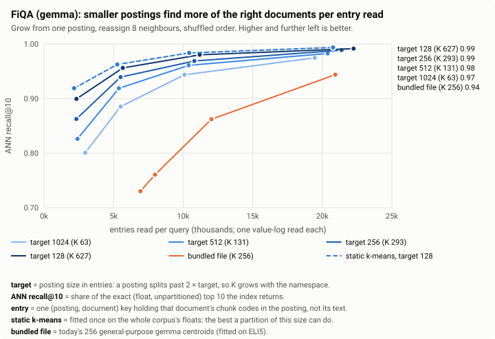

Smaller postings win at every cost. At 10,000 entries read per FiQA query:

| Partition | Postings at full size | Recall@10 at 10k entries | Chunks read at 10k entries | Probes at today's 70k budget |
|---|---|---|---|---|
| C, target 128 | 627 | 0.975 | 15,623 | 359 |
| C, target 256 | 293 | 0.964 | 16,611 | 184 |
| C, target 512 | 131 | 0.958 | 17,877 | 91 |
| C, target 1024 | 63 | 0.942 | 19,416 | 47 |
| static k-means, 660 postings | 660 | 0.982 | 16,600 | 432 |
| bundled file | 256 | 0.811 | 23,098 | 65 |

SciFact agrees (at 1,000 entries: 0.909 at target 128, 0.852 at 256; the
bundled file needs 2,000 entries to reach 0.820). Smaller postings fit a
document's neighbourhood more tightly, so the nearest postings hold more of the
right documents. They also read fewer chunks per entry. The namespace holds
somewhat more entries (FiQA: 110,638 at target 128, against 89,690 with the
bundled file) because a document's chunks spread over more postings.

At today's default budget (70,000 entries) every partition already finds the
exact top 10 (recall@10 0.999–1.000, nDCG@10 0.4760 on FiQA), so the gain from
smaller postings shows up as a cheaper budget for the same recall, not as
better ranking at today's cost. **What the simulation cannot tell is what a
probe costs.** At target 128 a query probes about 360 postings at the default
budget. Each probe is a prefix seek in every LSM layer of the sparse namespace.
M3a should measure the per-probe overhead before the default target is fixed;
256 is the safer start if it is large.

## 2. Lifecycle

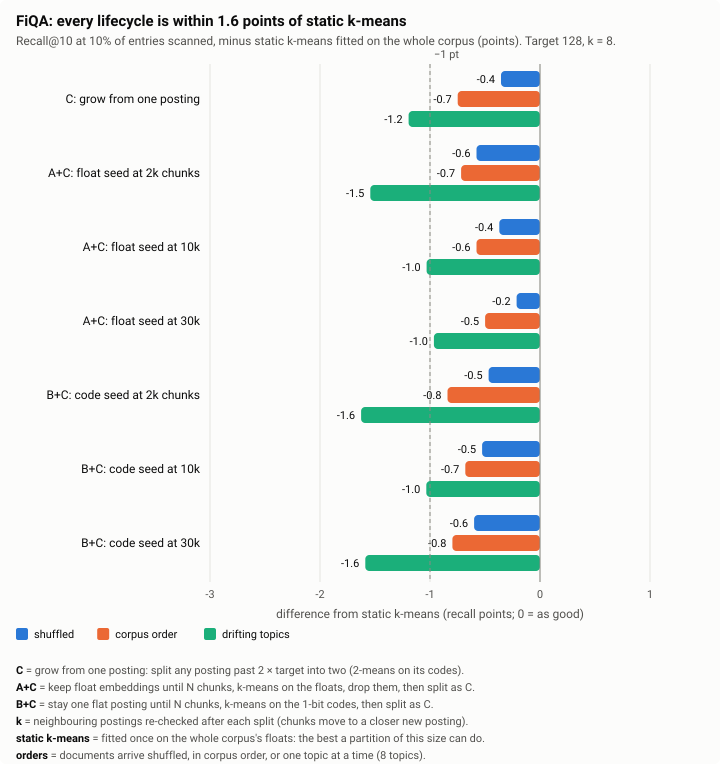

At target 128 with k = 8, every FiQA lifecycle is within 0.2–0.8 points of
static k-means on shuffled and corpus orders, and within 1.0–1.6 points when
topics arrive one at a time. The best seeded variant, A+C with floats kept to
30k chunks, is 0.2 points ahead of C on each order. That is the whole gain
from staging about 90 MB of floats (30,000 chunks at 3 KB) and running a
bootstrap job.

SciFact is small (22,787 chunks, so a 30k seed never happens and those
variants stay one flat posting) and noisy: with 300 queries the standard error
of recall@10 is roughly ±0.6 points (binomial approximation over the 10 slots,
which understates it), against about ±0.2 on FiQA. Its largest gap is under
drifting topics, where C trails a 10k float seed by 2.6 points; the same C
with k = 0 trails by 0.6, so part of this is noise. A 10k seed is 44% of
SciFact, which makes it close to a static fit on half the corpus.

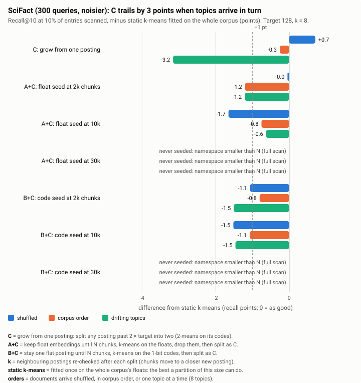

Seeding changes only where the first postings come from (about 80 at a 30k
seed on FiQA, out of 627 at full size). Once a
namespace has grown well past its seed, its postings come from splits either
way. Seeding from floats (A+C) has a cost the others do not: about 3 KB of
staged floats per chunk until the seed point, and a background job to cluster
and re-encode them.

**Early life.** Below the budget (70,000 entries) a query reads the whole
namespace whatever the partition, so the partition only starts to matter once a
namespace passes that size or the budget is lowered. At a 10% budget the young
namespace pays for having few postings: at 10,000 FiQA chunks (K ≈ 30), C
finds 0.83 of the top 10 at 10% read, against 0.74 with the bundled file and
0.95 for static k-means, which already has 660 centres. The flat phase of
A+C/B+C is an exhaustive scan, which is exact but costs the whole namespace.

**Write amplification.** Each chunk's key moves 1.57–1.92 times over the
namespace's life (FiQA, shuffled, target 128):

| Lifecycle | k = 0 | k = 2 | k = 8 |
|---|---|---|---|
| C: grow from one posting | 1.75 | 1.77 | 1.88 |
| A+C: float seed at 2k / 10k / 30k | 1.75 / 1.71 / 1.57 | 1.78 / 1.73 / 1.58 | 1.92 / 1.79 / 1.65 |
| B+C: code seed at 2k / 10k / 30k | 1.80 / 1.82 / 1.85 | 1.78 / 1.82 / 1.77 | 1.89 / 1.84 / 1.77 |

A move is a key rewrite of the chunk's code (about 100 bytes at 1 bit), never a
re-embedding.

**Reassignment.** Re-checking 8 neighbours after a split raises FiQA recall@10
at 10% read by up to 0.6 points over k = 0 (C: 0.975 → 0.980 shuffled, 0.976 →
0.976 corpus, 0.965 → 0.971 drifting) for about 0.1 extra moves per insert.
k = 2 sits in between.

## 3. Code width

The question was whether wider chunk codes would let maintenance work from the
codes alone. Three things were measured: how much of the vector a code keeps,
whether partitions fitted on codes are as good as partitions fitted on floats,
and what happens to codes that move.

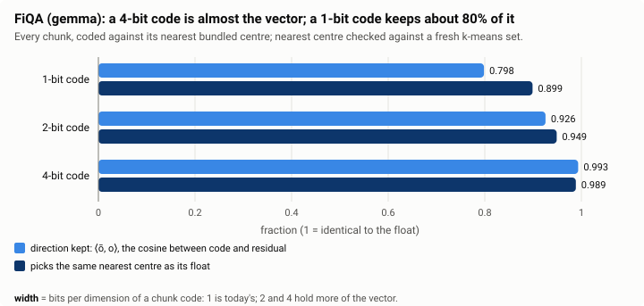

A 4-bit code is nearly the vector (cosine 0.993 with its residual) and almost
always picks the same nearest centre as its float (98.9%). A 1-bit code keeps a
cosine of 0.80 and picks the same centre 90% of the time.

**Partitions fitted on codes are as good as partitions fitted on floats, even at
1 bit.** Rebuilding FiQA's partition from scratch (the M4 case: an index coded
against the bundled centres, re-clustered into 304 postings):

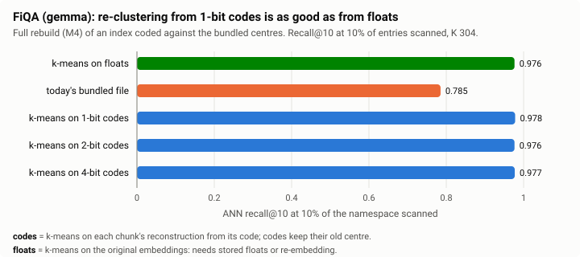

A centre is a mean over hundreds of chunks, and the 1-bit reconstruction is
unbiased, so the per-chunk noise averages out. Assignment errors (10% of chunks
pick a different nearest centre) mostly move a chunk to a posting that is nearly
as close, which a query near it is likely to probe as well.

**Re-partitioning is not re-encoding.** This result covers fitting new centres
and moving keys; every code keeps decoding against the centre it was encoded
against (its `centre_id`, separate from its posting since M2b). So a namespace
can be re-partitioned from its 1-bit codes with no embedding calls, including
an existing index moving off the bundled file. Rewriting the codes themselves
against the new centres is a different operation, and from 1-bit codes it
hurts (next part). Anything that changes the codes (a new model, dimension,
chunking, rotation or code width) still needs the floats: re-embedding, or
stored floats.

**Moved codes: keep them, or re-encode only from 4 bits.** After a full
simulated life (C, target 128, k = 8; FiQA, shuffled), recall@10 at 10% read:

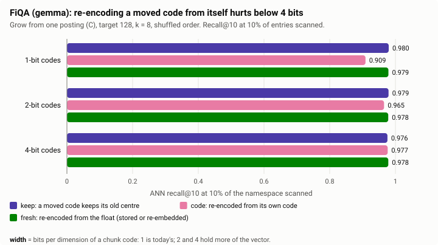

| Codes | keep | code (re-encode from the code) | fresh (from the float) |
|---|---|---|---|
| 1-bit | 0.980 | 0.909 | 0.979 |
| 2-bit | 0.979 | 0.965 | 0.978 |
| 4-bit | 0.976 | 0.977 | 0.978 |

Re-encoding from a 1-bit code adds the code's own error to every moved code, and
a chunk moves almost twice on average, so the error compounds. At 4 bits the
reconstruction is close enough that a re-encode is as good as one from the float.
That is the property the 4-bit option was meant to provide. But *keep* is as
good at every width: a code against a slightly farther centre is still an
unbiased estimate, just a little noisier. So M3 does not need re-encoding at
all.

**Wider codes improve Pass 1, not the final ranking.**

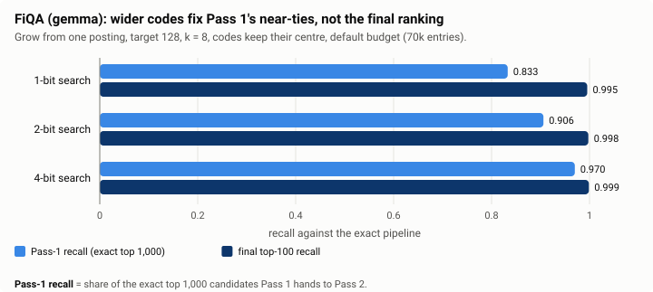

At today's budget, Pass-1 recall rises from 0.833 (1 bit) to 0.906 (2 bits) and
0.970 (4 bits), but the final top 100 is already 0.995–0.999 of the exact one,
and nDCG@10 and @100 do not change (0.4760 and 0.5412 at every width with
*keep*). This matches M2c-pre's measurement on the bundled centres: Pass 1's
lost candidates are near-ties at exact ranks 501–1,000.

**Split layout.** A B-bit code's top bit per dimension is its 1-bit code (both
use the sign of the same rotated residual), so search could keep scoring 1-bit
codes while maintenance reads the extra bits. The simulation ran this layout
(1-bit search, 2- or 4-bit maintenance). It gives the same recall as 1-bit
everything with *keep* (FiQA 0.976–0.979), so the extra bits buy nothing for
maintenance either.

**Cost.** Storage per chunk code at 768 dimensions (codes only; each chunk
also carries about 12 bytes of factors, 2 MB on FiQA, and its key):

| Width | Code bytes | FiQA (172,998 chunks) |
|---|---|---|
| 1 bit | 96 | 17 MB |
| 2 bits | 192 | 33 MB |
| 4 bits | 384 | 66 MB |
| stored f32 | 3,072 | 531 MB |

Today's multi-bit format stores **one byte per dimension whatever the width**
(`pack_bytes`, used for the 8-bit Pass-2 codes), so a 2- or 4-bit chunk code in
that format would take 768 bytes and score at the 8-bit speed. A real 2- or
4-bit chunk code needs a packed layout (bit planes, which also give the split
layout above for free). See *Scoring cost* below.

## 4. Probe limits that scale with the partition

The proposal: `max_probes = clamp(⌈p_probes · K⌉, min, max_ceiling)` and
`probe_budget_entries = min(p_budget · E, budget_ceiling)`, against today's
absolute 70,000 entries and 1,024 probes.

Both datasets were replayed with C (target 128, k = 8) and every combination of
`p_budget` and `p_probes` ∈ {5, 10, 20, 30}%, `budget_ceiling` ∈ {40k, 70k,
100k} and `max_probes_ceiling` ∈ {256, 1024}, evaluated at 1k, 5k, 10k and 20k
chunks and at full size.

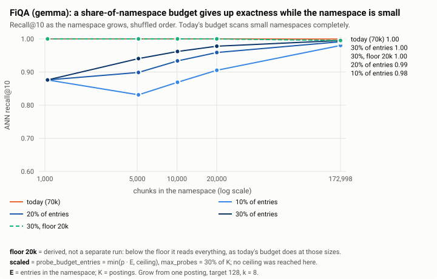

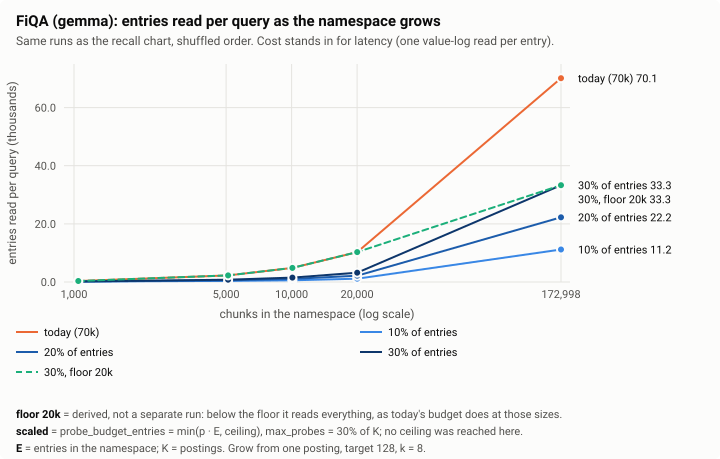

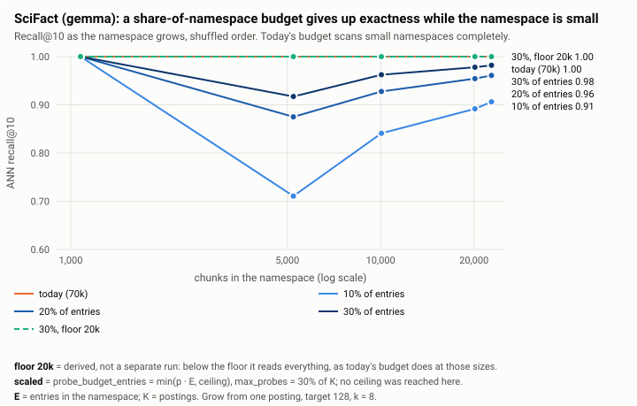

| FiQA, shuffled | 5k chunks (E 2,278) | 20k chunks (E 10,270) | full (E 110,638) |
|---|---|---|---|
| today, 70k absolute | 2.3k read, 1.000 | 10.3k, 1.000 | 70.1k, 0.999 |
| 10% of E | 0.4k, 0.831 | 1.1k, 0.905 | 11.2k, 0.980 |
| 20% of E | 0.6k, 0.899 | 2.2k, 0.959 | 22.2k, 0.992 |
| 30% of E | 0.8k, 0.941 | 3.2k, 0.978 | 33.3k, 0.995 |
| 30% of E, at least 20k | 2.3k, 1.000 | 10.3k, 1.000 | 33.3k, 0.995 |

(Entries read per query, ANN recall@10. The last row is derived, not a separate
run: below its floor it reads the whole namespace, which is what today's budget
does at those sizes.)

- **A pure share makes small namespaces inexact.** Today a namespace under
  70,000 entries is scanned completely and gets the exact top 10. A share
  scans a fraction of it: SciFact at full size loses 3.9 points at 20% and 9.4
  at 10%, and a 5,000-chunk FiQA namespace loses 10 points at 20%. When topics
  arrive one at a time it is worse (FiQA at 5k chunks: 0.565 at 20%), because
  queries about topics not yet indexed are far from every posting.
- **At full FiQA size a share is much cheaper, but not free.** 20% reads 22,200
  entries per query, under a third of today's 70,000, for recall@10 0.992
  instead of 0.999; nDCG@10 drops by 0.0025 and nDCG@100 by 0.0030, just over
  the 0.002 gate the milestones use. 30% reads 33,300 entries (under half) and
  stays inside it (−0.0013 at both cutoffs; drifting order −0.0018 / −0.0023).
  This is the saving the smaller postings of section 1 make possible.
- **Add a floor.** `probe_budget_entries = clamp(p_budget · E, floor,
  ceiling)` keeps small namespaces exact (they are cheap anyway: 20,000 entries
  is about 4 ms of Pass 1 at today's per-entry cost) and keeps the saving for
  large ones. With p = 30%, floor = 20k and ceiling = 70k, the rule reads
  everything up to 20k entries, 30% of the namespace from about 67k entries,
  and at most today's 70k from about 233k entries.
- **`p_probes` must not be below `p_budget`.** Posting entry counts vary, so the
  postings that hold 20% of the entries are often more than 20% of the
  postings. With `p_probes` = 10% and `p_budget` = 20%, the probe cap stopped
  82–100% of FiQA queries early (recall 0.985 instead of 0.992 at full size);
  at 30% / 30% it still stopped 0–23%. A probe cap at least 1.5 × `p_budget`
  never bound on full-size namespaces here. Simpler still: keep `max_probes`
  absolute (it is a safety bound, not the cost knob) and scale only the
  budget.
- **The ceilings were never reached.** 30% of FiQA's 110,638 entries is 33,191,
  under the lowest ceiling (40k). Choosing a ceiling needs a namespace several
  times FiQA's size. `max_probes_ceiling` (256 or 1,024) never bound either:
  FiQA ends with 627 postings, so 30% is 188.

These numbers count entries, not milliseconds. Entries are the dominant cost
of a warm query (one value-log read each), but at target 128 a 22k-entry query
probes about 110 postings, and each probe costs an LSM prefix seek that this
simulation does not model.

## 5. Churn: deletes, merges and turnover

Sections 1–4 only add documents. Here C (target 128 and 256, k = 0 and 8) is
first grown, then put through four kinds of churn:

- **delete a random half** of the corpus;
- **delete 2 of 8 topics** entirely, which empties whole regions;
- **replace a random half**: grow on half A of the corpus, then delete A and
  insert the other half B, 64 documents at a time, until A is gone;
- **replace topics 1–4 by 5–8**: the same, with A and B split by topic, so the
  postings were built for documents that all leave.

A posting that falls under a quarter of the target merges: it is retired and
its chunks move to the nearest of its 8 nearest postings, keeping their codes.
After each phase the index is compared with static k-means fitted on the
chunks still present, with the same number of postings.

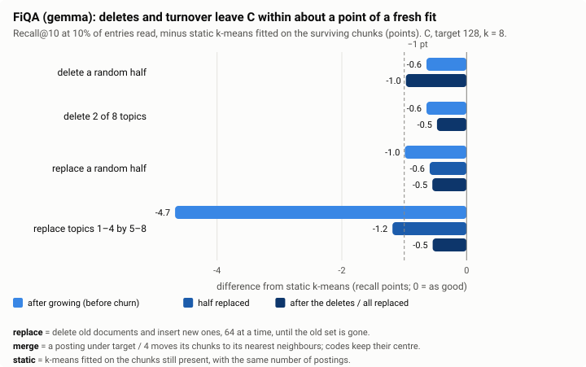

Gap to the fresh fit, recall@10 at 10% read, in points (FiQA):

| Scenario | target 128, k = 8 | target 128, k = 0 | target 256, k = 8 |
|---|---|---|---|
| delete a random half (before → after) | −0.6 → −1.0 | −0.9 → −0.8 | −0.6 → −1.0 |
| delete 2 of 8 topics | −0.6 → −0.5 | −0.9 → −0.8 | −0.6 → 0.0 |
| replace a random half (0 → 50 → 100%) | −1.0 → −0.6 → −0.5 | −1.4 → −1.1 → −0.8 | −1.1 → −1.4 → −1.1 |
| replace topics 1–4 by 5–8 | −4.7 → −1.2 → −0.5 | −3.0 → −1.7 → −1.4 | −1.6 → −2.3 → −1.2 |

- **Deletes cost little.** Half the corpus gone moves the gap by at most 0.4
  points. Few postings fall under a quarter of the target (57 merges of 643
  postings), so most keep their place at half their size, and the partition is
  simply finer than its target. Merges and their moves cost 0–0.09 key moves
  per deleted chunk.
- **Turnover heals.** When every document is replaced, the old postings shrink
  and merge and the new documents grow their own postings by splitting
  (topic replacement at target 128: 105 merges, 249 splits). The final gap is
  0.5 points at k = 8, as good as a namespace that never churned. A full
  replacement costs 1.88 key moves per deleted chunk, about what growing costs.
- **The −4.7 at the start of topic replacement is not churn.** At that point
  the namespace holds only topics 1–4 while the queries cover all eight, so
  half the queries are far from every posting (static k-means on the same
  documents also drops, to 0.894).
- **Reassigning neighbours matters more under churn.** After replacing topics,
  k = 8 ends 0.5 points from the fresh fit and k = 0 ends 1.4 points away.

SciFact agrees within its noise: at target 128 with k = 8 every phase is within
1.2 points of the fresh fit. At target 256 its half-corpus namespaces have 9
postings, too few to read 10% of.

So a namespace that keeps changing does not need periodic rebuilds to stay
good. The M4 rebuild remains for a model change, and for the 1.0–1.6 point gap
that growing one topic at a time leaves (section 2), which churn neither
widened nor closed.

## Scoring cost by width

Per-entry Pass-1 scoring time on this host (100,000 random entries at 768
dimensions, best of 30 runs, one thread; a temporary example built against
today's estimators):

| Code layout | ns per entry | 70k entries (today's budget) |
|---|---|---|
| 1 bit (today) | 20–25 | 1.4–1.8 ms |
| 2 bits as bit planes (2 passes of the 1-bit kernel) | 35 | 2.5 ms |
| 4 bits as bit planes (4 passes) | 70 | 4.9 ms |
| one byte per dimension, today's multi-bit format, any width | 18 | 1.3 ms |

The scoring itself is a small part of a warm FiQA query (about 14 ms at 70k
entries); reading the entries dominates, and a wider code reads 2–8 times the
bytes. A 4-bit bit-plane code would roughly triple the scoring time and
quadruple the bytes read, for no change in the ranking. The byte-per-dimension
format scores fastest because it uses the SIMD byte dot product, but it stores
eight times today's chunk code.

## What this means for M3

- **M3a builds option C**: one posting at the zero centre, split past twice the
  target with 2-means on code reconstructions, codes keep their centre (the
  *keep* policy, already the M2 design). Drop the staging namespace and the
  bootstrap phase (M3c) from the plan.
- **Reassign 8 neighbours** after each split (M3b), from code reconstructions.
- **Target posting size**: 128 is best on recall per entry; choose between 128
  and 256 once M3a measures per-probe cost.
- **Keep 1-bit chunk codes.** Revisit 2- or 4-bit codes only with a bit-plane
  layout and a reason in the ranking, which neither dataset shows.
- **Re-encode policies** (`reencode_source` = `stored` / `service`) are not
  needed for partition quality. They remain useful for changing the rotation or
  the dense width without the service, which this report did not test.
- **Probe limits**: scale the budget as `clamp(p_budget · E, floor, ceiling)`
  (for example 30%, 20k, 70k) and keep `max_probes` absolute. Re-check `p` on
  a namespace several times FiQA's size before choosing a ceiling.
- **Merge at a quarter of the target**, into the nearest of 8 neighbours,
  codes kept (M3b). Under every churn scenario this kept C within 0.5–1.0
  points of a fresh fit.
- **M4's rebuild from 1-bit codes works** (0.978 against 0.976 for floats on
  FiQA). Churn alone did not create a need for it.

## Caveats

- One model (gemma) and two datasets. FiQA (648 queries) is the stronger
  evidence; SciFact's 300 queries move by up to 2 points between near-identical
  configurations.
- Recall is against the exact pipeline, which is what the index controls. The
  final ranking changes far less than recall: in stage 2, nDCG@10 and @100
  moved by at most 0.0004 in any run with *keep*, and by up to 0.0028 / 0.0036
  when moved codes were re-encoded from 1-bit codes.
- Churn was simulated as whole-document deletes and replacements in batches of
  64, one writer, no concurrency. An "update" that re-embeds a document with
  different text is modelled as replacing it with another document.
- Probe cost is not modelled, and it decides between targets 128 and 256.
