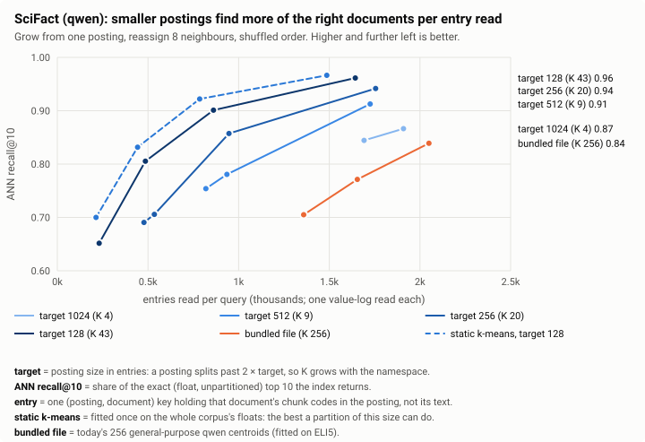
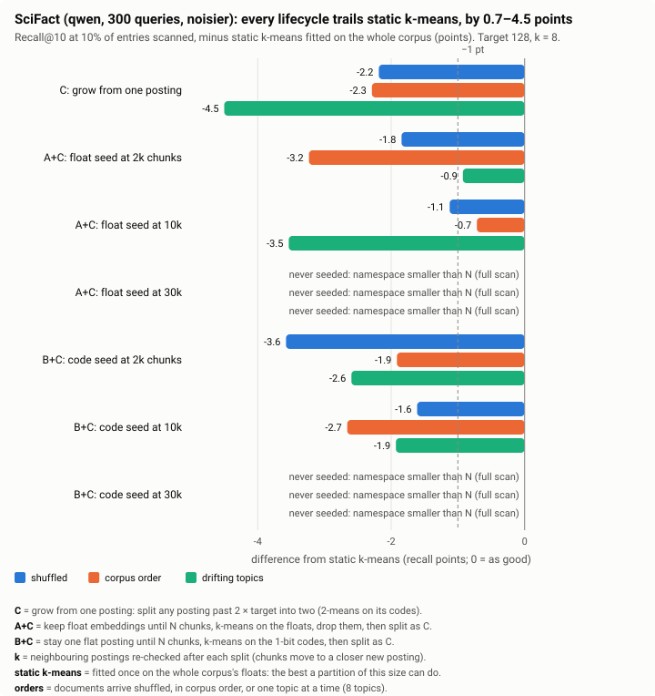
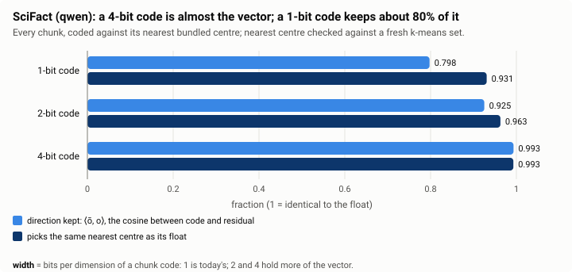
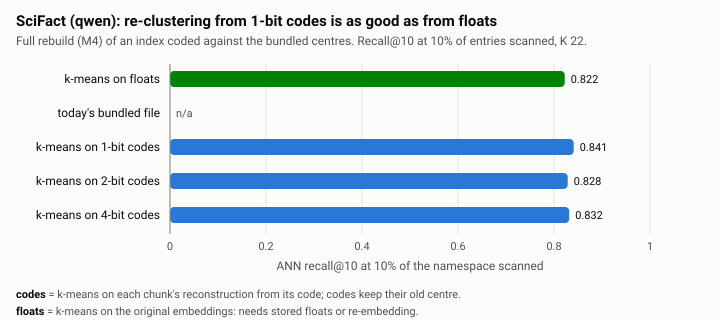
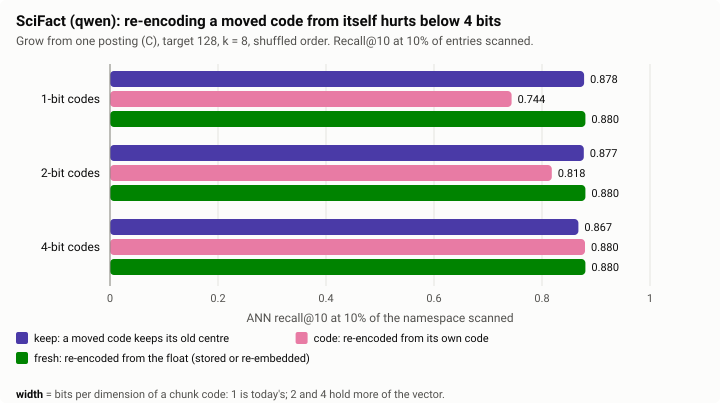
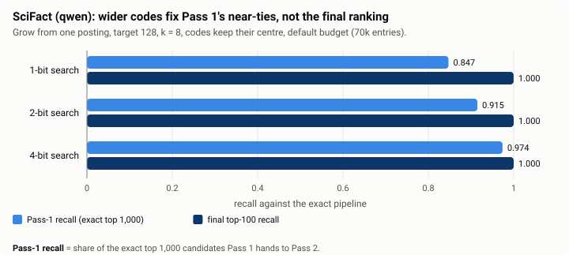
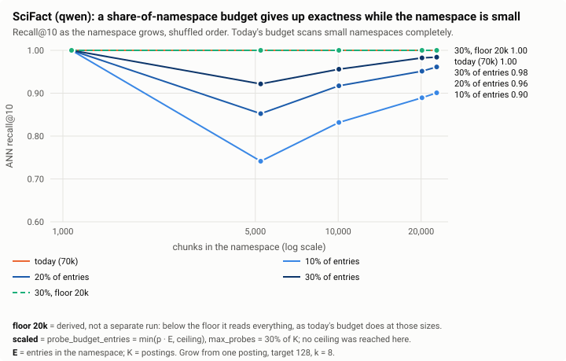
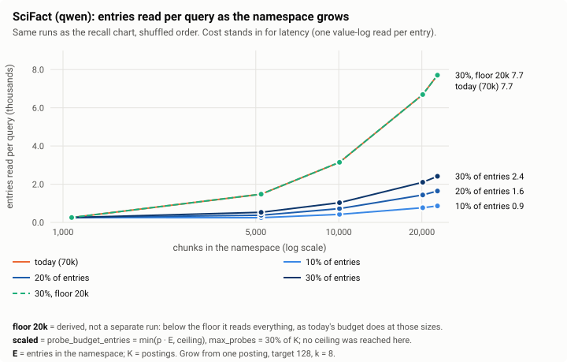
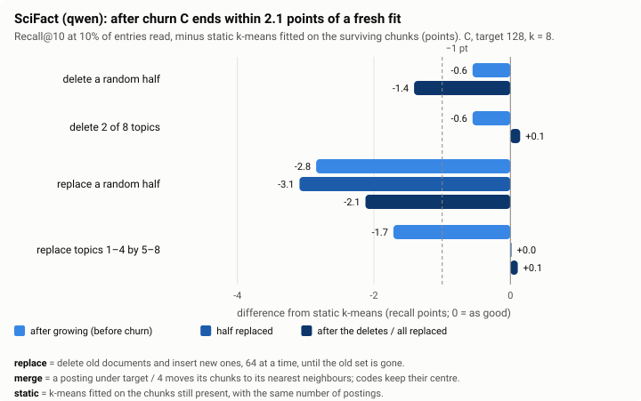

# M3-pre (qwen): do the partition findings hold for a second model?

The gemma report ([`../gemma/m3-pre-simulation.md`](../gemma/m3-pre-simulation.md))
simulated how a namespace should grow its own partition and made proposals for
M3. This report repeats the same simulation on **qwen** embeddings and compares
the two models, to check that those proposals are not specific to gemma.

*Status: SciFact only. The FiQA run (648 queries, the stronger evidence in the
gemma report) comes next and will be added here.*

*Measured on frozen qwen embeddings (`Qwen3-Embedding-8B`, Q4_K_M, llama.cpp,
768 dimensions) of BEIR SciFact: 5,183 documents, 22,787 chunks (the same
chunking as gemma: windows of 4 sentences advancing 2), 300 queries. The
bundled qwen file is 256 centroids fitted on ELI5 (25k records, k-means,
seed 42). Simulator: `work/bench/analysis/m3pre/` (stages 1–4,
`fidelity.py`; `compare.py` prints every number below for both models,
`ndcg_table.py` the nDCG table). Charts are drawn from
[`data.json`](data.json) by [`../charts.py`](../charts.py). Branch
`dynamic-rabitq-index` at `cbfccf9`.*

## Answer

On SciFact every gemma proposal holds for qwen, with one caveat about how
close growing from one posting gets to the best partition.

| Gemma report's proposal for M3 | Holds on qwen SciFact? |
|---|---|
| Smaller postings: target 128 is best per entry read | **Yes.** 0.912 recall@10 at 1,000 entries (target 256: 0.863, 512: 0.792); the bundled file needs 2,000 entries for 0.831 |
| Grow from one posting (C); no seed or bootstrap | **Yes, but qwen leaves a wider gap.** C is as good in absolute terms (0.878 against gemma's 0.883 at 10% read), but qwen's static k-means is better (0.900 against 0.876), so C trails it by 2.2–4.5 points. Seeding narrows this unevenly (best seed per order trails by 0.7–1.1), within SciFact's noise |
| Reassign 8 neighbours after a split | **Yes, weakly.** +1.5 and +2.5 points over k = 0 on shuffled and drifting orders, −0.1 on corpus order |
| Keep 1-bit codes; never re-encode from a 1- or 2-bit code | **Yes.** Re-encoding from a 1-bit code drops recall from 0.878 to 0.744 (gemma 0.883 to 0.664); codes that keep their centre lose nothing |
| A rebuild from 1-bit codes needs no floats | **Yes.** 0.841 from 1-bit codes against 0.822 from floats |
| Wider codes do not change the ranking | **Yes.** Pass-1 recall 0.847 → 0.974 from 1 to 4 bits; nDCG@10 and @100 identical in every run whose codes keep their centre |
| Probe budget `clamp(30% · E, 20k, 70k)`, `max_probes` absolute | **Yes.** SciFact stays below the floor and is scanned exactly; a pure share loses 2.6 nDCG points at 10%; `p_probes` < `p_budget` cuts every query short |
| Merge at a quarter of the target, k = 8 | **Yes on SciFact's terms.** After churn C ends within 2.1 points of a fresh fit; turnover by topic is healed only with k = 8 (+0.1 against −4.2 at k = 0) |

The pattern across sections: qwen's chunk embeddings cluster a little more
cleanly than gemma's (a static partition does better and its centres sit
closer to the chunks), and growing from one posting captures less of that
extra structure. FiQA, with twice the queries and seven times the chunks,
will show whether the gap is real.

## Terms used here

The gemma report defines every term; the ones this report leans on:

- **Posting**: one partition of a namespace's chunk codes, under one key
  prefix. **Entry**: one key per (posting, document), holding that document's
  chunk codes in the posting. Search cost scales with entries read;
  `probe_budget_entries` counts them. **E** = entries in the namespace,
  **K** = postings.
- **Target posting size**: a posting splits into two past twice the target.
- **Lifecycles**: **C** grows from one posting by splitting. **A+C** keeps the
  float embeddings until N chunks, runs k-means on them, then continues as C.
  **B+C** does the same from the 1-bit codes. **k** is the number of
  neighbouring postings re-checked after each split.
- **Static k-means**: a partition fitted once on all of the corpus's floats,
  with the same number of postings as C ends with: the best a partition of
  that size does. **Bundled file**: today's 256 general-purpose centroids for
  the model.
- **ANN recall@10**: the share of the exact top 10 (float embeddings, no
  partition, no quantisation) that the index returns. Compared at equal
  entries read, mostly at 10% of the namespace.
- **Orders**: documents arrive *shuffled*, in *corpus* order, or *drifting*
  (one topic at a time, 8 topics).
- **Re-encode policies** for a code whose posting changes: *keep* (it keeps the
  centre it was encoded against), *code* (re-encoded from its own code),
  *fresh* (re-encoded from the float).

**Noise.** With 300 queries the standard error of recall@10 is roughly
±0.6 points (binomial over the 10 slots, which understates it). Two
configurations that differ only in k move by up to 2.5 points here, so gaps
under about 2 points on SciFact are not evidence on their own.

## The two models on SciFact

| | gemma | qwen |
|---|---|---|
| exact nDCG@10 / @100 (full scan, float Pass 2) | 0.7900 / 0.8028 | 0.7817 / 0.7959 |
| C, target 128, k = 8, shuffled: postings K / entries E | 52 / 8,602 | 43 / 7,706 |
| static k-means at that size: recall@10 at 10% read | 0.876 | 0.900 |
| bundled file: largest posting, share of E | 34% | 30% |
| mean residual norm of a chunk against its bundled / k-means centre | 0.99 / 0.80 | 0.90 / 0.72 |
| 1-bit code: direction kept, ⟨ō, o⟩ | 0.798 | 0.798 |

qwen's exact nDCG@10 matches the vector bench's qwen two-pass result (0.7817).
At today's 70k budget both namespaces are scanned completely, so every
partition returns the exact ranking; the differences below show up only when
the budget is a fraction of the namespace.

## 1. Posting size

Recall@10 at a fixed number of entries read (shuffled, k = 8):

| Partition | qwen: K | qwen: 500 / 1,000 / 2,000 entries | gemma: K | gemma: 500 / 1,000 / 2,000 entries |
|---|---|---|---|---|
| C, target 128 | 43 | 0.809 / 0.912 / 0.969 | 52 | 0.785 / 0.909 / 0.964 |
| C, target 256 | 20 | 0.696 / 0.863 / 0.949 | 22 | 0.688 / 0.852 / 0.937 |
| C, target 512 | 9 | — / 0.792 / 0.925 | 10 | — / 0.793 / 0.926 |
| C, target 1024 | 4 | — / — / 0.873 | 4 | — / — / 0.874 |
| static k-means, target 128 | 49 | 0.847 / 0.936 / 0.976 | 53 | 0.807 / 0.909 / 0.966 |
| bundled file | 256 | — / — / 0.831 | 256 | — / — / 0.820 |

(— : the budget is below what one probe of the nearest posting reads, so the
point does not exist. The bundled file's largest posting holds 30% of SciFact
under qwen.)

The ordering is the same for both models and the dynamic numbers nearly
coincide: smaller postings find more of the right documents per entry read,
and today's bundled file is far behind. What differs is static k-means: on qwen
it is 2–4 points ahead of C at 500–1,000 entries, where on gemma the two were
level.

## 2. Lifecycle

Recall@10 at 10% read, minus static k-means (points; target 128, k = 8):

| Lifecycle | qwen: shuffled / corpus / drifting | gemma: shuffled / corpus / drifting |
|---|---|---|
| C: grow from one posting | −2.2 / −2.3 / −4.5 | +0.7 / −0.3 / −3.2 |
| A+C: float seed at 2k chunks | −1.8 / −3.2 / −0.9 | 0.0 / −1.2 / −1.2 |
| A+C: float seed at 10k | −1.1 / −0.7 / −3.5 | −1.7 / −0.8 / −0.6 |
| B+C: code seed at 2k | −3.6 / −1.9 / −2.6 | −1.1 / −0.8 / −1.5 |
| B+C: code seed at 10k | −1.6 / −2.7 / −1.9 | −1.5 / −1.1 / −1.5 |
| static k-means (absolute) | 0.900 | 0.876 |

(A 30k seed never happens on SciFact's 22,787 chunks; those namespaces stay
one flat posting, an exhaustive scan.)

- **No lifecycle wins consistently.** The best seed differs by order (10k
  floats on shuffled and corpus, 2k floats on drifting), and each seed is also
  the worst or near-worst on another order. Spread like this is what SciFact's
  noise looks like; the gemma report found the same.
- **C is level with gemma in absolute terms.** C reaches 0.878 / 0.877 / 0.855
  on qwen against 0.883 / 0.873 / 0.844 on gemma. The gap to static k-means is
  wider on qwen because qwen's static partition is better, not because C is
  worse.
- **Topics arriving in turn cost most**, as on gemma: C trails by 4.5 points
  (gemma 3.2). Postings created early for a topic are never re-centred.

**Write amplification.** Key moves per inserted chunk (shuffled, target 128),
k = 0 / 2 / 8:

| Lifecycle | qwen | gemma |
|---|---|---|
| C: grow from one posting | 1.65 / 1.87 / 1.78 | 1.75 / 1.84 / 1.93 |
| A+C: float seed at 2k / 10k | 1.55 / 1.47 / 1.59 ; 0.82 / 1.05 / 0.92 | 1.57 / 1.65 / 1.64 ; 0.93 / 0.96 / 0.90 |
| B+C: code seed at 2k / 10k | 1.72 / 1.75 / 1.65 ; 1.33 / 1.39 / 1.42 | 1.61 / 1.69 / 1.76 ; 1.46 / 1.43 / 1.40 |

The same on both models: each chunk's key moves under twice, and a large seed
moves less only because it skips the splits a small namespace would make.

**Reassignment.** C, recall@10 at 10% read, k = 0 / 2 / 8:

| Order | qwen | gemma |
|---|---|---|
| shuffled | 0.863 / 0.886 / 0.878 | 0.855 / 0.877 / 0.883 |
| corpus | 0.878 / 0.890 / 0.877 | 0.860 / 0.864 / 0.873 |
| drifting | 0.830 / 0.852 / 0.855 | 0.864 / 0.851 / 0.844 |

Reassigning helps on average on both models (k = 8 over k = 0: qwen +1.5,
−0.1, +2.5; gemma +2.8, +1.3, −2.0), with no consistent winner between k = 2
and k = 8 at this size.

**Early life.** At 10,000 chunks (K ≈ 19), C finds 0.753 of the top 10 at 10%
read against 0.870 for static k-means, which already has its 49 centres (gemma:
0.779 against 0.847). A young namespace pays for having few postings on both
models, and this is only visible when the budget is below the namespace size.

## 3. Code width

Codes keep the same share of the vector on both models: a cosine with the
residual of 0.798 / 0.925 / 0.993 at 1 / 2 / 4 bits (gemma 0.798 / 0.926 /
0.993; every chunk coded against its nearest bundled centre). Coded against its bundled centre, a 1-bit qwen code picks the same
nearest k-means centre as its float 93% of the time (gemma 92%).

**Rebuilding from codes.** An index coded against the bundled centres,
re-clustered into 22 postings (gemma: 24):

| Rebuilt from | qwen: recall@10 at 10% read | gemma |
|---|---|---|
| floats (needs stored floats or re-embedding) | 0.822 | 0.829 |
| 1-bit codes | 0.841 | 0.821 |
| 2-bit codes | 0.828 | 0.829 |
| 4-bit codes | 0.832 | 0.829 |

The bundled file itself has no value at 10% (its largest posting is 30% of the
namespace). A rebuild from 1-bit codes is as good as one from floats on both
models; the differences are within noise.

**Moved codes.** After a full simulated life (C, target 128, k = 8, shuffled),
recall@10 at 10% read:

| Codes | qwen: keep / code / fresh | gemma: keep / code / fresh |
|---|---|---|
| 1-bit | 0.878 / **0.744** / 0.880 | 0.883 / **0.664** / 0.863 |
| 2-bit | 0.877 / **0.818** / 0.880 | 0.866 / **0.820** / 0.863 |
| 4-bit | 0.867 / 0.880 / 0.880 | 0.862 / 0.876 / 0.863 |

Same result: re-encoding a moved code from its own 1- or 2-bit code compounds
its error, 4 bits re-encode without loss, and *keep* is as good as *fresh* at
every width.

**Ranking.** With codes that keep their centre, nDCG@10 and @100 are
0.7817 / 0.7959 in every stage-2 run on qwen (C, A+C and B+C seeded at 10k;
shuffled and drifting; every width and layout), as on gemma (0.7900 / 0.8028).
Wider codes raise Pass-1 recall (qwen 0.847 / 0.915 / 0.974 at 1 / 2 / 4 bits;
gemma 0.859 / 0.920 / 0.976) while the final top 100 stays at 1.000.

The *code* policy moves qwen's ranking more than gemma's: up to −0.0109
nDCG@10 and −0.0111 @100 (B+C, drifting, 1-bit codes re-encoded from
themselves), against at most 0.0006 on gemma. One more reason never to
re-encode from a narrow code.

## 4. Probe limits that scale with the partition

C, target 128, k = 8, full size, shuffled. Entries read, recall@10, and the
change in nDCG@10 / @100 from a full scan:

| Budget | qwen (E 7,706) | gemma (E 8,602) |
|---|---|---|
| today, 70k absolute | 7,706, 1.000, 0 / 0 | 8,602, 1.000, 0 / 0 |
| 10% of E | 861, 0.901, −0.0259 / −0.0286 | 965, 0.906, −0.0419 / −0.0434 |
| 20% of E | 1,643, 0.961, −0.0095 / −0.0097 | 1,814, 0.961, −0.0185 / −0.0195 |
| 30% of E | 2,416, 0.984, −0.0064 / −0.0058 | 2,673, 0.982, −0.0092 / −0.0104 |
| 30% of E, at least 20k | 7,706, 1.000, 0 / 0 | 8,602, 1.000, 0 / 0 |

nDCG by budget at every cutoff, C against the bundled file (qwen, shuffled;
full scan nDCG@10 / @20 / @40 / @100 = 0.7817 / 0.7912 / 0.7925 / 0.7959):

| Budget (share of E) | C: entries | C: ΔnDCG @10 / @20 / @40 / @100 | bundled: entries | bundled: ΔnDCG @10 / @20 / @40 / @100 |
|---|---|---|---|---|
| 10% | 0.9k | −0.0259 / −0.0288 / −0.0287 / −0.0286 | 2.0k | −0.0896 / −0.0937 / −0.0930 / −0.0935 |
| 20% | 1.6k | −0.0095 / −0.0103 / −0.0102 / −0.0097 | 2.6k | −0.0678 / −0.0720 / −0.0713 / −0.0719 |
| 40% | 3.2k | −0.0011 / −0.0010 / −0.0010 / −0.0005 | 3.9k | −0.0263 / −0.0273 / −0.0273 / −0.0273 |
| 70k entries (today) | 7.7k | 0 at every cutoff | 8.5k | 0 at every cutoff |

- **The floor is what keeps SciFact exact**, on both models. A pure share of
  a namespace this small gives up 2.6 nDCG points at 10% and 0.6 at 30% on
  qwen, for savings of a few thousand entries a query that a small namespace
  does not need.
- **qwen loses less than gemma at the same share** (−0.0095 against −0.0185
  at 20%), consistent with its chunks clustering more cleanly.
- **`p_probes` below `p_budget` cuts searches short**, as on gemma: with
  `p_probes` = 10% and `p_budget` = 20%, the probe cap stopped every query at
  full size (recall@10 0.919 instead of 0.961). At 30% / 30% it stopped 2% of
  queries (shuffled) and 20% (drifting).
- **Ceilings** cannot be judged on SciFact: it never comes near them. That
  waits for FiQA, and even FiQA is too small to choose one (gemma report).

## 5. Churn: deletes, merges and turnover

C first grown, then churned; recall@10 at 10% read minus static k-means fitted
on the chunks still present (points), at each phase:

| Scenario | qwen, k = 8 | qwen, k = 0 | gemma, k = 8 |
|---|---|---|---|
| delete a random half (0 → 50%) | −0.6 → −1.4 | −4.1 → −0.8 | −0.1 → +0.2 |
| delete 2 of 8 topics | −0.6 → +0.1 | −4.1 → −0.5 | −0.1 → +2.2 |
| replace a random half (0 → 50 → 100%) | −2.8 → −3.1 → −2.1 | −4.3 → +0.9 → +0.2 | −0.7 → −0.3 → −1.2 |
| replace topics 1–4 by 5–8 | −1.7 → 0.0 → +0.1 | −3.1 → −4.9 → −4.2 | −0.4 → −1.0 → +0.2 |

(Target 128. The two replacement scenarios start from half the corpus, so their
namespaces hold about 3,600 entries and 20–30 postings.)

- **Churn does not widen the gap.** No k = 8 scenario ends more than 0.8
  points worse than where it started (topic turnover ends 1.8 points better),
  and three of four end within 1.4 points of a fresh fit. *Replace a random half* starts 2.8 points behind (a
  half-size namespace grown from one posting) and stays there.
- **Reassignment matters most under topic turnover**, on both models: k = 8
  ends +0.1 from the fresh fit, k = 0 ends −4.2 (gemma: +0.2 and −1.7).
- **Cost.** Merges are few (1–11 per scenario); replacing four topics by four
  others costs 1.88 key moves per deleted chunk (gemma 1.93), about what growing
  costs. Plain deletes cost 0.01–0.02 moves per deleted chunk.

At target 256 SciFact's half-corpus namespaces have 10–13 postings, too few to
read 10% of, so those cells have no value (as on gemma).

## What this means for M3

Nothing in the M3 plan changes on SciFact's evidence:

- **M3a builds C**, target 128 (or 256 once per-probe cost is measured),
  *keep* policy, no staging namespace and no bootstrap.
- **Reassign 8 neighbours** after each split (M3b); it matters most under
  turnover by topic.
- **1-bit chunk codes**; never re-encode a code from itself.
- **M4's rebuild from 1-bit codes** works on qwen too.
- **Probe budget `clamp(30% · E, 20k, 70k)`**, `max_probes` absolute.
- **Merge at a quarter of the target** into the nearest of 8 neighbours.

One thing to watch: on qwen, C trails static k-means by 2.2–4.5 points where
gemma was level. If FiQA confirms a gap of that size, it is the case for the
float-seeded bootstrap (M3c) or for a periodic M4 rebuild, which the gemma
report found unnecessary.

## Caveats

- **SciFact only.** 300 queries and 22,787 chunks: K stays under about 50, so
  most comparisons are between partitions of a few dozen postings, and gaps
  under about 2 points are within noise. FiQA follows.
- **The bundled qwen file was refitted** through the current embedding service
  (ELI5, k = 256); the gemma file predates it. The two bundled files are not
  equally good fits, so bundled-file comparisons across models say little.
- Recall is against the exact pipeline. Below a full scan the final ranking
  moves less than recall: at 10% read recall@10 is 9.9 points short and
  nDCG@10 2.6 points; at 40% read, 0.7 and 0.1 points.
- Probe cost (an LSM prefix seek per posting) is not modelled, as in the
  gemma report.
