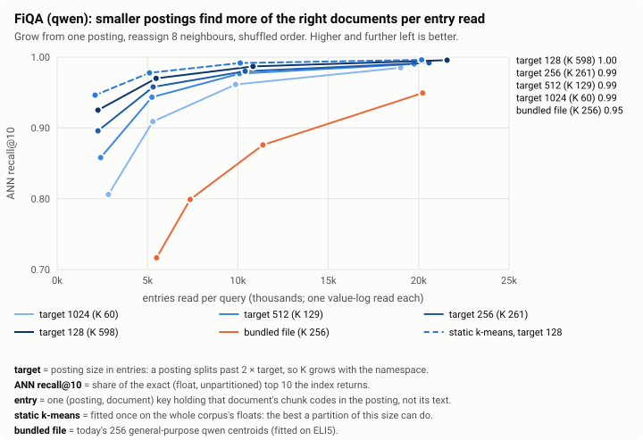
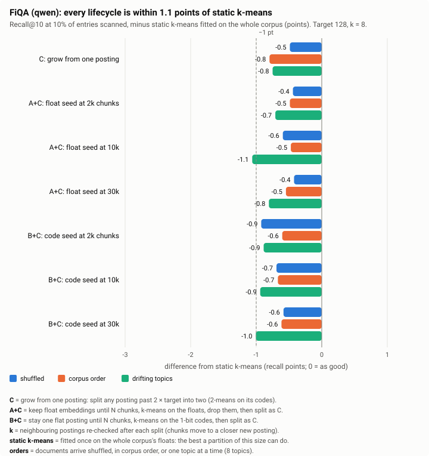
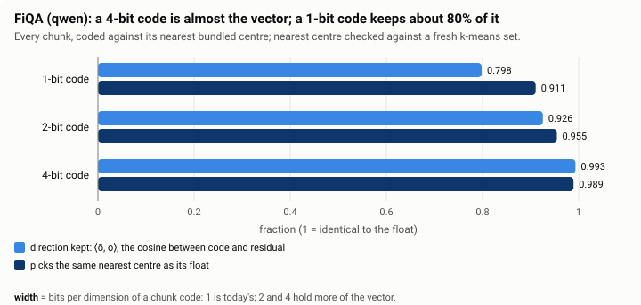
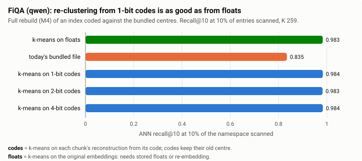
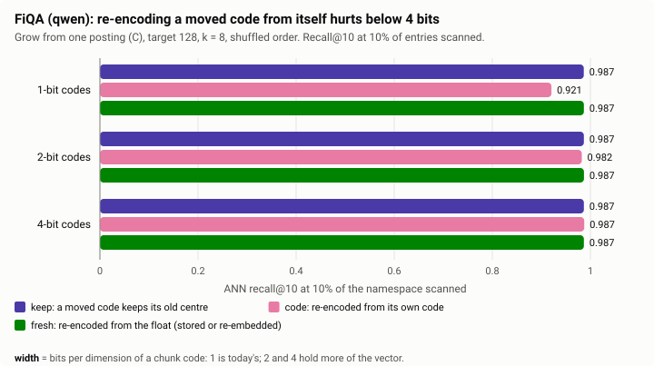
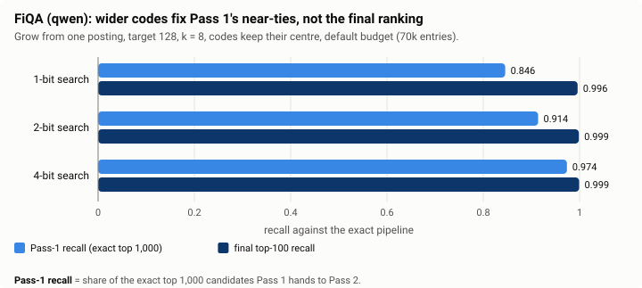
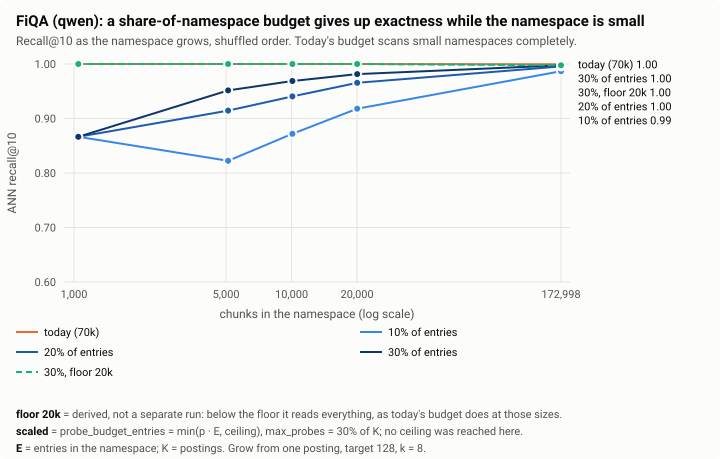
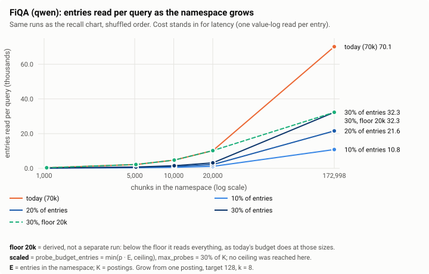
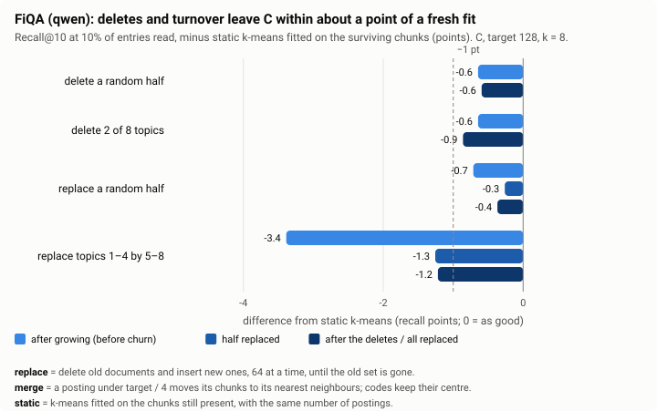

# M3-pre (qwen): do the partition findings hold for a second model?

The gemma report ([`../gemma/m3-pre-simulation.md`](../gemma/m3-pre-simulation.md))
simulated how a namespace should grow its own partition and made proposals for
M3. This report repeats the same simulation on **qwen** embeddings and sets
each number beside gemma's, to check that those proposals are not specific to
one model.

*Measured on frozen qwen embeddings (`Qwen3-Embedding-8B`, Q4_K_M, llama.cpp,
768 dimensions) of BEIR FiQA (57,600 documents, 172,998 chunks, 648 queries)
and SciFact (5,183 documents, 22,787 chunks, 300 queries), chunked as for
gemma (windows of 4 sentences advancing 2). The bundled qwen file is 256
centroids fitted on ELI5 (25k records, k-means, seed 42). Simulator:
`work/bench/analysis/m3pre/` (stages 1–4, `fidelity.py`; `compare.py` prints
every number below for both models, `ndcg_table.py` the nDCG table). Charts are
drawn from [`data.json`](data.json) by [`../charts.py`](../charts.py). Branch
`dynamic-rabitq-index` at `2c5dd35`.*

## Answer

Every gemma proposal holds on qwen. FiQA is the evidence; SciFact, with 300
queries and a few dozen postings, agrees within its noise.

| Gemma report's proposal for M3 | Holds on qwen FiQA? |
|---|---|
| Smaller postings: target 128 is best per entry read | **Yes.** Recall@10 at 10,000 entries read: 0.984 at target 128, 0.978 at 256, 0.962 at 1,024; 0.850 with the bundled file |
| Grow from one posting (C); no seed or bootstrap | **Yes.** C is within 0.5–0.8 points of static k-means on every order; no seeded variant is more than 0.3 points better on any order |
| Reassign 8 neighbours after a split | **Yes, weakly.** k = 8 over k = 0: +0.2, −0.1 and +0.1 points (shuffled, corpus, drifting) |
| Keep 1-bit codes; never re-encode from a 1- or 2-bit code | **Yes.** Re-encoding from a 1-bit code drops recall from 0.987 to 0.921 (gemma 0.980 to 0.909); codes that keep their centre lose nothing |
| A rebuild from 1-bit codes needs no floats | **Yes.** 0.984 from 1-bit codes against 0.983 from floats |
| Wider codes do not change the ranking | **Yes.** Pass-1 recall 0.846 → 0.974 from 1 to 4 bits; nDCG@10 within 0.0003 of the full scan in every run whose codes keep their centre |
| Scaled probe budget needs a floor; `max_probes` stays absolute | **Yes.** A pure share loses up to 18 points of recall at 5,000 chunks; at full size 30% reads 32k entries for −0.0003 nDCG@10 |
| Merge at a quarter of the target, k = 8 | **Yes.** After any churn C ends within 0.4–1.2 points of a fresh fit |

The SciFact run had raised one question: there, C trailed static k-means by
2.2–4.5 points on qwen where gemma was level. **FiQA does not reproduce it.**
On FiQA C trails by 0.5–0.8 points on qwen and 0.4–1.2 on gemma. The SciFact
gap came from a small namespace (about 43 postings), not from the model.

## Terms used here

The gemma report defines every term; the ones this report leans on:

- **Posting**: one partition of a namespace's chunk codes, under one key
  prefix. **Entry**: one key per (posting, document), holding that document's
  chunk codes in the posting. Search cost scales with entries read;
  `probe_budget_entries` counts them. **E** = entries in the namespace,
  **K** = postings.
- **Target posting size**: a posting splits into two past twice the target
  (counted in entries in this simulation).
- **Lifecycles**: **C** grows from one posting by splitting. **A+C** keeps the
  float embeddings until N chunks, runs k-means on them, then continues as C.
  **B+C** does the same from the 1-bit codes. **k** is the number of
  neighbouring postings re-checked after each split.
- **Static k-means**: a partition fitted once on all of the corpus's floats,
  with the same number of postings as C ends with: the best a partition of
  that size does. **Bundled file**: the 256 general-purpose centroids for the
  model.
- **ANN recall@10**: the share of the exact top 10 (float embeddings, no
  partition, no quantisation) that the index returns. Compared at equal
  entries read, mostly at 10% of the namespace.
- **Orders**: documents arrive *shuffled*, in *corpus* order, or *drifting*
  (one topic at a time, 8 topics).
- **Re-encode policies** for a code whose posting changes: *keep* (it keeps the
  centre it was encoded against), *code* (re-encoded from its own code),
  *fresh* (re-encoded from the float).

**Noise.** With 648 FiQA queries the standard error of recall@10 is roughly
±0.4 points (binomial over the 10 slots, which understates it); with 300
SciFact queries about ±0.6, and configurations that differ only in k move by up
to 2.5 points there. Gaps under about a point on FiQA, or two on SciFact, are
not evidence on their own.

## The two models on FiQA

| | gemma | qwen |
|---|---|---|
| exact nDCG@10 / @100 (full scan, float Pass 2) | 0.4760 / 0.5412 | 0.5919 / 0.6522 |
| C, target 128, k = 8, shuffled: postings K / entries E | 627 / 110,638 | 598 / 107,307 |
| static k-means at that size: recall@10 at 10% read | 0.983 | 0.991 |
| bundled file: largest posting, share of E | 10.6% | 8.7% |
| mean residual norm of a chunk against its bundled / k-means centre | 0.88 / 0.75 | 0.81 / 0.70 |
| 1-bit code: direction kept, ⟨ō, o⟩ | 0.798 | 0.798 |

qwen ranks FiQA 12 points of nDCG@10 better than gemma, and its chunks sit a
little closer to their centres. At today's 70k budget a full-size FiQA query
reads about 65% of the namespace, so every partition returns the exact top 10
(recall@10 0.999–1.000); the differences below show up only at smaller
budgets.

## 1. Posting size

At 10,000 entries read per query:

| Partition | qwen: K | qwen: recall@10 / chunks read | gemma: K | gemma: recall@10 / chunks read | Probes at today's budget (qwen / gemma) |
|---|---|---|---|---|---|
| C, target 128 | 598 | 0.984 / 16,081 | 627 | 0.975 / 15,623 | 365 / 359 |
| C, target 256 | 261 | 0.978 / 16,983 | 293 | 0.964 / 16,611 | 171 / 184 |
| C, target 512 | 129 | 0.976 / 18,504 | 131 | 0.958 / 17,877 | 90 / 91 |
| C, target 1024 | 60 | 0.962 / 19,872 | 63 | 0.942 / 19,416 | 45 / 47 |
| static k-means, target 128 | 623 | 0.991 / 17,144 | 660 | 0.982 / 16,600 | 424 / 432 |
| bundled file | 256 | 0.850 / 22,320 | 256 | 0.811 / 23,098 | 60 / 65 |

The same ordering on both models: smaller postings find more of the right
documents per entry read, read fewer chunks for it, and the bundled file is
far behind. qwen is 0.9–2.0 points higher at every target, and its gap between
target 128 and 256 is smaller (0.6 points against 1.1). Probe cost is still
not modelled; at target 128 a query probes about 365 postings at today's
budget.

## 2. Lifecycle

Recall@10 at 10% read, minus static k-means (points; target 128, k = 8):

| Lifecycle | qwen: shuffled / corpus / drifting | gemma: shuffled / corpus / drifting |
|---|---|---|
| C: grow from one posting | −0.5 / −0.8 / −0.8 | −0.4 / −0.7 / −1.2 |
| A+C: float seed at 2k chunks | −0.4 / −0.5 / −0.7 | −0.6 / −0.7 / −1.5 |
| A+C: float seed at 10k | −0.6 / −0.5 / −1.1 | −0.4 / −0.6 / −1.0 |
| A+C: float seed at 30k | −0.4 / −0.5 / −0.8 | −0.2 / −0.5 / −1.0 |
| B+C: code seed at 2k | −0.9 / −0.6 / −0.9 | −0.5 / −0.8 / −1.6 |
| B+C: code seed at 10k | −0.7 / −0.7 / −0.9 | −0.5 / −0.7 / −1.0 |
| B+C: code seed at 30k | −0.6 / −0.6 / −1.0 | −0.6 / −0.8 / −1.6 |
| static k-means (absolute) | 0.991 | 0.983 |

- **Every lifecycle is within 1.1 points of static k-means**, and no seed beats
  C by more than 0.3 points on any order. Seeding is not worth its staging
  namespace and bootstrap job on either model.
- **Topics arriving one at a time cost less on qwen** (C −0.8 against −1.2).
- **SciFact's larger gap does not carry over.** On SciFact C trailed by 2.2,
  2.3 and 4.5 points; there K stays near 43 and the yardstick is a 49-posting
  k-means, so a few postings in the wrong place show up as several points.

**Write amplification.** Key moves per inserted chunk (FiQA, shuffled, target
128), k = 0 / 2 / 8:

| Lifecycle | qwen | gemma |
|---|---|---|
| C: grow from one posting | 1.73 / 1.73 / 1.83 | 1.75 / 1.77 / 1.88 |
| A+C: float seed at 2k / 10k / 30k, k = 8 | 1.81 / 1.71 / 1.56 | 1.92 / 1.79 / 1.65 |
| B+C: code seed at 2k / 10k / 30k, k = 8 | 1.70 / 1.77 / 1.75 | 1.89 / 1.84 / 1.77 |

The same on both models: each chunk's key moves under twice over the
namespace's life.

**Reassignment.** C, recall@10 at 10% read, k = 0 / 2 / 8:

| Order | qwen | gemma |
|---|---|---|
| shuffled | 0.985 / 0.986 / 0.987 | 0.975 / 0.976 / 0.980 |
| corpus | 0.984 / 0.984 / 0.983 | 0.976 / 0.977 / 0.976 |
| drifting | 0.983 / 0.980 / 0.984 | 0.965 / 0.971 / 0.971 |

On growth alone reassignment is worth at most a few tenths of a point on qwen
(gemma up to 0.6). It matters more under churn (section 5).

**Early life.** At 10,000 FiQA chunks (K ≈ 27), C finds 0.830 of the top 10 at
10% read against 0.964 for static k-means, which already has its 623 centres,
and 0.757 for the bundled file (gemma: 0.832 / 0.952 / 0.742). As on gemma, a
young namespace pays for having few postings, which matters only when the
budget is below the namespace's size.

## 3. Code width

Codes keep the same share of the vector on both models. Coded against a
k-means centre, the cosine of a code with its residual is 0.905 / 0.964 /
0.997 at 1 / 2 / 4 bits (gemma 0.891 / 0.958 / 0.996), and the code picks the
same nearest k-means centre as its float 92.2% / 96.2% / 99.0% of the time
(gemma 91.3% / 95.7% / 99.0%).

**Rebuilding from codes.** An index coded against the bundled centres,
re-clustered into 259 postings (gemma: 304), recall@10 at 10% read:

| Rebuilt from | qwen | gemma |
|---|---|---|
| floats (needs stored floats or re-embedding) | 0.983 | 0.976 |
| 1-bit codes | 0.984 | 0.978 |
| 2-bit codes | 0.983 | 0.976 |
| 4-bit codes | 0.984 | 0.977 |
| the bundled file, as indexed | 0.835 | 0.785 |

A rebuild from 1-bit codes is as good as one from floats on both models.

**Moved codes.** After a full simulated life (C, target 128, k = 8, shuffled),
recall@10 at 10% read:

| Codes | qwen: keep / code / fresh | gemma: keep / code / fresh |
|---|---|---|
| 1-bit | 0.987 / **0.921** / 0.987 | 0.980 / **0.909** / 0.979 |
| 2-bit | 0.987 / **0.982** / 0.987 | 0.979 / **0.965** / 0.978 |
| 4-bit | 0.987 / 0.987 / 0.987 | 0.976 / 0.977 / 0.978 |

Same result: re-encoding a moved code from its own 1- or 2-bit code compounds
its error, 4 bits re-encode without loss, and *keep* is as good as *fresh* at
every width.

**Ranking.** With codes that keep their centre, nDCG@10 is 0.5916–0.5919 and
nDCG@100 0.6519–0.6522 in every stage-2 run on qwen FiQA (C, A+C and B+C
seeded at 10k; shuffled and drifting; every width and layout), against
0.5919 / 0.6522 for a full scan. Wider codes raise Pass-1 recall (0.846 /
0.914 / 0.974 at 1 / 2 / 4 bits; gemma 0.833 / 0.906 / 0.970) while the final
top 100 stays at 0.996–0.999.

The *code* policy moves qwen's ranking more than gemma's: up to −0.0044
nDCG@10 and −0.0071 @100 (B+C, 1-bit codes re-encoded from themselves),
against at most −0.0028 / −0.0036 on gemma. One more reason never to re-encode
from a narrow code.

## 4. Probe limits that scale with the partition

C, target 128, k = 8, shuffled. Entries read per query and recall@10:

| Budget | 5k chunks (E 2,208) | 20k chunks (E 10,204) | full (E 107,307) |
|---|---|---|---|
| today, 70k absolute | 2.2k, 1.000 | 10.2k, 1.000 | 70.1k, 0.999 |
| 10% of E | 0.3k, 0.822 | 1.1k, 0.918 | 10.8k, 0.987 |
| 20% of E | 0.6k, 0.915 | 2.2k, 0.966 | 21.6k, 0.996 |
| 30% of E | 0.7k, 0.952 | 3.2k, 0.981 | 32.3k, 0.998 |
| 30% of E, at least 20k | 2.2k, 1.000 | 10.2k, 1.000 | 32.3k, 0.998 |

(The last row is derived, not a separate run: below its floor it reads the
whole namespace, which is what today's budget does at those sizes.)

nDCG by budget at every cutoff, C against the bundled file (qwen, shuffled;
full scan nDCG@10 / @20 / @40 / @100 = 0.5919 / 0.6185 / 0.6363 / 0.6522):

| Budget (share of E) | C: entries | C: ΔnDCG @10 / @20 / @40 / @100 | bundled: entries | bundled: ΔnDCG @10 / @20 / @40 / @100 |
|---|---|---|---|---|
| 2% | 2.3k | −0.0225 / −0.0265 / −0.0296 / −0.0314 | 5.5k | −0.1085 / −0.1168 / −0.1242 / −0.1313 |
| 5% | 5.5k | −0.0106 / −0.0124 / −0.0132 / −0.0138 | 7.4k | −0.0672 / −0.0733 / −0.0787 / −0.0838 |
| 10% | 10.8k | −0.0034 / −0.0040 / −0.0046 / −0.0046 | 11.4k | −0.0391 / −0.0425 / −0.0463 / −0.0495 |
| 20% | 21.6k | −0.0006 / −0.0007 / −0.0012 / −0.0012 | 20.2k | −0.0130 / −0.0133 / −0.0141 / −0.0154 |
| 30% | 32.3k | −0.0003 / −0.0008 / −0.0008 / −0.0007 | — | — |
| 40% | 43.0k | −0.0003 / −0.0005 / −0.0005 / −0.0005 | 38.5k | −0.0005 / −0.0011 / −0.0011 / −0.0016 |
| 70k entries (today) | 70.1k | −0.0003 at every cutoff | 71.2k | +0.0001 / +0.0001 / +0.0001 / 0.0000 |

(The 30% row is from the stage-3 run; the bundled file was not run at 30%.)

- **The floor keeps small namespaces exact**, on both models. A pure share of
  a 5,000-chunk namespace gives up 5–18 points of recall; when topics arrive
  one at a time it is worse (0.758 at 20%, gemma 0.565).
- **qwen loses less than gemma at the same share.** At 20% of E, nDCG@10 is
  −0.0006 on qwen against −0.0026 on gemma, so qwen passes the 0.002 gate at
  20% where gemma needs 30%.
- **`p_probes` below `p_budget` cuts searches short**, as on gemma: with
  `p_probes` = 10% and `p_budget` = 20% the probe cap stopped every full-size
  query (recall@10 0.989 instead of 0.996).
- **No ceiling was reached**, as on gemma: FiQA is too small to choose one.

## 5. Churn: deletes, merges and turnover

C first grown, then churned; recall@10 at 10% read minus static k-means fitted
on the chunks still present (points), at each phase:

| Scenario | qwen, target 128, k = 8 | qwen, k = 0 | qwen, target 256, k = 8 | gemma, target 128, k = 8 |
|---|---|---|---|---|
| delete a random half (before → after) | −0.6 → −0.6 | −0.5 → −0.3 | −0.4 → −0.7 | −0.6 → −1.0 |
| delete 2 of 8 topics | −0.6 → −0.9 | −0.5 → −1.4 | −0.4 → −0.8 | −0.6 → −0.5 |
| replace a random half (0 → 50 → 100%) | −0.7 → −0.3 → −0.4 | −1.1 → −0.4 → −0.5 | −0.9 → −0.1 → −0.3 | −1.0 → −0.6 → −0.5 |
| replace topics 1–4 by 5–8 | −3.4 → −1.3 → −1.2 | −3.8 → −1.7 → −1.4 | −1.9 → −1.3 → −1.0 | −4.7 → −1.2 → −0.5 |

- **Churn does not wear the partition down.** Every k = 8 scenario ends within
  1.2 points of a fresh fit, as on gemma (0.5–1.0).
- **The large first number of topic replacement is not churn**: at that point
  the namespace holds only topics 1–4 while the queries cover all eight.
- **Reassignment helps under churn**, by a little less than on gemma: after
  topic replacement k = 8 ends 1.2 points from the fresh fit and k = 0 ends 1.4
  away (gemma 0.5 and 1.4).
- **Cost.** Replacing four topics by four others costs 1.92 key moves per
  deleted chunk (gemma 1.88), about what growing costs; plain deletes cost
  0.02–0.08.

## What this means for M3

Nothing in the M3 plan changes on qwen's evidence:

- **M3 builds C**: grow from one posting, no staging namespace and no
  bootstrap. Codes keep their centre.
- **Target posting size** 128 or 256, chosen once M3a measures per-probe cost;
  qwen's smaller 128-to-256 gap makes 256 cheaper to choose.
- **Reassign neighbours after each split**; it matters most under churn.
- **1-bit chunk codes**; never re-encode a code from itself.
- **M4's rebuild from 1-bit codes** works on qwen too.
- **Probe budget**: a scaled budget needs a floor; `max_probes` stays absolute.

The split algorithm itself (how a posting is divided, which chunks are
re-checked, how small postings merge) was settled afterwards by a second
simulation that follows SPFresh's LIRE protocol on both models:
[`../spfresh-comparison.md`](../spfresh-comparison.md).

## Caveats

- **Two datasets, one host.** FiQA is the evidence; SciFact's 300 queries and
  22,787 chunks keep K under about 50, where a few misplaced postings move
  recall by several points.
- **The bundled qwen file was refitted** through the current embedding service
  (ELI5, k = 256); the gemma file predates it. The two bundled files are not
  equally good fits, so bundled-file comparisons across models say little.
- Recall is against the exact pipeline. Below a full scan the final ranking
  moves less than recall: at 10% of E recall@10 is 1.3 points short and
  nDCG@10 0.3 points.
- Probe cost (an LSM prefix seek per posting) is not modelled, as in the
  gemma report.
